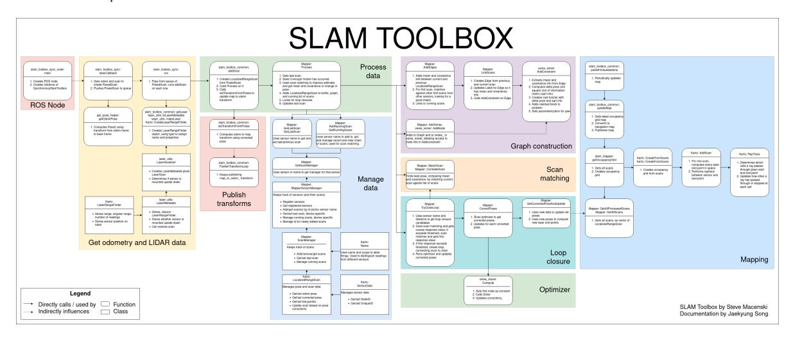
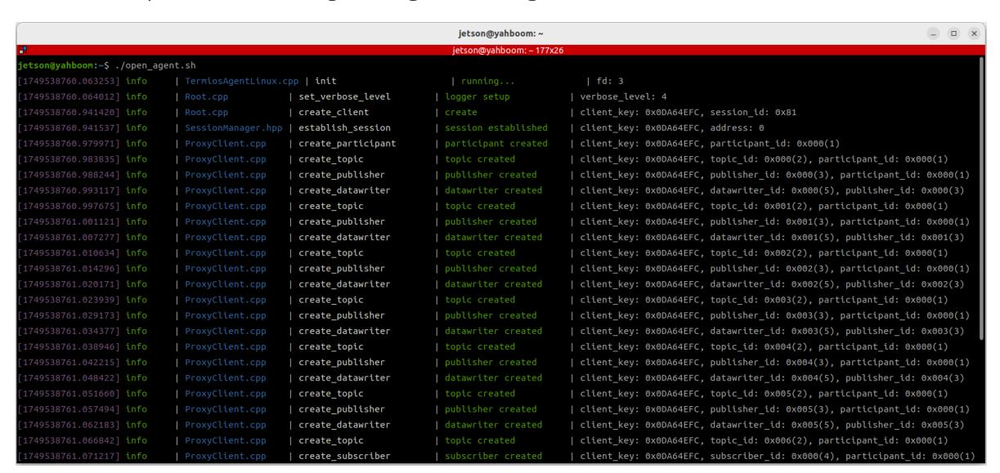
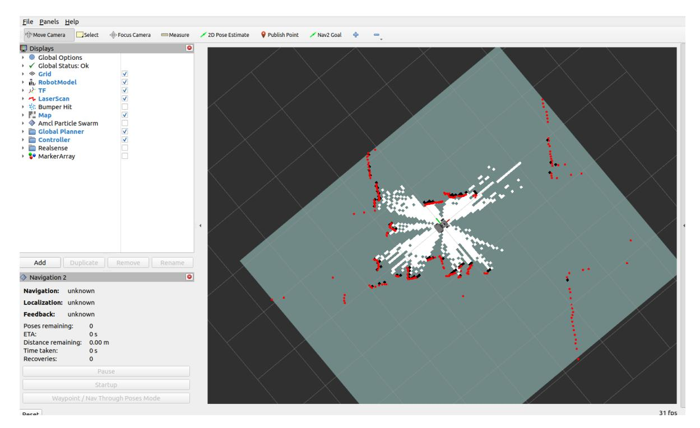
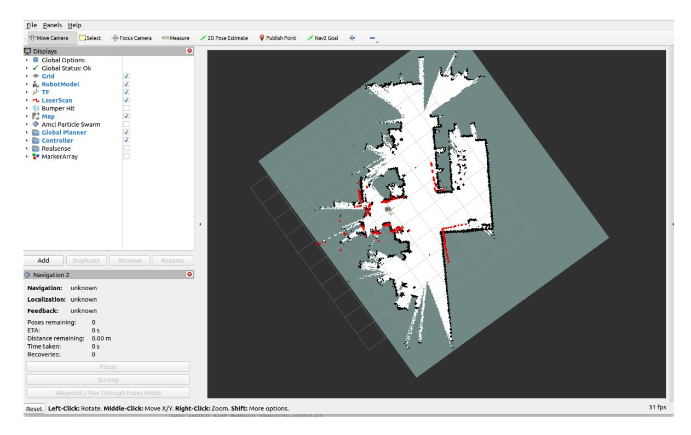
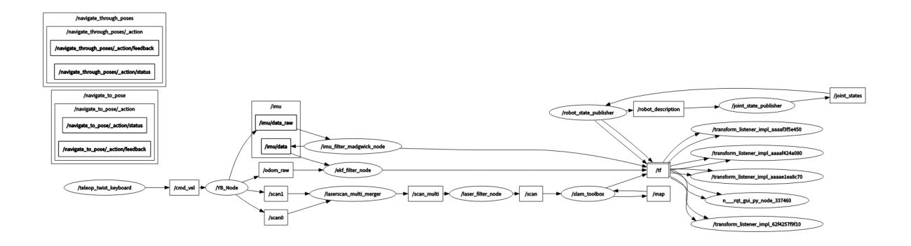
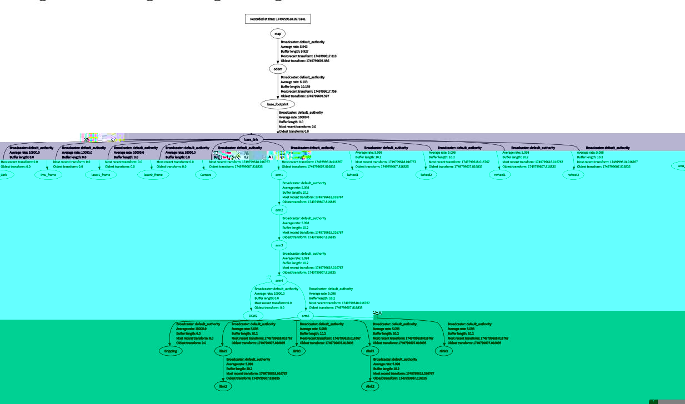

# slam_toolbox mapping

# 1. Course Content

Learn the SLAM mapping algorithm for robotics using the slam-toolbox.

After running the sample program, control the robot using the keyboard or controller to complete mapping and save the map.

# 2. Introduction to slam-toolbox

slam-toolbox is an open-source 2D SLAM (Simultaneous Localization and Mapping) algorithm package based on ROS, primarily used for mapping and localizing mobile robots in unknown environments. Based on the **Graph Optimization** framework, it combines sensor data from laser radar (such as 2D LiDAR) and inertial measurement units (IMUs) to construct a 2D grid map of the environment and update the robot's pose in real time.

### 2.1 Core Technology Principles

#### 2.1.1 Front-end Processing (Laser Scan Matching)

- **GICP Algorithm**: It estimates the robot's relative pose by iteratively calculating the optimal match between the current laser scan and the map. Compared to traditional ICP, GICP introduces a probabilistic model, making it more robust to outliers.
- **Motion Compensation**: Uses IMU data to compensate for laser scanning distortion during robot motion, improving matching accuracy in dynamic environments.

#### 2.1.2 Backend Optimization (Graph Optimization)

- **Pose Graph Construction**: Constructs a graph structure by combining the robot's pose nodes and the relative pose constraints obtained from scan matching.
- **Global Optimization**: Uses a nonlinear optimization algorithm (such as the Ceres Solver) to optimize the pose graph, eliminating accumulated errors and achieving global consistency of the map.



GitHub Project Address: [https://github.com/SteveMacenski/slam\\_toolbox](https://github.com/SteveMacenski/slam_toolbox)

# 3. Preparation

### 3.1 Content Description

This lesson uses the Jetson Orin NX as an example. For Raspberry Pi and Jetson Nano boards, you need to open a terminal and enter the command to enter the Docker container. Once inside the Docker container, enter the commands mentioned in this lesson in the terminal. For instructions on entering the Docker container, refer to the product tutorial **[Configuration and Operation Guide]--[Entering the Docker (Jetson Nano and Raspberry Pi 5 users, see here)]**. For Orin and NX boards, simply open a terminal and enter the commands mentioned in this lesson.

### 3.2 Start the agent

**Note: To test all cases, you must first start the docker agent. If it has already been started, you do not need to restart it**

Enter the command in the vehicle terminal:

```
sh start_agent.sh
```

The terminal prints the following message, indicating that the connection is successful



# 4. Run the case

# 4.1 Map creation process

#### Note:

- **When building a map, the slower the speed, the better the effect (mainly the slower the rotation speed). If the speed is too fast, the effect will be very poor.**
- For the Jetson Nano and Raspberry Pi series controllers, you must first enter the Docker container (for steps, see the [Docker course chapter - Entering the Robot's Docker Container]).

Command to start mapping on the vehicle terminal:

```
ros2 launch slam_mapping slam_toolbox.launch.py
```

Using the virtual machine configuration as an example, open a terminal and launch the RViz visualization interface:

ros2 launch slam_view slam_view.launch.py

Command to start the RViz visualization interface on the vehicle terminal:

#### ros2 launch slam_mapping slam_view.launch.py



Open another terminal in the virtual machine and start the keyboard control node (you can also use a controller remote control. To start the controller control node in advance, refer to [5. Chassis Control - 2. Controller Control]):

```
ros2 run yahboomcar_ctrl yahboom_keyboard
```

Click the terminal window with your mouse and press z to reduce the speed.

Click the terminal window with your mouse and press z to reduce the speed. Press I, <, J, and L to control the car's forward, backward, left, and right turns, respectively. Control the car's movement to complete the map building.



# 4.2 Saving the Map

Open a new terminal on the vehicle and save the map.

```
ros2 launch slam_mapping save_map.launch.py
```

The terminal prompts \*\*Map saved "successful" indicates the map was saved successfully.

The map save path is as follows:

Jetson Orin Nano, Jetson Orin NX:

/home/jetson/M3Pro_ws/install/M3Pro_navigation/share/M3Pro_navigation/map

Jetson Orin Nano, Raspberry Pi:

You need to enter Docker first.

/root/M3Pro_ws/install/M3Pro_navigation/share/M3Pro_navigation/map/

One PGM image, one YAML file yahboom_map.yaml

```
image: yahboom_map.pgm
mode: trinary
resolution: 0.05
origin: [-10, -10, 0]
negate: 0
occupied_thresh: 0.65
free_thresh: 0.25
```

#### Parameter Explanation:

- image: The path to the map file, either absolute or relative.
- mode: This attribute can be one of trinary, scale, or raw, depending on the selected mode. Trinary is the default.
- resolution: The map resolution, in meters/pixels.
- origin: The 2D pose (x, y, yaw) of the lower-left corner of the map. yaw is rotated counterclockwise (yaw=0 means no rotation). Currently, many parts of the system ignore the yaw value.
- negate: Whether to invert the meaning of white/black and free/occupied (this does not affect the interpretation of the thresholds).
- occupied_thresh: Pixels with an occupied probability greater than this threshold are considered fully occupied.
- free_thresh: Pixels with an occupied probability less than this threshold are considered completely free.

# 5. Node Analysis

### 5.1 Displaying the Node Computation Graph

ros2 run rqt_graph rqt_graph



### 5.2 TF Transformation

Run in the VM terminal:

```
ros2 run rqt_tf_tree rqt_tf_tree
```

Image size is too large; the original image can be viewed in this lesson folder.



## 5.3 slam-toolbox Node Details

```
ros2 node info /slam_toolbox
```

Enter the above command in the terminal to view the subscription and publication topics related to the gmapping node.

```
/slam_toolbox
  Subscribers:
    /map: nav_msgs/msg/OccupancyGrid
    /parameter_events: rcl_interfaces/msg/ParameterEvent
    /scan: sensor_msgs/msg/LaserScan
    /slam_toolbox/feedback: visualization_msgs/msg/InteractiveMarkerFeedback
  Publishers:
    /map: nav_msgs/msg/OccupancyGrid
    /map_metadata: nav_msgs/msg/MapMetaData
    /parameter_events: rcl_interfaces/msg/ParameterEvent
    /pose: geometry_msgs/msg/PoseWithCovarianceStamped
    /rosout: rcl_interfaces/msg/Log
    /slam_toolbox/graph_visualization: visualization_msgs/msg/MarkerArray
    /slam_toolbox/scan_visualization: sensor_msgs/msg/LaserScan
    /slam_toolbox/update: visualization_msgs/msg/InteractiveMarkerUpdate
    /tf: tf2_msgs/msg/TFMessage
  Service Servers:
    /slam_toolbox/clear_changes: slam_toolbox/srv/Clear
    /slam_toolbox/describe_parameters: rcl_interfaces/srv/DescribeParameters
    /slam_toolbox/deserialize_map: slam_toolbox/srv/DeserializePoseGraph
    /slam_toolbox/dynamic_map: nav_msgs/srv/GetMap
```

```
/slam_toolbox/get_interactive_markers:
visualization_msgs/srv/GetInteractiveMarkers
    /slam_toolbox/get_parameter_types: rcl_interfaces/srv/GetParameterTypes
    /slam_toolbox/get_parameters: rcl_interfaces/srv/GetParameters
    /slam_toolbox/list_parameters: rcl_interfaces/srv/ListParameters
    /slam_toolbox/manual_loop_closure: slam_toolbox/srv/LoopClosure
    /slam_toolbox/pause_new_measurements: slam_toolbox/srv/Pause
    /slam_toolbox/save_map: slam_toolbox/srv/SaveMap
    /slam_toolbox/serialize_map: slam_toolbox/srv/SerializePoseGraph
    /slam_toolbox/set_parameters: rcl_interfaces/srv/SetParameters
    /slam_toolbox/set_parameters_atomically:
rcl_interfaces/srv/SetParametersAtomically
    /slam_toolbox/toggle_interactive_mode: slam_toolbox/srv/ToggleInteractive
  Service Clients:
  Action Servers:
  Action Clients:
```
