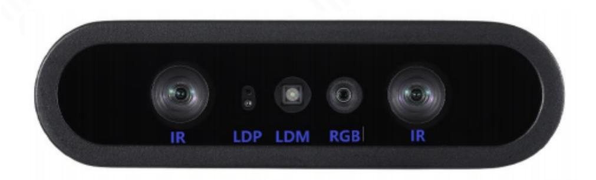
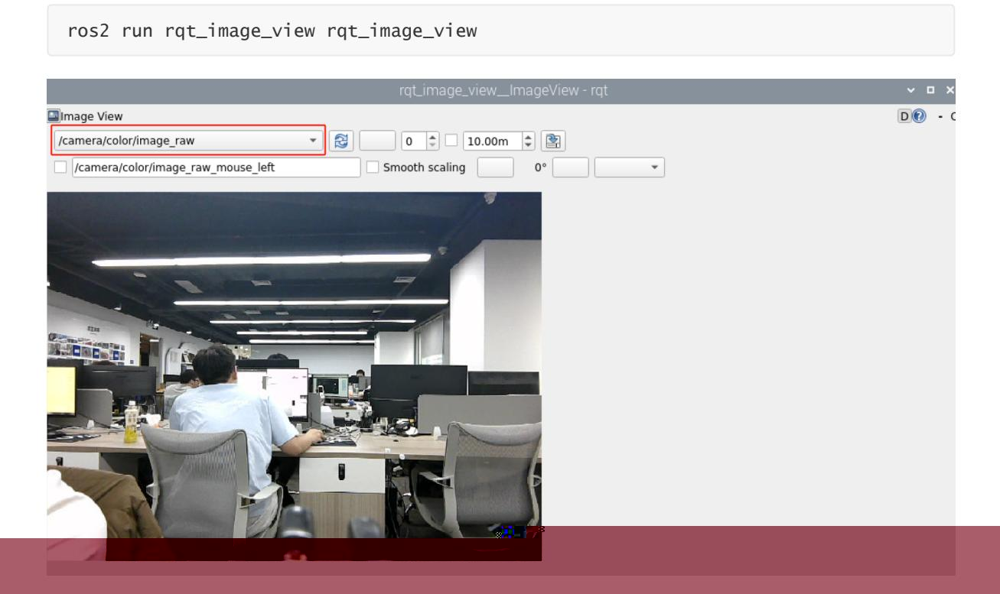
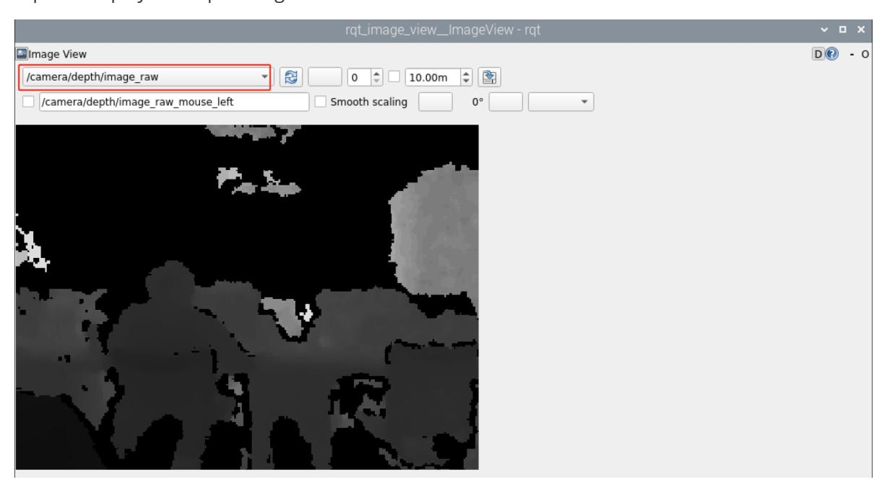
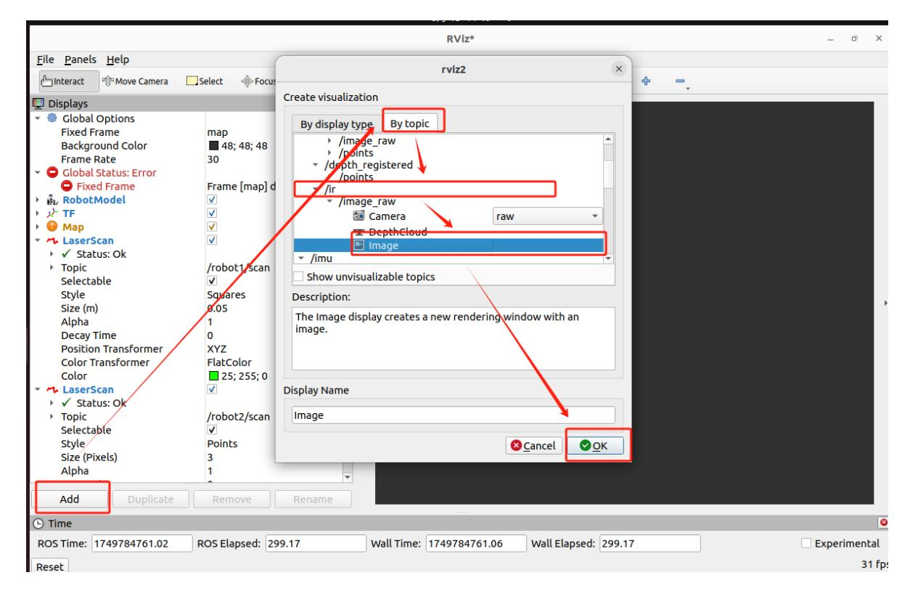
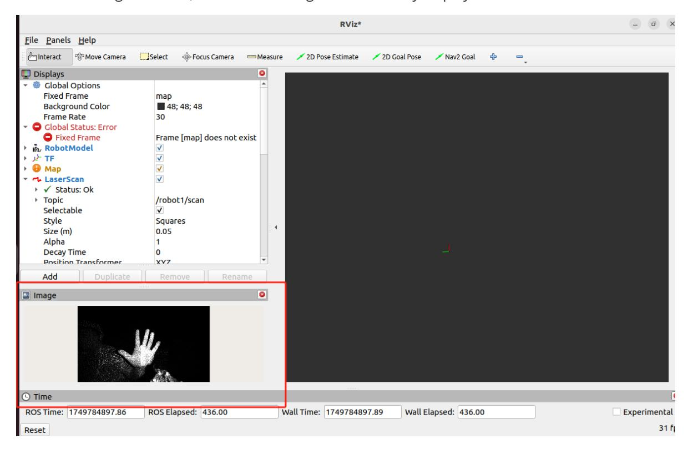
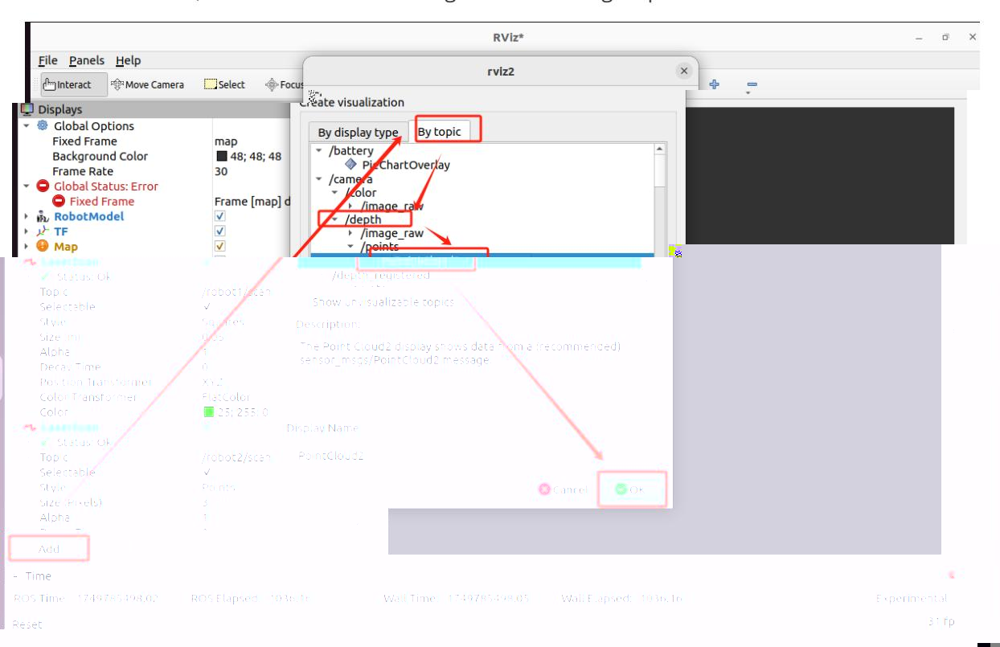
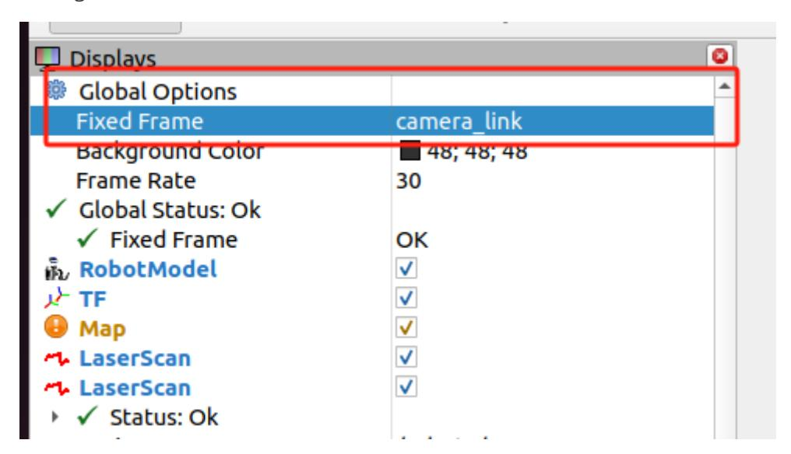
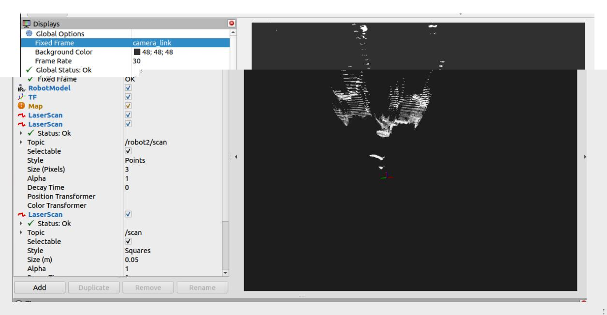
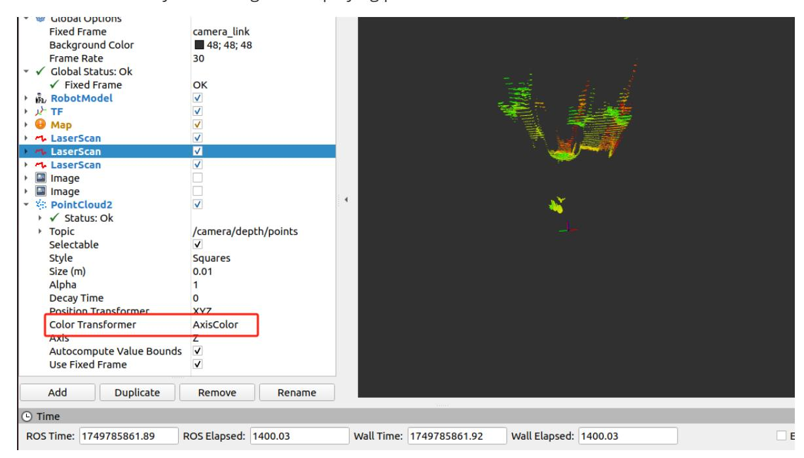
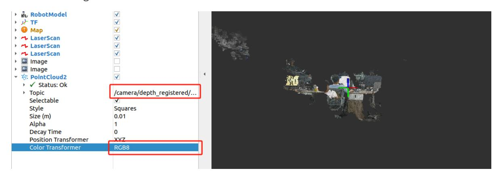

# Dabai_DCW2 Camera Introduction

## 1. Content Description

This tutorial introduces the Dabai_DCW2, an Orbbec depth camera used in this product, and examines how the camera node publishes color images, depth images, infrared images, and point clouds.

This section requires entering commands in the terminal. The terminal you open depends on your motherboard type. This lesson uses the Raspberry Pi 5 as an example. For Raspberry Pi and Jetson Nano boards, you need to open a terminal on the host computer and enter the command to enter the Docker container. Once inside the Docker container, enter the commands mentioned in this section in the terminal. For instructions on entering the Docker container from the host computer, refer to this product tutorial **[Configuration and Operation Guide]--[Enter the Docker (Jetson Nano and Raspberry Pi 5 users, see here)]**.

Simply open the terminal on the Orin motherboard and enter the commands mentioned in this section.

## 2. Camera Introduction

DaBai DCW2/DW2 depth camera is based on binocular structured light 3D imaging technology to obtain the depth image of the object, and uses color

The camera collects color images of objects and is suitable for smart products that perform 3D object scanning at a distance of 0.2m-5m.

Depth data measurement of objects.



IR: Infrared camera

LDP: Laser Dot Projector

LDM: Laser Driver Module

RGB: color camera

Features of DaBai DCW2:

- Low reflective objects: can effectively identify objects with a reflectivity of 5%
- Anti-interference: comprehensively improves electromagnetic compatibility and anti-static capabilities
- Balanced field of view: H-FOV: 91° V-FOV: 62°
- Energy level switching: Provide two energy level modes for customers to adapt
- Depth image: supports up to 640\*400 depth resolution
- Working distance: 0.15m-5m

Depth accuracy: <1%@1m

Interface: USB2.0 Type C

## 3. ROS-driven camera

This product has compiled the ROS SDK of Dabai_DCW2. You can directly enter the following command in the terminal to start the camera. Terminal input,

```
ros2 launch orbbec_camera dabai_dcw2.launch.py
```

The successful camera driving screen is as follows:

If the camera cannot be started, you need to check whether the connection between the camera and the mainboard/Hub expansion board is loose.

You can use the ros2 node tool to view which topics the camera node has published and which services it has provided. Enter the terminal input,

```
ros2 node info /camera/camera
```

The published topics are shown in the figure below.

The services provided are shown in the figure below.

## 4. Subscribe to the image topic to display the image

### 4.1. Subscribe to color images

According to the query node information, we can find that the color image topics are as follows:

/camera/color/image_raw: color image topic /camera/color/image_raw/compressed: compressed color image topic /camera/color/image_raw/compressedDepth: depth compressed color image topic /camera/color/image_raw/theora: color image topic compressed using theora encoder

After the camera is started, you can enter the following command in the terminal to open the rqt_images_view tool and view the image according to the selected image topic. Terminal input,



As shown in the red box in the figure above, the image of the color image topic /camera/color/image_raw is selected.

#### 4.2. Subscribe to depth image

According to the query node information, we can find the following deep image topics:

/camera/depth/image_raw: Depth image topic /camera/depth/image_raw/compressed: Compressed depth image topic /camera/depth/image_raw/compressedDepth: Depth image topic after depth compression /camera/depth/image_raw/theora: Depth image topic compressed using theora encoder

Similarly, we can enter the above-mentioned command in the terminal ros2 run rqt_image_view rqt_image_view to start the rqt_images_view tool, and select the depth image topic to display the depth image.



As shown in the figure above, the depth image of the /camera/depth/image_raw depth image topic is displayed.

### 4.3. Subscribe to infrared images

According to the query node information, the following infrared image topics can be found:

/camera/ir/image_raw: infrared image topic /camera/ir/image_raw/compressed: compressed infrared image topic /camera/ir/image_raw/compressedDepth: depth compressed infrared image topic /camera/ir/image_raw/theora: infrared image topic compressed using theora encoder

rqt_image_view cannot display infrared images, so we need to use RViz to display them. Use a virtual machine to communicate with the car in a distributed manner. Start RViz on the virtual machine to select the plug-in to display the infrared image. Before that, you need to set up distributed communication between the virtual machine and the car. For detailed setting steps, please refer to the [Car Virtual Machine Distributed Communication Settings] in this product tutorial [0. Instructions and Installation Steps]. Open a terminal in the virtual machine and enter the following command to start RViz.



Follow the arrow instructions in the above picture and click [OK] to complete the selection. As shown in the figure below, the infrared image is successfully displayed.



## 5. Subscribe to image point cloud

According to the query node information, it can be found that the camera node has published image point cloud.

/camera/depth/points: 3D depth point cloud information

/camera/depth_registered/points: Registered 3D point cloud topic (depth data (Depth) has been **aligned (registered)** with the color image (RGB), ensuring that each depth point corresponds to the correct color)

Use the RViz tool to display point cloud information. Similarly, you need to set up a virtual machine to communicate with the car in a distributed manner. We rivz2 start RViz by typing in the virtual machine terminal, and then select according to the following steps:



After the selection is completed, we also need to set the coordinate system to camera_link, as shown in the figure below.



As shown in the figure below, the point cloud of the topic /camera/depth/points is displayed.



We can also modify the settings for displaying point clouds.



In [topic], select /camera/depth_registered/points to display the point cloud after aligning the depth and color images; in [Color Transformer], select RGB8 to display the RGB point cloud, as shown in the figure below.


