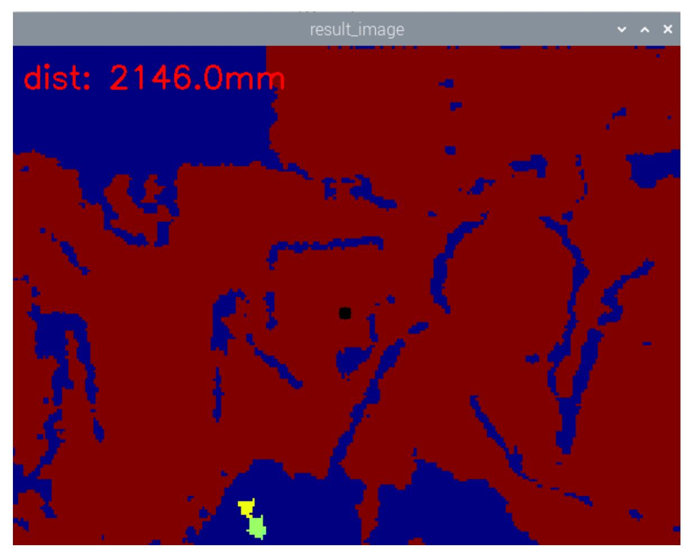

# Depth-Based Distance Measurement

## 1. Content Description

This lesson uses the depth camera to measure distance within the camera's operating range.

This lesson requires terminal commands. Use the terminal that matches your mainboard. This lesson uses Raspberry Pi 5 as the example. Raspberry Pi and Jetson Nano users should open a terminal on the host system, enter the Docker container, and then run the commands from this lesson inside the container. For Docker instructions, see **Configuration and Operation Guide - Enter the Docker (Jetson Nano and Raspberry Pi 5 users, see here)**.

Orin board users can open a terminal directly on the robot and run the commands from this lesson.

## 2. Program Startup

Start the camera:

```bash
ros2 launch orbbec_camera dabai_dcw2.launch.py
```

After the camera starts successfully, open another terminal and start the distance measurement program:

```bash
ros2 run yahboom_M3Pro_DepthCam Measure_Distance
```

After startup, the window appears as shown below.



Click the red area with the mouse to select the point to measure. The selected point turns black, and the depth camera distance is printed in millimeters in the upper-left corner of the image.

## 3. Core Code Analysis

Program code path for Raspberry Pi 5 and Jetson Nano:

```text
/root/yahboomcar_ws/src/yahboom_M3Pro_DepthCam/yahboom_M3Pro_DepthCam/Measure_ Distance.py
```

Program code path for Orin boards:

```text
/home/jetson/yahboomcar_ws/yahboom_M3Pro_DepthCam/yahboom_M3Pro_DepthCam/Measu re_Distance.py
```

Import the required libraries:

```python
from cv_bridge import CvBridge
import cv2
from rclpy.node import Node
import rclpy
from sensor_msgs.msg import Image
import numpy as np
```

Define the depth image decoding formats:

```python
encoding = ['16UC1', '32FC1']
```

Create the subscriber and subscribe to the depth image topic:

```python
self.sub_depth =
self.create_subscription(Image,"/camera/depth/image_raw",self.get_DepthImgCallBa
ck,100)
```

Create `self.depth_bridge` to convert ROS image messages into an image format that OpenCV can process:

```python
self.depth_bridge = CvBridge()
```

Convert the ROS image message into an image:

```python
depth_image = self.depth_bridge.imgmsg_to_cv2(depth_frame, encoding[1])
```

Call `cv2.applyColorMap` to convert the depth map:

```python
depth_to_color_image = cv2.applyColorMap(cv2.convertScaleAbs(depth_image,
alpha=1.0), cv2.COLORMAP_JET)
```

Convert the image data NumPy array into a 32-bit single-precision floating-point array. This keeps floating-point precision for later calculations.

```python
depth_image_info = depth_image.astype(np.float32)
```

Read the depth value of a point. In a 2D image, `(x, y)` identifies a point location.

```python
dist = depth_image_info[self.y,self.x]
```

Process the depth value and draw it on the image:

```python
dist = round(dist,3)
dist = 'dist: ' + str(dist) + 'mm'
cv2.putText(depth_to_color_image, dist, (10, 40), cv2.FONT_HERSHEY_SIMPLEX,
1.0, (0, 0, 255), 2)
```

Use the OpenCV mouse callback to get the clicked point in the valid image area:

```python
cv2.setMouseCallback(self.window_name, self.click_callback)
def click_callback(self, event, x, y, flags, params):
    if event == 1:
        self.x = x
        self.y = y
```

Draw the selected point on the image and display the image:

```python
cv2.circle(depth_to_color_image,(self.x,self.y),1,(0,0,0),10)
cv2.imshow("result_image", depth_to_color_image)
```
