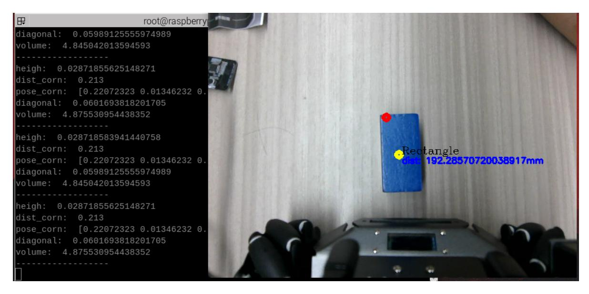

# Depth-Based Object Volume Measurement

## 1. Content Description

This lesson explains how to combine depth information with coordinate-frame transformations to calculate the volume of a wooden block.

This lesson requires terminal commands. Use the terminal that matches your mainboard. This lesson uses Raspberry Pi 5 as the example. Raspberry Pi and Jetson Nano users should open a terminal on the host system, enter the Docker container, and then run the commands from this lesson inside the container. For Docker instructions, see **Configuration and Operation Guide - Enter the Docker (Jetson Nano and Raspberry Pi 5 users, see here)**.

Orin board users can open a terminal directly on the robot and run the commands from this lesson.

## 2. Program Startup

Start the camera and robotic arm kinematics program:

```bash
ros2 launch M3Pro_demo camera_arm_kin.launch.py
```

Robotic arm inverse kinematics is explained in **9. Robotic Arm and 3D Space Gripping - Robotic Arm Inverse Solution**. For this lesson, you only need to understand that kinematics are used to calculate coordinate values.

After starting the camera and robotic arm kinematics program, start the wooden block volume measurement program:

```bash
ros2 run M3Pro_demo estimate_volume
```

After startup, place a rectangular wooden block as close to the camera as practical so the depth information is more accurate. Click inside the image frame, then press the spacebar. Based on the recognized depth information and the robotic arm pose, the program calculates the coordinates of the center point and the shape vertices in the world coordinate system. These values are generally represented as `(x, y, z)` in meters and describe the distance from the `base_link` coordinate frame at `(0, 0, 0)`. The program then combines those coordinates with the recognized block shape to calculate volume. In the example below, the recognized object is a cuboid and the calculated volume is displayed in the terminal.



The cuboid dimensions are `2.8 cm x 2.8 cm x 5.8 cm`. The theoretical volume is `45.472 cm^3`. The remaining error mainly comes from depth measurement error and the virtual servo position.

## 3. Core Code Analysis

Program code path for Raspberry Pi 5 and Jetson Nano:

```text
/root/yahboomcar_ws/src/M3Pro_demo/M3Pro_demo/estimate_volume.py
```

Program code path for Orin boards:

```text
/home/jetson/yahboomcar_ws/src/M3Pro_demo/M3Pro_demo/estimate_volume.py
```

Import the required libraries:

```python
import cv2
import os
import numpy as np
from sensor_msgs.msg import Image, CameraInfo
import message_filters
from cv_bridge import CvBridge
import cv2 as cv
from arm_interface.srv import ArmKinemarics
from arm_interface.msg import AprilTagInfo,CurJoints
from arm_msgs.msg import ArmJoints
from std_msgs.msg import Float32,Bool,Int16
encoding = ['16UC1', '32FC1']
import time
import transforms3d as tfs
import tf_transformations as tf
import yaml
import math
from rclpy.node import Node
import rclpy
from message_filters import Subscriber,
TimeSynchronizer,ApproximateTimeSynchronizer
from sensor_msgs.msg import Image
```

Load the robotic arm offset values to compensate for errors caused by the virtual position:

```
#The robotic arm offset parameter file address in the Docker container for Pi and Jetson
#Nano boards: /root/yahboomcar_ws/src/arm_kin/param/offset_value.yaml
#Orin mainboard docker robot arm offset parameter file address:
/home/jetson/yahboomcar_ws/src/arm_kin/param/offset_value.yaml
offset_file = "/root/yahboomcar_ws/src/arm_kin/param/offset_value.yaml"
with open(offset_file, 'r') as file:
    offset_config = yaml.safe_load(file)
print(offset_config)
print("----------------------------")
print("x_offset: ",offset_config.get('x_offset'))
print("y_offset: ",offset_config.get('y_offset'))
print("z_offset: ",offset_config.get('z_offset'))
```

Subscribe to the depth and color image topics and synchronize them. When the message timestamps are close, the callback function processes the image messages.

```
self.depth_image_sub = Subscriber(self, Image, '/camera/depth/image_raw')
self.rgb_image_sub = Subscriber(self, Image, '/camera/color/image_raw')
self.ts = ApproximateTimeSynchronizer([self.rgb_image_sub,
self.depth_image_sub], 1, 0.5)
self.ts.registerCallback(self.callback)
```

Create a publisher for controlling the six servos and a client for requesting the kinematics service.

```
self.pub_SixTargetAngle = self.create_publisher(ArmJoints, "arm6_joints", 10)
self.client = self.create_client(ArmKinemarics, 'get_kinemarics')
```

Move the robotic arm to the recognition posture and calculate the current end-effector pose.

```python
self.pubSixArm(self.init_joints)
self.get_current_end_pos()
def get_current_end_pos(self):
    request = ArmKinemarics.Request()
    request.cur_joint1 = float(self.init_joints[0])
    request.cur_joint2 = float(self.init_joints[1])
    request.cur_joint3 = float(self.init_joints[2])
    request.cur_joint4 = float(self.init_joints[3])
    request.cur_joint5 = float(self.init_joints[4])
    request.kin_name = "fk"
    #Request to call the inverse solution fk service, that is, calculate the end
pose from the joint of each joint, and the incoming request is the joint value of
each servo of the current robot arm
    future = self.client.call_async(request)
    future.add_done_callback(self.get_fk_respone_callback)
def get_fk_respone_callback(self, future):
    try:
        response = future.result()
        #Get the end position of the robot arm, including xyz representing the
position and rpy representing the posture, and assign them to the self.CurEndPos
array
```

```
#self.get_logger().info(f'Response received: {response.x}')
    self.CurEndPos[0] = response.x
    self.CurEndPos[1] = response.y
    self.CurEndPos[2] = response.z
    self.CurEndPos[3] = response.roll
    self.CurEndPos[4] = response.pitch
    self.CurEndPos[5] = response.yaw
    print("self.CurEndPose: ",self.CurEndPos)
except Exception as e:
    self.get_logger().error(f'Service call failed: {e}')
```

In the image callback function, image processing is used to identify the wooden block shape:

```
rgb_image = self.rgb_bridge.imgmsg_to_cv2(color_frame,'rgb8')
rgb_image = cv2.cvtColor(rgb_image, cv2.COLOR_RGB2BGR)
result_image = np.copy(rgb_image)
#depth_image
depth_image = self.depth_bridge.imgmsg_to_cv2(depth_frame, encoding[1])
frame = cv.resize(depth_image, (640, 480))
depth_to_color_image = cv2.applyColorMap(cv2.convertScaleAbs(depth_image,
alpha=1.0), cv2.COLORMAP_JET)
depth_image_info = frame.astype(np.float32)
#cv2.cvtColor converts the image from BGR to grayscale for subsequent image
processing
gray_image = cv2.cvtColor(depth_to_color_image, cv2.COLOR_BGR2GRAY)
#Create an all-zero array with exactly the same shape and data type as
gray_image
black_image = np.zeros_like(gray_image)
#Assign values to the array and copy the pixel values of the first 420 rows x the
first 640 columns of the grayscale image to the same position in black_image
black_image[0:420, 0:640] = gray_image[0:420, 0:640]
#Threshold black_image and set all pixels with values < 90 to 0 (pure black).
black_image[black_image < 90] = 0
cv2.circle(black_image, (320,240), 1, (255,255,255), 1)
#Gaussian filter to reduce image noise and details
gauss_image = cv2.GaussianBlur(black_image, (3, 3), 1)
#Convert the grayscale image to a binary image (black and white image)
_,threshold_img = cv2.threshold(gauss_image, 0, 255, cv2.THRESH_BINARY)
#Perform corrosion operation on the image to remove noise
erode_img = cv2.erode(threshold_img, np.ones((5, 5), np.uint8))
#Dilution operation on the image to connect the broken edges
dilate_img = cv2.dilate(erode_img, np.ones((5, 5), np.uint8))
#Find the contour according to the image and perform shape analysis. The returned
contours are a list of contour points.
contours, hierarchy = cv2.findContours(dilate_img, cv2.RETR_EXTERNAL,
cv2.CHAIN_APPROX_NONE)
#Traverse each contour point list
for obj in contours:
    area = cv2.contourArea(obj)
    if area < 2000 :
        continue
    #Draw the contour function to visualize the detected object contours
    cv2.drawContours(depth_to_color_image, obj, -1, (255, 255, 0), 4)
    #Calculate the perimeter of the object
    perimeter = cv2.arcLength(obj, True)
    #Approximate the contour into a simpler polygon
```

```
approx = cv2.approxPolyDP(obj, 0.035 * perimeter, True)
    self.corners = approx
    #print("self.corners: ",self.corners)
    cv2.drawContours(depth_to_color_image, approx, -1, (255, 0, 0), 4)
    # Calculate the number of edges
    CornerNum = len(approx)
    #print(CornerNum)
    x, y, w, h = cv2.boundingRect(approx)
    #4 sides indicate a rectangle, determine whether it is a rectangle or a
square
    if CornerNum == 4:
        side_lengths = []
        for i in range(4):
            p1 = approx[i]
            p2 = approx[(i + 1) % 4]
            side_lengths.append(np.linalg.norm(p1 - p2)) # Calculate the
distance between two points
        #Calculate the length of adjacent edges
        side_lengths = np.array(side_lengths)
#Judge the error of two adjacent sides. If the error is within the range, the
adjacent sides are considered equal, which is a square, otherwise it is a
rectangle
        if np.allclose(side_lengths[1], side_lengths[0], atol=50): # Allow some
small errors
            objType = "Square"
        else:
            objType = "Rectangle"
    #According to actual needs, if the number of sides is greater than 5, it is
considered a circle, that is, the top of the cylinder
    elif CornerNum > 5:
        objType = "Cylinder"
    else:
        objType = "None"
```

Get the minimum-area enclosing rectangle for the contour and return the rectangle center point.

```
rect = cv2.minAreaRect(obj)
center = rect[0]
```

Calculate the pose of the center point in the world coordinate system.

```python
cx = int(center[0])
cy = int(center[1])
dist = depth_image_info[int(cy),int(cx)]/1000
pose = self.compute_heigh(cx,cy,dist)
def compute_heigh(self,x,y,z):
    #Conversion from plane to camera coordinate system
    camera_location = self.pixel_to_camera_depth((x,y),z)
    #print("camera_location: ",camera_location)
    #Conversion from camera coordinate system to end coordinate system
    PoseEndMat = np.matmul(self.EndToCamMat,
self.xyz_euler_to_mat(camera_location, (0, 0, 0)))
```

```
#PoseEndMat = np.matmul(self.xyz_euler_to_mat(camera_location, (0, 0,
0)),self.EndToCamMat)
    #Get the end pose
    EndPointMat = self.get_end_point_mat()
    #Conversion from the end coordinate system to the world coordinate system
    WorldPose = np.matmul(EndPointMat, PoseEndMat)
    #Convert the 4*4 matrix representing the pose into translation and
orientation, where pose_T stores the xyz values, and the actual values also
include the offset of the robotic arm
    pose_T, pose_R = self.mat_to_xyz_euler(WorldPose)
    pose_T[0] = pose_T[0] + self.x_offset
    pose_T[1] = pose_T[1] + self.y_offset
    pose_T[2] = pose_T[2] + self.z_offset
    #print("pose_T: ",pose_T)
    #print("pose_R: ",pose_R)
    return pose_T
```

x value: The point's x-axis distance from `base_link`.

y value: The point's y-axis distance from `base_link`.

z value: The point's z-axis distance from `base_link`, which can be treated as height.

After obtaining each point in the world coordinate system, the program can calculate side lengths according to the recognized shape. For a cube, only the `z` value is needed because all side lengths are equal, so the volume is the side length cubed.

```
if objType == "Square":
    volume = pose[2]**3* 100000 # cubic centimeters
    print("volume: ",volume)
    print("------------------")
```

To calculate cuboid volume, the program first calculates one side length. The side length can be calculated from the distance between two vertices using Euclidean distance. In this example, the distance between the vertex and the center is used to obtain half of the diagonal length. The volume is then calculated from the diagonal length and height.

```
elif objType == "Rectangle":
    corn_x = self.corners[0][0][0] *1.01
    corn_y = self.corners[0][0][1] *1.01
    cv2.circle(rgb_image, (int(corn_x),int(corn_y)), 5, (0,0,255), 5)
    cv2.circle(rgb_image, (int(center[0]),int(center[1])), 5, (0,255,255), 5)
    dist_corn = depth_image_info[int(corn_y),int(corn_x)]/1000
    print("dist_corn: ",dist_corn)
    if dist_corn!=0:
        pose_corn = self.compute_heigh(corn_x,corn_y,dist_corn)
        print("pose_corn: ",pose_corn)
        diagonal = math.sqrt((pose[1] - pose_corn[1]) ** 2 + (pose[0] -
pose_corn[0])** 2) * 2 #diagonal meters
        print("diagonal: ",diagonal)
        volume = pose_corn[2]**2 * math.sqrt(diagonal**2 - pose_corn[2]**2)*
100000 # cubic centimeters
```

```
print("volume: ",volume)
print("------------------")
```

For a cylinder, the program calculates the distance between a contour point and the center point to obtain the radius of the top circle, then calculates volume using the cylinder volume formula.

```
elif objType == "Cylinder":
    corn_x = self.corners[0][0][0] *1.01
    corn_y = self.corners[0][0][1] *1.01
    cv2.circle(rgb_image, (int(corn_x),int(corn_y)), 5, (0,0,255), 5)
    cv2.circle(rgb_image, (int(center[0]),int(center[1])), 5, (0,255,255), 5)
    dist_corn = depth_image_info[int(corn_y),int(corn_x)]/1000
    print("dist_corn: ",dist_corn)
    if dist_corn!=0:
        pose_corn = self.compute_heigh(corn_x,corn_y,dist_corn)
        print("pose_corn: ",pose_corn)
        radius = math.sqrt((pose[1] - pose_corn[1]) ** 2 + (pose[0] -
pose_corn[0])** 2) #radius meters
        print("radius: ",radius)
        volume = pose_corn[2] * radius **2 *math.pi * 100000 #cubic centimeters
        print("volume: ",volume)
        print("------------------")
```
