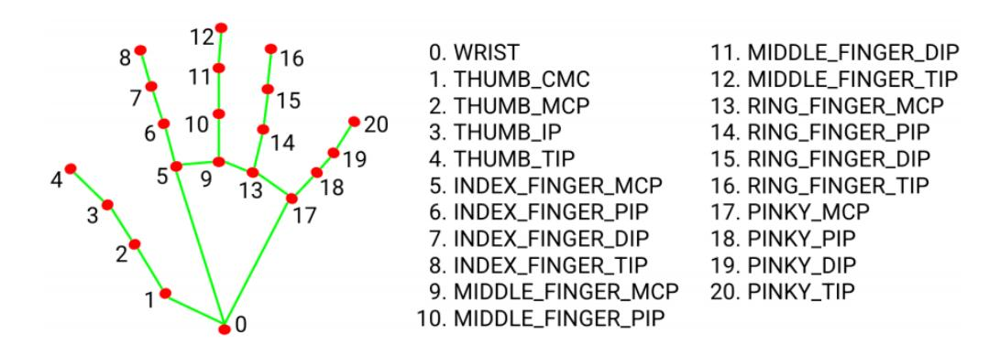
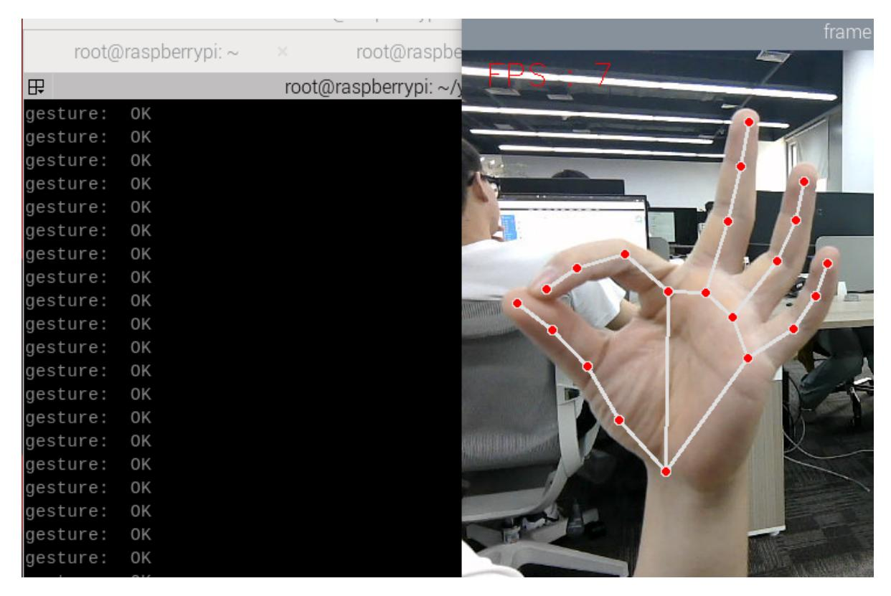
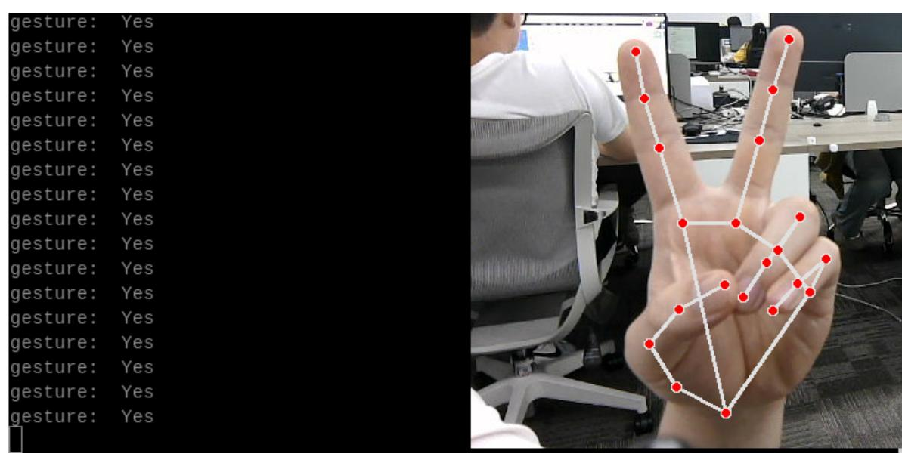
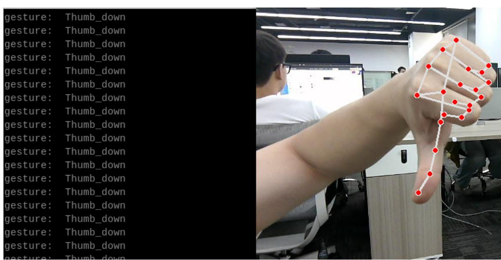

# Mediapipe gesture recognition

### 1. Content Description

This lesson explains how to subscribe to an image topic to retrieve images and use MediaPipe for gesture recognition.

This section requires entering commands in the terminal. The terminal you open depends on your motherboard type. This lesson uses the Raspberry Pi 5 as an example. For Raspberry Pi and Jetson Nano boards, you need to open a terminal on the host computer and enter the command to enter the Docker container. Once inside the Docker container, enter the commands mentioned in this section in the terminal. For instructions on entering the Docker container from the host computer, refer to this product tutorial **[Configuration and Operation Guide]--[Enter the Docker (Jetson Nano and Raspberry Pi 5 users, see here)]**.

#### About Mediapipe:

MediaPipe is a data stream processing and machine learning application development framework developed and open-sourced by Google. It is a graph-based data processing pipeline used to build applications that utilize a variety of data sources, such as video, audio, sensor data, and any time series data. MediaPipe is cross-platform and can run on embedded platforms (such as the Raspberry Pi), mobile devices (iOS and Android), workstations, and servers, and supports mobile GPU acceleration. MediaPipe provides a cross-platform, customizable ML solution for real-time and streaming media. The core framework of MediaPipe is implemented in C++, with support for languages such as Java and Objective C. Key concepts in MediaPipe include packets, streams, calculators, graphs, and subgraphs.

#### Mediapipe Hands

MediaPipe Hands is a high-fidelity hand and finger tracking solution. It uses machine learning (ML) to infer 21

After palm detection in the entire image, the 21 3D hand joint coordinates in the detected hand region are accurately located by regression based on the hand landmark model, i.e. direct coordinate prediction. The model learns a consistent internal hand pose representation, even for partially visible hands and

It is also robust to occlusion. To obtain ground truth data, we manually annotated approximately 30K real-world images with 21 3D coordinates, as shown below. To better cover possible hand poses and provide additional supervision on the properties of hand geometry, we also rendered high-quality synthetic hand models against various backgrounds and mapped them to corresponding 3D coordinates.



Therefore, as long as we can obtain the coordinate value of each joint, we can perform gesture recognition through calculation.

### 2. Program startup

First, in the terminal, enter the following command to start the camera,

```
ros2 launch orbbec_camera dabai_dcw2.launch.py
```

After successfully starting the camera, open another terminal and enter the following command in the terminal to start the mediapipe gesture recognition program.

```
ros2 run M3Pro_demo mediapipe_gesture
```

After the program is started, as shown in the figure below, it can recognize three gestures: [OK], [Yes] and [Thumb_down].







## 3. Core code analysis

Program code path:

Raspberry Pi 5 and Jetson Nano board The path in docker

is /root/yahboomcar_ws/src/M3Pro_demo/M3Pro_demo/mediapipe_gesture.py

Orin Motherboard

The program code path is /home/jetson/yahboomcar_ws/src/M3Pro_demo/M3Pro_demo/mediapipe_gesture.py

Import the necessary library files,

```
import cv2
import os
from sensor_msgs.msg import Image
import message_filters
from cv_bridge import CvBridge
import cv2 as cv
from arm_msgs.msg import ArmJoints
import time
from M3Pro_demo.media_library import *
```

```
from rclpy.node import Node
import rclpy
from message_filters import Subscriber,
TimeSynchronizer,ApproximateTimeSynchronizer
from sensor_msgs.msg import Image
import threading
```

Initialize some variables and create subscribers and publishers,

```
def __init__(self, name):
    super().__init__(name)
    self.init_joints = [90, 150, 12, 20, 90, 0]
    self.rgb_bridge = CvBridge()
    #Create an object recognized by Medipipe
    self.hand_detector = HandDetector()
    self.pr_time = time.time()
    self.pTime = self.cTime = 0
    #Subscribe to the publisher, publish the initial position of the robotic arm,
and control the movement of the robotic arm to the posture of the recognized
gesture
    self.TargetAngle_pub = self.create_publisher(ArmJoints, "arm6_joints", 10)
    #Create a color image topic subscriber
    self.rgb_image_sub = Subscriber(self, Image, '/camera/color/image_raw')
    #Publish initial recognition posture
    self.pubSix_Arm(self.init_joints)
    self.ts = ApproximateTimeSynchronizer([self.rgb_image_sub], 1, 0.5)
    self.ts.registerCallback(self.callback)
    time.sleep(2)
    self.start_time = 0.0
```

Color image callback function and image processing,

```
def callback(self,color_msg):
    rgb_image = self.rgb_bridge.imgmsg_to_cv2(color_msg, "bgr8")
    self.process(rgb_image)
def process(self, frame):
     #Call the function to find the palm in the Medipipe recognition class
    frame, lmList, bbox = self.hand_detector.findHands(frame)
    #Judge the length of lmList. If it is greater than 0, it means the palm is
found.
    if len(lmList) != 0:
        # Enter the thread to process the gesture recognition function, the
parameter passed in is lmList
        gesture = threading.Thread(target=self.Gesture_Detect_threading, args=
(lmList,bbox))
        gesture.start()
        gesture.join()
        self.cTime = time.time()
        fps = 1 / (self.cTime - self.pTime)
        self.pTime = self.cTime
        text = "FPS : " + str(int(fps))
        cv.putText(frame, text, (20, 30), cv.FONT_HERSHEY_SIMPLEX, 0.9, (0, 0,
255), 1)
        if cv.waitKey(1) & 0xFF == ord('q'):
            cv.destroyAllWindows()
```

```
cv.imshow('frame', frame)
def Gesture_Detect_threading(self, lmList,bbox):
    #Call the function to get gesture in Medipipe recognition class
    gesture = self.hand_detector.get_gesture(lmList)
    print("gesture: ",gesture)
```

The definition of the Medipipe recognition class can be found in the media_library library, which is located in the directory of the M3Pro_demo function package.

Raspberry Pi 5 and Jetson Nano board

The path in docker is /root/yahboomcar_ws/src/M3Pro_demo/M3Pro_demo/media_library.py

Orin Motherboard

The program code path is /home/jetson/yahboomcar_ws/src/M3Pro_demo/M3Pro_demo/media_library.py

In this library, we use the native library of meidiapipe to expand and define many classes. Each class defines different functions. When we need them, we can pass the parameters into them. For example, we define the following function in the HandDetector class.

- findHands: Find hands
- fingersUp: fingers extended straight down
- ThumbTOforefinger: Detects the angle between the thumb and index finger
- get_gesture: Detect gestures
