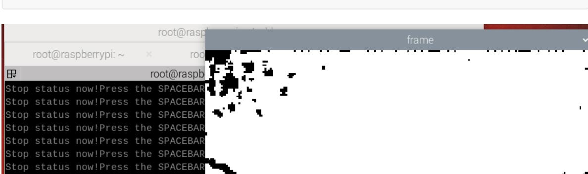
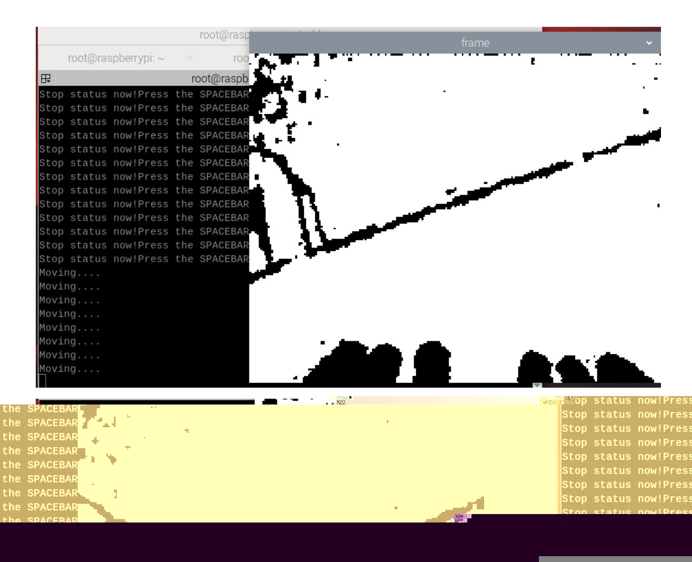

# Edge detection

## 1. Content Description

This lesson explains how to use depth imaging for edge detection. Combined with the chassis, this allows the robot to stop at an edge, preventing the risk of a fall. This can be expanded to include depth imaging for obstacle avoidance.

This section requires entering commands in the terminal. The terminal you open depends on your motherboard type. This lesson uses the Raspberry Pi 5 as an example. For Raspberry Pi and Jetson Nano boards, you need to open a terminal on the host computer and enter the command to enter the Docker container. Once inside the Docker container, enter the commands mentioned in this section in the terminal. For instructions on entering the Docker container from the host computer, refer to this product tutorial **[Configuration and Operation Guide]--[Enter the Docker (Jetson Nano and Raspberry Pi 5 users, see here)]**.

## 2. Program startup

First, in the terminal, enter the following command to start the camera,

```bash
ros2 run yahboom_M3Pro_DepthCam edge_detection
```

```bash
ros2 launch orbbec_camera dabai_dcw2.launch.py
```

After successfully starting the camera, open another terminal and enter the following command in the terminal to start the edge detection program.



As shown in the figure above, after the program is started, it will print and display that the current state is stopped. Press the space bar to change the state. After pressing the space bar, if the robot does not detect an edge, it will move forward and print "Moving..."; if it detects an edge, it will stop and print "Stop!!!".



## 3. Core code

Program code path:

Raspberry Pi 5 and Jetson Nano board

The program code is in the running docker. The path in docker is /root/yahboomcar_ws/src/yahboom_M3Pro_DepthCam/yahboom_M3Pro_DepthCam/Edge_ Detection.py

Orin Motherboard

The program code path is /home/jetson/yahboomcar_ws/yahboom_M3Pro_DepthCam/yahboom_M3Pro_DepthCam/Ed ge_Detection.py

Import the necessary library files,

```python
import rclpy
from rclpy.node import Node
from sensor_msgs.msg import Image
from geometry_msgs.msg import Twist
from arm_msgs.msg import ArmJoints
from cv_bridge import CvBridge
import cv2
import numpy as np
import threading
```

Depth image decoding format,

```
encoding = ['16UC1', '32FC1']
```

Initialize variables and define publishers and subscribers,

```python
def __init__(self, name):
    super().__init__(name)
    #Define the posture of the robotic arm to identify the edge downwards
    self.init_joints = [90, 120, 0, 0, 90, 90]
    self.pub_vel = self.create_publisher(Twist,'/cmd_vel',1)
    self.TargetAngle_pub = self.create_publisher(ArmJoints, "arm6_joints", 10)
    self.sub_depth =
self.create_subscription(Image,"/camera/depth/image_raw",self.get_DepthImageCall
Back,100)
    self.pubSix_Arm(self.init_joints)
    #The car's forward speed
    self.lin_x = 0.1
    self.depth_bridge = CvBridge()
    #Parking/Moving signs
    self.move_flag = False
```

Depth image topic callback function, and calculate the center point depth distance information,

```python
def get_DepthImageCallBack(self,msg):
    depth_image = self.depth_bridge.imgmsg_to_cv2(msg, encoding[1])
    #Call the thread to pass in the acquired depth image and calculate the depth
information
    compute_ = threading.Thread(target=self.compute_dist, args=(depth_image,))
    compute_.start()
    compute_.join()
    key = cv2.waitKey(10)
    if key == 32:
        self.move_flag = True
    cv2.imshow("frame", depth_image)
def compute_dist(self,result_frame):
    frame = cv2.resize(result_frame, (640, 480))
    depth_image_info = frame.astype(np.float32)
    #Judge whether the current state is moving. If so, judge the distance to the
center point. If not, call the function, issue a parking instruction, and print
the information.
    if self.move_flag == True:
```

```
#Judge whether the depth information of the center point, that is, the
point x=320, y=240, is greater than 0.5m. If so, call the function to issue a
stop command. If not, call the function to issue a forward command.
        if depth_image_info[240, 320]/1000>0.5:
            self.pubVel(0,0,0)
            self.move_flag = False
            print("Stop!!!")
        else:
            self.pubVel(self.lin_x,0,0)
            print("Moving....")
    else:
        self.pubVel(0,0,0)
        print("Stop status now!Press the SPACEBAR to change the state.")
```

Release speed function,

```python
def pubVel(self,vx,vy,vz):
    vel = Twist()
    vel.linear.x = float(vx)
    vel.linear.y = float(vy)
    vel.angular.z = float(vz)
    self.pub_vel.publish(vel)
```

Three variables are passed in: the speed in the x-direction, the speed in the y-direction, and the angular velocity. After assigning the values, self.pub_vel.publish(vel) the speed topic is called.
