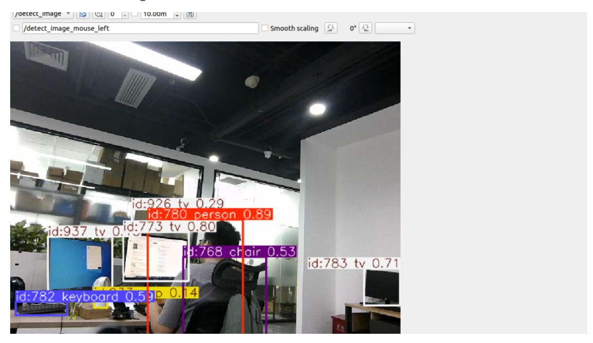

# YOLOv8 Object Detection

## 1. Content Description

This section is exclusive to the **Orin motherboard** and primarily introduces the YOLOv8 framework and its use for object detection.

### 1.1 Introduction to YOLOv8

YOLOv8 is an object detection model launched by Ultralytics in 2023. Compared to previous versions (such as YOLOv5), it offers significant improvements in accuracy, speed, and ease of use. It is widely used in computer vision tasks such as object detection, image segmentation, and pose estimation.

#### YOLOv8 Features:

- **Architecture Upgrade**: Using **CSPDarknet53** as the underlying backbone network, combined with an improved feature fusion network (PAN-FPN), it enhances the ability to extract multi-scale features.
- **Detection Head Optimization**: Adopting an **Anchor-Free** design, it directly predicts the center point, width, and height of the object, avoiding the limitations of the pre-set anchor box size in traditional anchor-based methods. This simplifies model design and improves small object detection accuracy.
- **Loss Function Improvement**: The classification loss uses **Varifocal Loss** (optimized for class imbalance), and the localization loss combines **CIoU Loss** and \*\*DFL (Distribution Focal Loss) to improve the accuracy of bounding box prediction.
- **Multi-Task Support**: In addition to object detection, it also supports **Instance Segmentation** (mask-based object segmentation) and **Pose Estimation** (human keypoint detection), while maintaining a unified model architecture.
- **Engineering Optimization**: Provides a concise Python API and command-line tools, and supports export to formats such as ONNX and TensorRT, facilitating deployment on edge devices or the cloud.

#### YOLOv application scenarios:

- Real-time monitoring (such as pedestrian and vehicle detection)
- Autonomous driving (obstacle recognition)
- Robotic vision (object grasping)
- Industrial quality inspection (defect detection), etc.

Visit the official website [Explore Ultralytics YOLOv8 - Ultralytics YOLO Docs](https://docs.ultralytics.com/models/yolov8/#performance-metrics) to download the trained model and learn more about using YOLOv8.

## 2. Program Startup

Enter the following command in the terminal to start the camera:

```bash
ros2 launch orbbec_camera dabai_dcw2.launch.py
```

Next, open another terminal and enter the following command to start YOLOv8 object detection:

```bash
ros2 run yahboom_yolov8 yolov8_detect
```

Then open a third terminal and enter the following command to start rqt_image_view to view the image:

```bash
ros2 run rqt_image_view rqt_image_view
```

Select the topic /detect_image in the upper left corner and click the refresh button on the right to view the detected image, as shown below.



## 3. Core Code Analysis

Code Path: /home/jetson/yahboomcar_ws/src/yahboom_yolov8/yahboom_yolov8/yolov8_track.py Import necessary library files:

```python
import cv2
import numpy as np
from collections import OrderedDict, namedtuple
import time
import torch
import sys
sys.path.append('/home/jetson/yahboomcar_ws/src/yahboom_yolov8/yahboom_yolov8/yo
lov8')
from ultralytics.utils.ops import non_max_suppression, scale_boxes
from ultralytics import YOLO
import rclpy
from rclpy.node import Node
from sensor_msgs.msg import Image
from cv_bridge import CvBridge
#Created a YOLO model instance
model =
YOLO('/home/jetson/yahboomcar_ws/src/yahboom_yolov8/yahboom_yolov8/yolov8/weight
s/yolov8n.pt')
```

Program initialization, definition of publishers and subscribers,

```python
def __init__(self,name):
    super().__init__(name)
    self.rgb_bridge = CvBridge()
    self.msg2img_bridge = CvBridge()
    self.yolov8_img_pub = self.create_publisher(Image,"detect_image",1)
    self.sub_rgb =
self.create_subscription(Image,"/camera/color/image_raw",self.get_RGBImageCallBa
ck,100)
```

Color topic callback function get_RGBImageCallBack,

```python
def get_RGBImageCallBack(self,rgb_msg):
    rgb_image = self.msg2img_bridge.imgmsg_to_cv2(rgb_msg, "rgb8")
    self.process(rgb_image)
```

Image processing function process,

```python
def process(self,frame):
    #The loaded YOLOv8 model tracks the target for a single input frame and
returns an object containing the tracking results. This object contains not only
the conventional detection results (target category, confidence, bounding box
coordinates), but also the track_id of each target (a unique identifier used to
distinguish different targets).
    results = model.track(frame, persist=True)
    #Overlay detection/tracking information (such as bounding boxes, category
labels, confidence levels, tracking IDs, etc.) on the original image to generate
a new annotated image. results[0] represents the processing result of the first
frame.
    annotated_frame = results[0].plot()
    ros_image = self.rgb_bridge.cv2_to_imgmsg(annotated_frame, encoding='rgb8')
    self.yolov8_img_pub.publish(ros_image)
```
