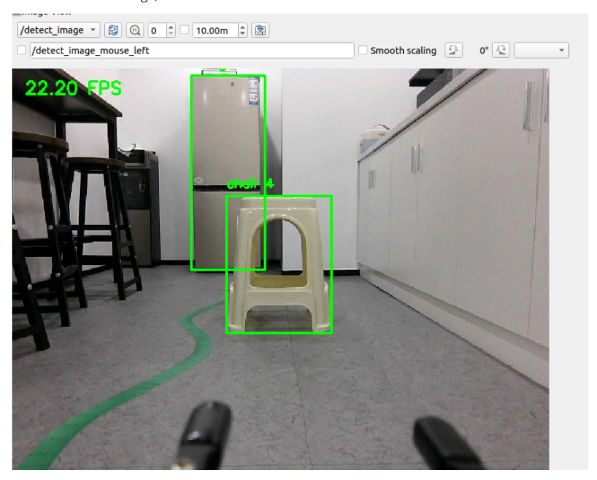
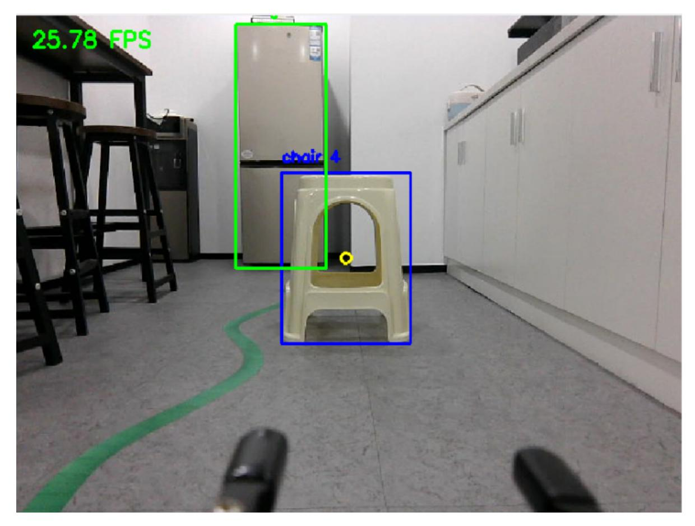

# Deep Learning Object Tracking

## 1. Content Description

This section is exclusive to the Orin motherboard and primarily introduces optimizing the YOLOv8 object detection framework using TensorRT. Users control the robot to track a target by selecting a track_id.

### 1.1 Introduction to TensorRT

TensorRT is a high-performance deep learning inference optimization SDK (Software Development Kit) released by NVIDIA. It is primarily used to optimize trained deep learning models to improve their inference efficiency (speed and throughput) on NVIDIA GPUs. It is widely used in real-time inference scenarios in fields such as computer vision and natural language processing, such as autonomous driving, robotics, and video analysis.

Core Features and Benefits:

- **Model Optimization**
- **Operator Fusion**: Combines multiple consecutive operations (such as convolution + activation function) into a single optimized operator, reducing computational overhead and memory access. - **Precision Calibration**: Supports converting models from FP32 (singleprecision floating point) to FP16 (half-precision) or INT8 (integer) with minimal loss of accuracy, significantly improving computation speed and reducing memory usage.
- **Inter-Layer Optimization**: Adjusts the execution order and computational methods of layers based on GPU hardware features (such as Tensor Cores) to maximize hardware utilization.
- **Efficient Inference Engine**

Optimized models are converted to a TensorRT-specific inference engine. This engine is binary code compiled for specific GPU hardware and can run directly and efficiently on the GPU, avoiding the redundant computation and overhead of general-purpose frameworks.

#### Multi-Framework Support

Models trained in various deep learning frameworks can be imported, including PyTorch, TensorFlow, and ONNX. (ONNX is a common intermediate format; most frameworks can be exported as ONNX models and then imported into TensorRT.)

#### Low Latency and High Throughput

TensorRT-optimized models typically achieve several times or even dozens of times faster inference speeds. They also support batch inference and concurrent processing, making them ideal for scenarios with high real-time requirements, such as real-time object detection in autonomous driving.

In this lesson, converting the YOLOv8.pt model to the TensorRT engine significantly improves inference speed on the Orin motherboard, meeting real-time requirements.

## 2. Program Startup

Enter the following commands in the terminal to start the camera and radar:

```bash
ros2 launch yahboom_yolov8 yolov8_deep_track.launch.py
```

Open another terminal and enter the following command to start the tracking program:

```bash
ros2 run yahboom_yolov8 yolov8_track
```

Then, open a third terminal and enter the following command to start rqt_image_view to view the image:

```bash
ros2 run rqt_image_view rqt_image_view
```

Select the topic /detect_image in the upper left corner and click the refresh button on the right to view the detected image, as shown below.



Then, based on the ID in the image, enter the following command to publish to the target topic /track_id. For example, if we want to track an object with ID 4, enter the following command and press Enter to publish the message.

```bash
ros2 topic pub /tracker_id std_msgs/msg/Int16 "data: 4" --once
```

After publishing, the tracked object will be outlined in a blue box, as shown below.



Then slowly move the object, and the robot will slowly follow it. The program will adjust the robot so that the center point of the tracked object (yellow circle) is near the center of the screen. After completing left and right tracking, the robot will maintain a distance of 1.2 meters from the object based on radar information.

## 3. Core Code Analysis

Import the necessary library files.

```python
import cv2
import numpy as np
from collections import OrderedDict, namedtuple
import time
import torch
import sys
sys.path.append('/home/jetson/yahboomcar_ws/src/yahboom_yolov8/yahboom_yolov8/yo
lov8')
import tracker_trt
from ultralytics.utils.ops import non_max_suppression, scale_boxes
import tensorrt as trt
import rclpy
from rclpy.node import Node
from sensor_msgs.msg import Image
from std_msgs.msg import Int16
from cv_bridge import CvBridge
from yahboom_yolov8.Robot_Move import *
from yahboom_yolov8.common import *
from geometry_msgs.msg import Twist
from arm_msgs.msg import ArmJoints
from sensor_msgs.msg import LaserScan
import math
import os
```

The image preprocessing function letterbox returns the processed image im, the scaling factor r, and the padding (dw, dh) (which can be used to map the coordinates of the model output back to the original image).

```python
def letterbox(im, new_shape=(640, 640), color=(114, 114, 114), auto=False,
scaleup=True, stride=32):
    # Resize and pad image while meeting stride-multiple constraints
    shape = im.shape[:2] # current shape [height, width]
    if isinstance(new_shape, int):
        new_shape = (new_shape, new_shape)
    # Scale ratio (new / old)
    r = min(new_shape[0] / shape[0], new_shape[1] / shape[1])
    if not scaleup: # only scale down, do not scale up (for better val mAP)
        r = min(r, 1.0)
    # Compute padding
    new_unpad = int(round(shape[1] * r)), int(round(shape[0] * r))
    dw, dh = new_shape[1] - new_unpad[0], new_shape[0] - new_unpad[1] # wh
padding
    if auto: # minimum rectangle
        dw, dh = np.mod(dw, stride), np.mod(dh, stride) # wh padding
    dw /= 2 # divide padding into 2 sides
    dh /= 2
    if shape[::-1] != new_unpad: # resize
        im = cv2.resize(im, new_unpad, interpolation=cv2.INTER_LINEAR)
    top, bottom = int(round(dh - 0.1)), int(round(dh + 0.1))
    left, right = int(round(dw - 0.1)), int(round(dw + 0.1))
    im = cv2.copyMakeBorder(im, top, bottom, left, right, cv2.BORDER_CONSTANT,
value=color) # add border
    return im, r, (dw, dh)
```

The image preprocessing function preprocess is used to convert the original input image into an input format acceptable to the model, and returns the processed model input tensor img, the original image image, the padding dw and dh ( dw / dh are used to subsequently map the bounding box predicted by the model from the processed image back to the original image).

```python
def preprocess(image, imgsz=640):
    img, ratio, (dw, dh) = letterbox(image, imgsz, stride=32, auto=False)
    img = cv2.cvtColor(img, cv2.COLOR_BGR2RGB)
    img = img.transpose((2, 0, 1))
    img = np.ascontiguousarray(img)
    img = torch.from_numpy(img).to(torch.device('cuda:0')).float()
    img /= 255.0
    return img, image, dw, dh
```

The post-processing function post_process is mainly used to process the detection results output by the model (such as coordinate mapping) and organize the results into a format that is convenient for subsequent use. At the same time, it prepares for drawing bounding boxes on the original image and returns the original image img and the organized detection results list detections.

```python
def post_process(img, det, frames):
    """
    Draw bounding boxes on the input image.
    """

    detections = []
    if len(det):
        # Rescale boxes from img_size to im0 size
        det[:, :4] = scale_boxes(frames.shape[2:], det[:, :4],
    img.shape).round()
        for *xyxy, conf, cls in reversed(det):
            label = f'{names[int(cls)]} {conf:.2f}'
            cls_id = int(cls)
            cls1 = names[int(cls)]
            detections.append((int(xyxy[0]), int(xyxy[1]), int(xyxy[2]),
    int(xyxy[3]), cls1, conf.item()))
    return img, detections
```

The program initializes and creates publishers and subscribers,

```python
def __init__(self, weight, thres=0.60, size=640, video_path='', batch_size=3) ->
None:
    super().__init__('yolov8_node')
    self.video_path = video_path
    self.imgsz = size
    #Engine file, the file address is
/home/jetson/yahboomcar_ws/src/yahboom_yolov8/yahboom_yolov8/yolov8/weights/yolo
v8s.trt
    self.weight = weight
    self.iou_thres = thres
    self.batch_size = batch_size
    #Specify the device used for PyTorch calculations as NVIDIA GPU number 0
    self.device = torch.device('cuda:0')
    #Initialize the engine
    self.init_engine()
    self.frame = None
    self.rgb_bridge = CvBridge()
    self.msg2img_bridge = CvBridge()
    self.TargetAngle_pub = self.create_publisher(ArmJoints, "arm6_joints", 10)
    self.yolov8_imq_pub = self.create_publisher(Image,"detect_image",1)
    self.cmd_pub = self.create_publisher(Twist,"/cmd_vel",1)
    self.sub_rqb =
self.create_subscription(Image,"/camera/color/image_raw",self.get_RGBImageCallBa
ck.1)
    self.sub_laser =
self.create_subscription(LaserScan, "/scan", self.registerScan, 1)
    self.trackered_id = None
    self.sub_t_id =
self.create_subscription(Int16,"/tracker_id",self.get_IDCallBack,100)
    self.vel = Twist()
    self.angular_PID = (0.5, 0.0, 0.3)
    self.lin_pid = SinglePID(0.5, 0.0, 0.1)
    self.angular_pid = simplePID(self.angular_PID[0] / 100.0,
self.angular_PID[1] / 100.0, self.angular_PID[2] / 100.0)
    self.found = False
    self.joy_ctrl = False
    self.init_joints = [90, 178, 0, 0, 90, 90]
```

```
while not self.TargetAngle_pub.get_subscription_count():
    self.pubSix_Arm(self.init_joints)
    time.sleep(0.1)
self.pubSix_Arm(self.init_joints)
self.img_list = []
self.original_frames = []
self.LaserAngle = 5
self.depth_image_info = []
self.depth_bridge = CvBridge()
self.rotation_done = False
self.ResponseDist = 1.2
```

Initialize the engine init_engine, the method to initialize the TensorRT reasoning engine, its main function is to load the precompiled TensorRT engine file, parse the engine's input and output information, and complete the initialization of the reasoning environment to prepare for subsequent efficient reasoning.

```python
def init_engine(self):
    # Infer TensorRT Engine
    self.Binding = namedtuple('Binding', ('name', 'dtype', 'shape', 'data',
'ptr'))
    self.logger = trt.Logger(trt.Logger.INFO)
    trt.init_libnvinfer_plugins(self.logger, namespace="")
    with open(self.weight, 'rb') as self.f, trt.Runtime(self.logger) as
self.runtime:
        self.model = self.runtime.deserialize_cuda_engine(self.f.read())
    self.bindings = OrderedDict()
    for index in range(self.model.num_io_tensors):
        self.name = self.model.get_tensor_name(index)
        self.dtype = trt.nptype(self.model.get_tensor_dtype(self.name))
        self.shape = tuple(self.model.get_tensor_shape(self.name))
        self.data = torch.from_numpy(np.empty(self.shape,
dtype=np.dtype(self.dtype))).to(self.device)
        self.bindings[self.name] = self.Binding(self.name, self.dtype,
self.shape, self.data,
                                               int(self.data.data_ptr()))
    self.context_ = self.model.create_execution_context()
    # Set the addresses of input and output tensors
    for name, binding in self.bindings.items():
        self.context_.set_tensor_address(name, binding.ptr)
```

Image processing function process,

```python
def process(self):
    #Convert received image topic messages into image data
    frame = self.msg2img_bridge.imgmsg_to_cv2(self.frame, "rgb8")
    # Preprocessing frames
    frame_tensor, _, dw, dh = preprocess(frame, imgsz=self.imgsz)
    self.img_list.append(frame_tensor)
    self.original_frames.append(frame)
    if len(self.img_list) == self.batch_size:
        #Concatenate multiple single-frame tensors into a batch tensor
        frames = torch.stack(self.img_list, 0)
```

```
t1 = time.perf_counter()
         # Calling the model for batch inference (using the TensorRT engine)
        outputs = self.predict(frames)
        t2 = time.perf_counter()
        infer_time = (t2 - t1) / self.batch_size
        #Filter duplicate detection boxes by IoU (Intersection over Union)
threshold and retain the best result
        outputs = non_max_suppression(outputs, 0.25, self.iou_thres,
classes=None, agnostic=False)
        for i in range(self.batch_size):
            t3 = time.perf_counter()
            #Post-processing using raw frames
            result,det_infos = post_process(self.original_frames[i], outputs[i],
frames)
            # Target tracking: Update the tracker and obtain target information
with tracking ID
            list_bbox = tracker_trt.update(det_infos,frame)
            # Draw the bounding box
            for (x1, y1, x2, y2, cls, track_id) in list_bbox:
                color = [0, 255, 0]
                #Draw a green box
                cv2.rectangle(result, (int(x1), int(y1)), (int(x2), int(y2)),
color, 2)
                cv2.putText(result, f'{cls} {track_id}', (int(x1), int(y1) -
10), cv2.FONT_HERSHEY_SIMPLEX, 0.5, color, 2)
                #If the current detection id value is equal to the tracking id
value
                if track_id == self.trackered_id:
                    self.found = True
                    color = [0, 0, 255]
                    self.cx = (x1 + x2)/2
                    self.cy = (y1 + y2)/2
                    cv2.circle(result, (int(self.cx), int(self.cy)), 5, (255,
255, 0), 2)
                    #Draw a blue box
                    cv2.rectangle(result, (int(x1), int(y1)), (int(x2),
int(y2)), color, 2)
                    #Plotting category and tracking ID labels
                    cv2.putText(result, f'{cls} {track_id}', (int(x1), int(y1) -
10), cv2.FONT_HERSHEY_SIMPLEX, 0.5, color, 2)
            t4 = time.perf_counter()
            fps = 1 / (infer_time + t4 - t3)
            cv2.putText(result, f"{fps:.2f} FPS", (15, 30),
cv2.FONT_HERSHEY_SIMPLEX, 0.7, (0, 255, 0), 2)
            ros_image = self.rgb_bridge.cv2_to_imgmsg(result, encoding='rgb8')
            self.yolov8_img_pub.publish(ros_image)
        #If the target tracking object is found and the current handle control
is not enabled
        if self.found == True and self.joy_ctrl == False:
            #If the x coordinate of the tracking target center is not between
[315,325]
            if abs(self.cx - 320 )>5:
                #Calculating angular velocity
                angular_z = self.angular_pid.compute(320, self.cx)
```

```
#Determine whether the absolute value of the calculated angular
velocity is less than 0.1. If so, the angular velocity is assigned to 0 and
self.rotation_done is assigned to True, indicating that the front and rear
distances can be adjusted according to the lidar test in the next stage; if not,
the angular velocity is taken as the calculated angular velocity.
                if abs(angular_z) < 0.1:
                    angular_z = 0.0
                    self.rotation_done = True
                    self.vel.angular.z = angular_z
                    self.cmd_pub.publish(self.vel)
                else:
                    self.rotation_done = False
                    print("angular_z: ",angular_z)
                    self.vel.angular.z = angular_z
                    self.cmd_pub.publish(self.vel)
            else:
                self.cmd_pub.publish(Twist())
        else:
            self.cmd_pub.publish(Twist())
        self.img_list = []
        self.original_frames = []
        self.found = False
```

LiDAR topic callback function registerScan,

```python
def registerScan(self, scan_data):
    if not isinstance(scan_data, LaserScan): return
    ranges = np.array(scan_data.ranges)
    minDistList = []
    minDistIDList = []
    for i in range(len(ranges)):
        #Radians
        angle = (scan_data.angle_min + scan_data.angle_increment * i) * RAD2DEG
        #The radar detection range is self.LaserAngle, which is set to 5 degrees
to the left and right of 0 degrees, that is, 10 degrees in front of the radar,
and the distance of the current angle is not 0
        if abs(angle) < self.LaserAngle and ranges[i] !=0.0 :
            minDistList.append(ranges[i])
            minDistIDList.append(angle)
    if len(minDistList) == 0: return
    #Get the current minimum distance
    minDist = min(minDistList)
    minDistID = minDistIDList[minDistList.index(minDist)]
    #print("minDistID: ",minDistID)
    print("minDist: ",minDist)
    #Determine whether the left and right rotation tracking is completed.
    if self.rotation_done == True:
        #Determine whether the absolute value of the difference between the
minimum distance and the set distance 1.2 is less than 0.2. If so, issue a stop
command; if not, it means that adjustment is needed
        if abs(minDist - self.ResponseDist) < 0.2:
            minDist = self.ResponseDist
            self.cmd_pub.publish(Twist())
        else:
            #print("Adjust dist.")
            if not math.isinf(minDist):
                #PID calculation of linear speed
```

```
linear_x = -self.lin_pid.pid_compute(self.ResponseDist, minDist)
print("linear_x: ",linear_x)
self.vel.linear.x = linear_x
self.cmd_pub.publish(self.vel)
```
