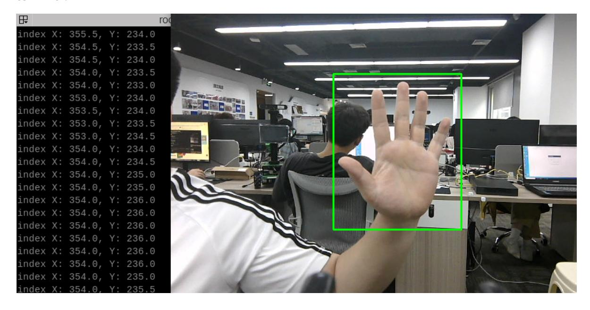

## Palm target positioning

## 1. Content Description

This course implements capturing color images and using the MediaPipe framework to detect a hand, outputting its coordinates. This can then be combined with a robot chassis or robotic arm to track hand movements.

This section requires entering commands in the terminal. The terminal you open depends on your motherboard type. This lesson uses the Raspberry Pi 5 as an example. For Raspberry Pi and Jetson Nano boards, you need to open a terminal on the host computer and enter the command to enter the Docker container. Once inside the Docker container, enter the commands mentioned in this section in the terminal. For instructions on entering the Docker container from the host computer, refer to this product tutorial **[Configuration and Operation Guide]--[Enter the Docker (Jetson Nano and Raspberry Pi 5 users, see here)]**.

Simply open the terminal on the Orin motherboard and enter the commands mentioned in this section.

## 2. Program startup

First, in the terminal, enter the following command to start the camera,

```
ros2 launch orbbec_camera dabai_dcw2.launch.py
```

After successfully starting the camera, open another terminal and enter the following command in the terminal to start the palm positioning program.

```
ros2 run yahboomcar_mediapipe 12_FindHand
```

After the program is started, as shown in the figure below, when a palm is detected, the palm will be framed in green on the screen, and the center coordinates of the palm will be output on the terminal.



## 3. Core code analysis

Program code path:

Raspberry Pi 5 and Jetson Nano board

```
The program code is in the running docker. The path in docker
is /root/yahboomcar_ws/src/yahboomcar_mediapipe/yahboomcar_mediapipe/12_FindHand.
py
```

Orin Motherboard

The program code path is /home/jetson/yahboomcar_ws/src/yahboomcar_mediapipe/yahboomcar_mediapipe/12_Fi ndHand.py

Import the library files used,

```
import rclpy
from rclpy.node import Node
from M3Pro_demo.media_library import *
import cv2 as cv
import numpy as np
import time
import os
import threading
from cv_bridge import CvBridge
from sensor_msgs.msg import Image
from arm_msgs.msg import ArmJoints
import cv2
```

Initialize data and define publishers and subscribers,

```
def __init__(self,name, mode=False, maxHands=2, detectorCon=0.5, trackCon=0.5):
    super().__init__(name)
    #Call the media_library library to create an object of the HandDetector
class
    self.hand_detector = HandDetector()
    #create a publisher
    self.rgb_bridge = CvBridge()
    #Define the topic for controlling 6 servos and publish the detected posture
    self.TargetAngle_pub = self.create_publisher(ArmJoints, "arm6_joints", 10)
    self.init_joints = [90, 150, 10, 20, 90, 90]
    self.pubSix_Arm(self.init_joints)
    #Define subscribers for the color image topic
    self.sub_rgb =
self.create_subscription(Image,"/camera/color/image_raw",self.get_RGBImageCallBa
ck,100)
```

Color image callback function,

```
def get_RGBImageCallBack(self,msg):
    #Use CvBridge to convert color image message data into image data
    rgb_image = self.rgb_bridge.imgmsg_to_cv2(msg, "bgr8")
    # Pass the obtained image into the process function for palm detection
    frame = self.process(rgb_image)
    key = cv2.waitKey(1)
    cv.imshow('dist', frame)
```

process function,

```
def process(self, frame):
    #Call the object method to perform palm detection and return the detected
image as well as the lmList list and bbox list
    frame, lmList, bbox = self.hand_detector.findHands(frame)
    self.hand_detector.draw = True
    #If the lmList list is not empty, it means that a palm has been detected
    if len(lmList) != 0:
        hand = self.hand_detector.fingersUp(lmList)
    #Get the xy coordinates of the palm, bbox stores the xy coordinates of the
upper left and lower right corners of the palm
    indexX = (bbox[0] + bbox[2]) / 2
    indexY = (bbox[1] + bbox[3]) / 2
    print("index X: %.1f, Y: %.1f" % (indexX, indexY))
    return frame
```

The definition of the Medipipe recognition class can be found in the media_library library, which is located in the M3Pro_demo function package.

In the directory,

Raspberry Pi 5 and Jetson Nano board

The path in docker is /root/yahboomcar_ws/src/M3Pro_demo/M3Pro_demo/media_library.py

Orin Motherboard

The program code path is

/home/jetson/yahboomcar_ws/src/M3Pro_demo/M3Pro_demo/media_library.py

In this library, we use the native library of meidiapipe to expand and define many classes. Each class defines different functions.

When needed, just pass in the parameters. For example, we define the following function in the HandDetector class:

- findHands: Find hands
- fingersUp: fingers straight up
- ThumbTOforefinger: Detects the angle between the thumb and index finger
- get_gesture: Detect gestures
