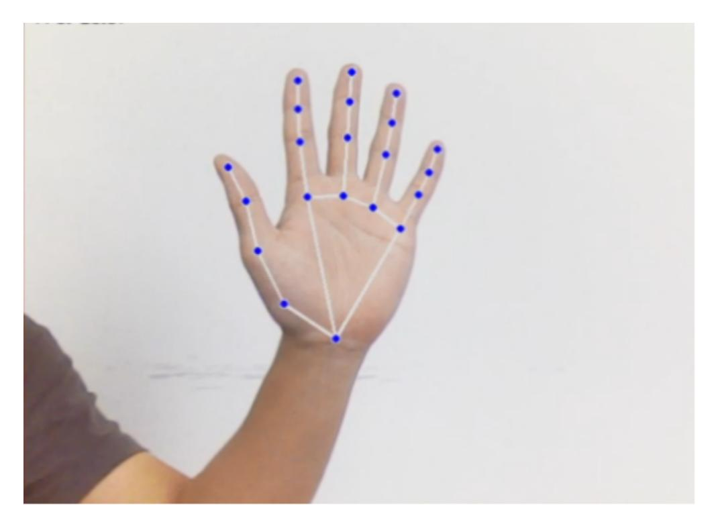
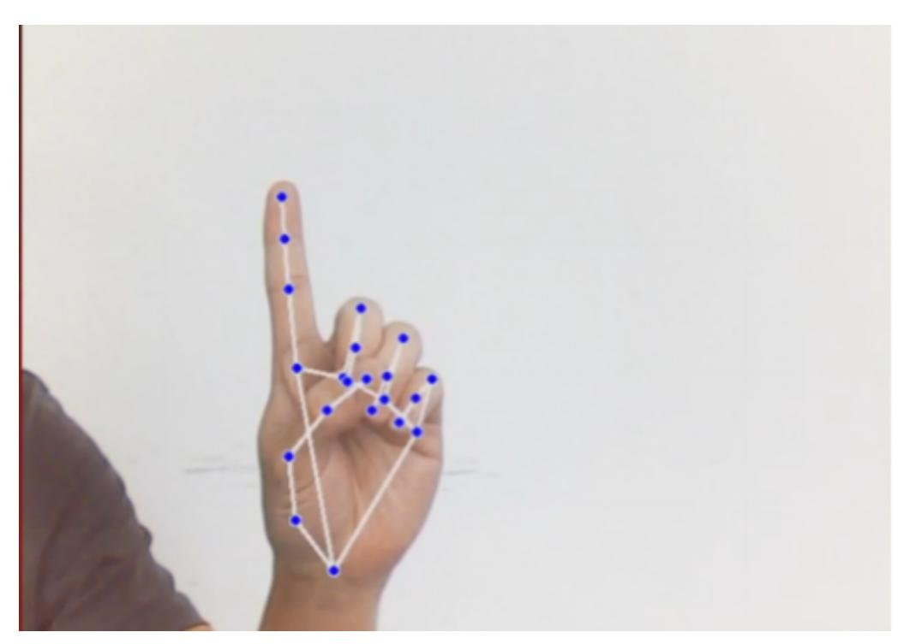
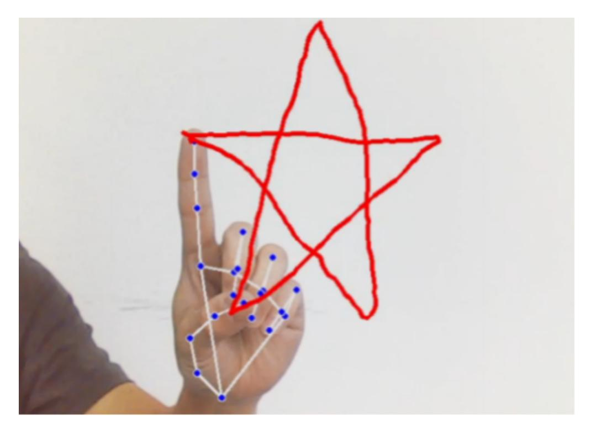
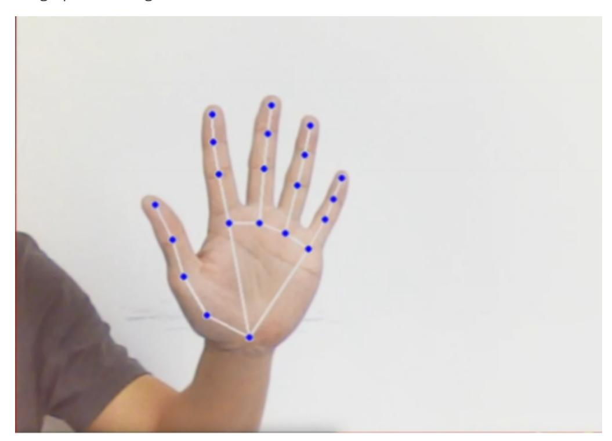
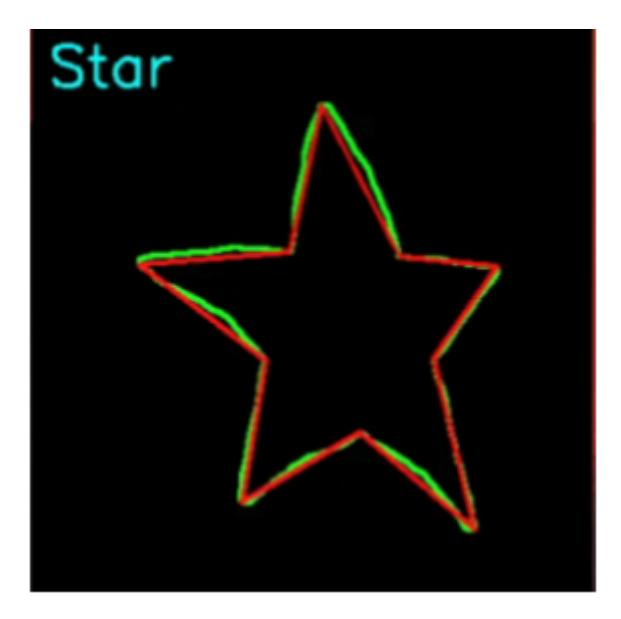

# Fingertip gesture control robotic arm

## 1. Content Description

This function captures color images and uses the MediaPipe framework to detect fingertips. Gestures are used to start and stop recording the fingertip's trajectory within the image. After recording is complete, a fingertip trajectory map is generated and the trajectory is recognized. Finally, the robot arm is controlled based on the trajectory.

This section requires entering commands in the terminal. The terminal you open depends on your motherboard type. This lesson uses the Raspberry Pi 5 as an example. For Raspberry Pi and Jetson Nano boards, you need to open a terminal on the host computer and enter the command to enter the Docker container. Once inside the Docker container, enter the commands mentioned in this section in the terminal. For instructions on entering the Docker container from the host computer, refer to this product tutorial **[Configuration and Operation Guide]--[Enter the Docker (Jetson Nano and Raspberry Pi 5 users, see here)]**.

Simply open the terminal on the Orin motherboard and enter the commands mentioned in this section.

## 2. Program startup

First, in the terminal, enter the following command to start the camera,

```bash
ros2 launch orbbec_camera dabai_dcw2.launch.py
```

After successfully starting the camera, open another terminal and enter the following command in the terminal to start the program for controlling the robotic arm with fingertip trajectory gestures:

```bash
ros2 run yahboomcar_mediapipe 14_FingerAction
```

After the program is run, as shown in the figure below, place your palm flat on the camera screen, open your fingers, and face the camera with your palm, similar to the number 5 gesture. The image will draw the joints on the entire palm. Adjust the position of your palm and try to keep it in the upper middle part of the screen.



At this time, the index finger remains unchanged and the other fingers are retracted, similar to the gesture of the number 1.



While holding gesture 1, move the position of your finger and a red line will appear on the screen, drawing the path of your index finger.



After the graphic is drawn, open all your fingers and make a gesture similar to the number 5, and the drawn graphic will be generated below.





Note: The drawn graphics need to be closed, otherwise some content may be missing.

There are currently four trajectory shapes that can be recognized: triangle, rectangle, circle, and five-pointed star.

When the camera recognizes different trajectory shapes, it will control the robotic arm to perform corresponding actions.

## 3. Core code analysis

Program code path:

Raspberry Pi 5 and Jetson Nano board

The program code is in the running docker. The path in docker is /root/yahboomcar_ws/src/yahboomcar_mediapipe/yahboomcar_mediapipe/14_FingerAct ion.py

Orin Motherboard

The program code path is /home/jetson/yahboomcar_ws/src/yahboomcar_mediapipe/yahboomcar_mediapipe/14_Fi ngerAction.py

Import the library files used,

```python
import math
import time
import cv2 as cv
import numpy as np
import mediapipe as mp
import rclpy
from rclpy.node import Node
from cv_bridge import CvBridge
from sensor_msgs.msg import Image
from arm_msgs.msg import ArmJoints,ArmJoint
import cv2
import gc
import threading
import enum
```

Initialize data and define publishers and subscribers,

```python
def __init__(self,name):
    super().__init__(name)
    self.drawing = mp.solutions.drawing_utils
    self.timer = time.time()
    self.move_state = False
    self.state = State.NULL
    self.points = []
    self.start_count = 0
    self.no_finger_timestamp = time.time()
    self.gc_stamp = time.time()
    self.hand_detector = mp.solutions.hands.Hands(
        static_image_mode=False,
        max_num_hands=1,
        min_tracking_confidence=0.05,
        min_detection_confidence=0.6
    )
    self.rgb_bridge = CvBridge()
    #Define the topic for controlling 6 servos and publish the detected posture
    self.TargetAngle_pub = self.create_publisher(ArmJoints, "arm6_joints", 10)
    #Define a topic for controlling a single servo and publish data on a single
servo control topic
    self.pub_SingleTargetAngle = self.create_publisher(ArmJoint, "arm_joint",
10)
    self.init_joints = [90, 164, 18, 0, 90, 30]
    self.pubSix_Arm(self.init_joints)
    #Define subscribers for the color image topic
    self.sub_rgb =
self.create_subscription(Image,"/camera/color/image_raw",self.get_RGBImageCallBa
ck,100)
```

The color image callback function can refer to the content of the previous section. Here, there is an additional thread to control the robotic arm.

```
if not self.move_state:
   self.move_state = True
   # Pass in a parameter graph_name, which is the name of the trajectory
   task = threading.Thread(target=self.arm_move_action, name="arm_move_action",
args= (graph_name, ))
   task.setDaemon(True)
   task.start()
```

The arm_move_action thread executes the function and executes the corresponding function according to the passed name.

```python
def arm_move_action(self, name):
    time.sleep(1)
    print("-----------------")
    if name == 'Triangle':
        self.arm_move_triangle()
    elif name == 'Square':
        self.arm_move_square()
    elif name == 'Circle':
        self.arm_move_circle()
    elif name == 'Star':
        self.arm_move_star()
    self.pubSix_Arm(self.init_joints)
```

```
time.sleep(1.5)
self.move_state = False
```

Take self.arm_move_square() as an example,

```python
def arm_move_square(self):
    move_joints = [90, 0, 180, 20, 90, 30]
    #Publish a topic message to control 6 servos and change the posture of the
robotic arm
    self.pubSix_Arm(move_joints)
    time.sleep(1.4)
    for i in range(3):
        #Control servo No. 4 to -15 degrees
        self.pubSingleArm(4,-15)
        time.sleep(0.4)
        #Control servo No. 4 to turn to 20 degrees
        self.pubSingleArm(4,20)
        time.sleep(0.4)
```
