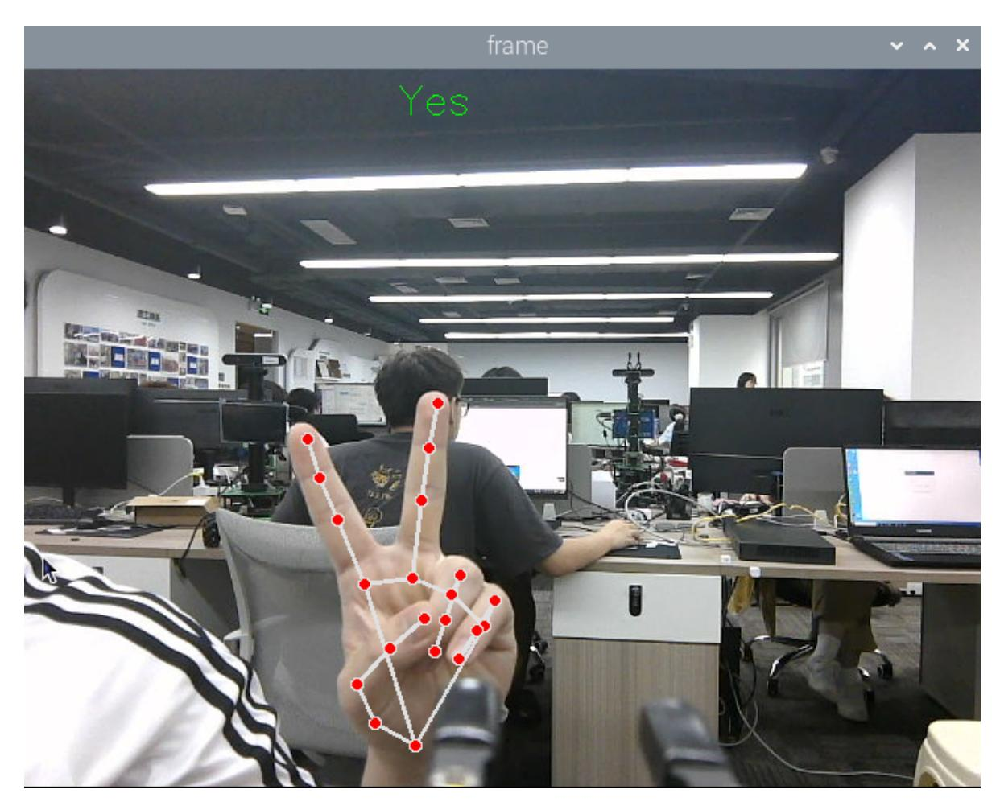
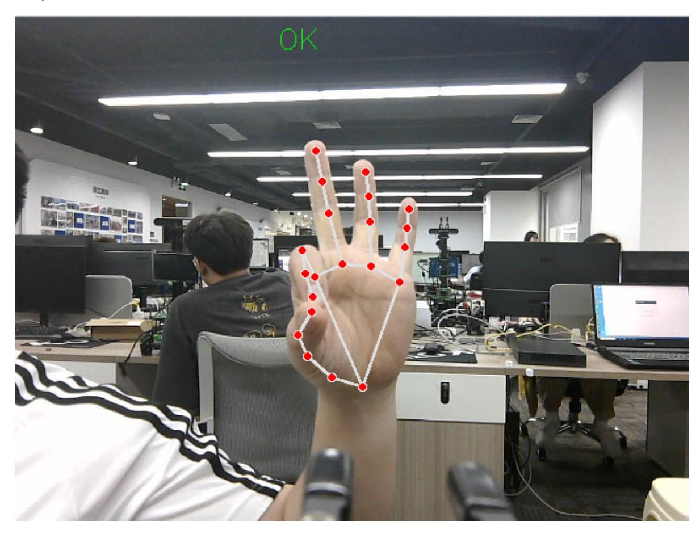

# Gesture grabbing and releasing objects

## 1. Content Description

This function acquires color images and uses the MediaPipe framework to detect gestures, controlling the robotic arm to grasp objects based on these gestures.

This section requires entering commands in the terminal. The terminal you open depends on your motherboard type. This lesson uses the Raspberry Pi 5 as an example. For Raspberry Pi and Jetson Nano boards, you need to open a terminal on the host computer and enter the command to enter the Docker container. Once inside the Docker container, enter the commands mentioned in this section in the terminal. For instructions on entering the Docker container from the host computer, refer to this product tutorial **[Configuration and Operation Guide]--[Enter the Docker (Jetson Nano and Raspberry Pi 5 users, see here)]**.

Simply open the terminal on the Orin motherboard and enter the commands mentioned in this section.

## 2. Program startup

First, in the terminal, enter the following command to start the camera,

```bash
ros2 launch orbbec_camera dabai_dcw2.launch.py
```

After successfully starting the camera, open another terminal and enter the following command in the terminal to start the gesture grab and release program.

```bash
ros2 run yahboomcar_mediapipe 16_GestureGrasp
```

After the program starts, if the camera image shows a "Yes" gesture, the robotic arm will move to a specific location to grab an object. If the camera image shows an "OK" gesture, the robotic arm will place the object in a specific location. The two recognized gestures are: "Yes" and "OK."

At this time, put your hand in the camera image and make a "Yes" gesture, and the robotic arm will move forward to grab the object.



When the object is grabbed and the gesture is recognized as OK, the object is placed in the upper left position.



Press Ctrl+C in the terminal to exit the program.

## 3. Core code analysis

Program code path:

Raspberry Pi 5 and Jetson Nano board

The program code is in the running docker. The path in docker is /root/yahboomcar_ws/src/yahboomcar_mediapipe/yahboomcar_mediapipe/16_GestureGras p.py

Import the library files used,

```python
import math
import time
import cv2 as cv
import numpy as np
import rclpy
from rclpy.node import Node
from cv_bridge import CvBridge
from sensor_msgs.msg import Image
from arm_msgs.msg import ArmJoints,ArmJoint
import cv2
from M3Pro_demo.media_library import *
import threading
```

Initialize data and define publishers and subscribers,

```python
def __init__(self,name):
    super().__init__(name)
    self.drawing = mp.solutions.drawing_utils
    self.timer = time.time()
    self.move_state = False
    self.points = []
    self.start_count = 0
    self.no_finger_timestamp = time.time()
    self.gc_stamp = time.time()
    #Call the media_library library to create an object of the HandDetector
class
    self.hand_detector = HandDetector()
    self.pTime = 0
    # Define the state of grabbing blocks
    self.one_grabbed = 0
    self.two_grabbed = 0
    self.three_grabbed = 0
    self.four_grabbed = 0
    self.block_num = 0
    # Define the state of grabbing blocks
    self.Count_One = 0
    self.Count_Two = 0
    self.Count_Three = 0
    self.Count_Four = 0
    self.Count_Five = 0
    self.rgb_bridge = CvBridge()
    #Define the topic for controlling 6 servos and publish the detected posture
    self.TargetAngle_pub = self.create_publisher(ArmJoints, "arm6_joints", 10)
    #Define a topic for controlling a single servo and publish data on a single
servo control topic
```

```
self.pub_SingleTargetAngle = self.create_publisher(ArmJoint, "arm_joint",
10)
    self.init_joints = [90, 164, 18, 0, 90, 30]
    self.pubSix_Arm(self.init_joints)
    #Define subscribers for the color image topic
    self.sub_rgb =
self.create_subscription(Image,"/camera/color/image_raw",self.get_RGBImageCallBa
ck,100)
```

```python
def get_RGBImageCallBack(self,msg):
    #Use CvBridge to convert color image message data into image data
    rgb_image = self.rgb_bridge.imgmsg_to_cv2(msg, "bgr8")
    #Call the findHands method of the class to detect the palm and return the
joint list
    frame, lmList,_ = self.hand_detector.findHands(rgb_image)
    #print("lmList: ",lmList)
    #Judge whether the joint list is 0, that is, whether the palm is detected
    if len(lmList) != 0:
        #Call the get_gesture method of the class, which returns the recognized
gesture based on the list of joint points
        gesture = self.hand_detector.get_gesture(lmList)
        #print("gesture = {}".format(gesture))
        #Based on the returned gesture, determine whether it is Yes or OK
        if gesture == 'Yes':
            cv.putText(frame, gesture, (250, 30), cv.FONT_HERSHEY_SIMPLEX, 0.9,
(0, 255, 0), 1)
            self.Count_One = self.Count_One + 1
            self.Count_Two = 0
            self.Count_Three = 0
            self.Count_Four = 0
            self.Count_Five = 0
            #Count the value of self.Count_One. If it is greater than 5 and
self.move_state is False, the thread function of the robot arm gripping will be
executed.
            if self.Count_One >= 5 and self.move_state == False:
                self.move_state = True
                self.Count_One = 0
                print("start arm_ctrl_threading = {}".format(gesture))
                task = threading.Thread(target=self.arm_ctrl_threading,
name="arm_ctrl_threading", args=(gesture, ))
                task.setDaemon(True)
                task.start()
        elif gesture == 'OK':
            cv.putText(frame, gesture, (250, 30), cv.FONT_HERSHEY_SIMPLEX, 0.9,
(0, 255, 0), 1)
            self.Count_Five = self.Count_Five + 1
            self.Count_One = 0
            self.Count_Two = 0
            self.Count_Three = 0
            self.Count_Four = 0
            if self.Count_Five >= 5 and self.move_state == False:
                self.move_state = True
                self.Count_Five = 0
```

```
print("start arm_ctrl_threading = {}".format(gesture))
                task = threading.Thread(target=self.arm_ctrl_threading,
name="arm_ctrl_threading", args=(gesture, ))
                task.setDaemon(True)
                task.start()
    key = cv2.waitKey(1)
    cv.imshow('frame', frame)
```

arm_ctrl_threading is the thread function of the robot arm gripping. The parameter passed in is the gesture.

```python
def arm_ctrl_threading(self, gesture):
    if gesture == 'OK':
        #The placement position can be modified according to actual needs
        move_joints = [163, 111, 0, 53, 90, 135]
        self.pubSix_Arm(move_joints)
        time.sleep(2.0)
        #Control servo No. 6 and release the gripper
        self.pubSingleArm(6,30)
        time.sleep(2.0)
        # Return to the initial posture
        move_joints = [90, 164, 18, 0, 90, 135]
        self.pubSix_Arm(move_joints)
        time.sleep(2.0)
    elif gesture == 'Yes':
        #The position of the lower claw can be modified according to actual
needs
        move_joints = [90, 15, 65, 20, 90, 30]
        # #Control servo No. 6 and release the gripper
        self.pubSingleArm(6,30)
        time.sleep(2.0)
        # Move to object position
        self.pubSix_Arm(move_joints)
        time.sleep(2.0)
        #Control servo No. 6 and clamp the claws
        self.pubSingleArm(6,135)
        time.sleep(2.0)
        move_joints = [90, 164, 18, 0, 90, 135]
        self.pubSix_Arm(move_joints)
        time.sleep(2.0)
    self.move_state = False
```
