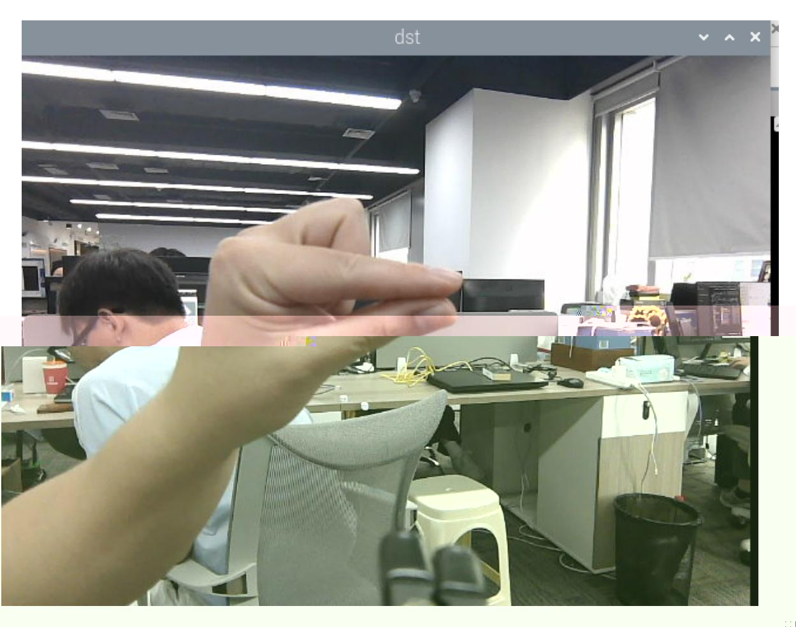

# Finger Control of Robotic Arm

## 1. Content Description

This lesson captures color images, uses MediaPipe Hands to detect fingers, and calculates the angle between the thumb and index finger. The angle controls the opening and closing of the robotic arm gripper, servo No. 6.

This lesson requires terminal commands. Use the terminal that matches your mainboard. Raspberry Pi 5 and Jetson Nano users should open a terminal on the host system, enter the Docker container, and then run the commands from this lesson inside the container. For Docker entry steps, see **Configuration and Operation Guide - Enter the Docker (Jetson Nano and Raspberry Pi 5 users, see here)**.

Orin users can open a terminal directly on the robot and run the commands there.

## 2. Program Startup

Start the camera:

```bash
ros2 launch orbbec_camera dabai_dcw2.launch.py
```

After the camera starts successfully, open another terminal and start the finger-controlled gripper program:

```bash
ros2 run yahboomcar_mediapipe 13_FingerCtrl
```

After the program starts, it detects the hand and calculates the angle between the thumb and index finger. Slowly opening and closing the two fingers changes the gripper opening. Raspberry Pi 5 and Jetson Nano boards may respond more slowly because of board performance and Docker overhead.



## 3. Core Code Analysis

Program code path:

Raspberry Pi 5 and Jetson Nano:

```text
/root/yahboomcar_ws/src/yahboomcar_mediapipe/yahboomcar_mediapipe/13_FingerCtrl.py
```

Orin:

```text
/home/jetson/yahboomcar_ws/src/yahboomcar_mediapipe/yahboomcar_mediapipe/13_FingerCtrl.py
```

Import the required libraries:

```python
import math
import time
import cv2 as cv
import numpy as np
#Import mediapipe library
import mediapipe as mp
import rclpy
from rclpy.node import Node
from cv_bridge import CvBridge
from sensor_msgs.msg import Image
from arm_msgs.msg import ArmJoints,ArmJoint
import cv2
```

Initialize the MediaPipe hand detector, arm publishers, and image subscriber:

```python
def __init__(self, name):
    super().__init__(name)
    self.lmList = []
    #Use the class in the mediapipe library to define a palm object
    self.mpHand = mp.solutions.hands
    self.mpDraw = mp.solutions.drawing_utils
    self.hands = self.mpHand.Hands(
        static_image_mode=False,
        max_num_hands=2,
        min_detection_confidence=0.5,
        min_tracking_confidence=0.5
    )
    self.rgb_bridge = CvBridge()
    #Define the topic publisher that controls the 6 servos and publishes the
detected posture
    self.TargetAngle_pub = self.create_publisher(ArmJoints, "arm6_joints", 10)
    #Define the topic publisher for controlling a single servo, and then control
servo No. 6 (gripper) separately
    self.pub_SingleTargetAngle = self.create_publisher(ArmJoint, "arm_joint",
10)
    self.init_joints = [90, 150, 10, 20, 90, 180]
    self.pubSix_Arm(self.init_joints)
    #Define subscribers for the color image topic
    self.sub_rgb =
self.create_subscription(Image,"/camera/color/image_raw",self.get_RGBImageCallBa
ck,100)
```

Color image callback:

```python
def get_RGBImageCallBack(self,msg):
    #Use CvBridge to convert color image message data into image data
    frame = self.rgb_bridge.imgmsg_to_cv2(msg, "bgr8")
    #Put the obtained image into the custom findHands function to check the palm
    img = self.findHands(frame)
    #Run the custom findPosition function to get the xy coordinates of the finger
joints
    lmList = self.findPosition(frame, draw=False)
    if len(lmList) != 0:
        #Calculate the angle between the thumb tip, wrist joint and index finger
tip
        angle = self.calc_angle(4, 0, 8)
        print("angle: ",angle)
        #If the clip is less than 2, set the value of angle to 2, because the
maximum value of the servo is 180
        if angle<2:
            angle = 2
        #Calculate the value of servo No. 6
        grasp = 360/angle
        #Execute the topic function of publishing a single servo angle
        self.pubSingleArm(6,int(grasp))
    cv.imshow('dst', frame)
    action = cv2.waitKey(1)
```

```python
def findPosition(self, frame, draw=True):
    #Define a list to store the id of each joint and the xy coordinates
corresponding to the id
    self.lmList = []
    if self.results.multi_hand_landmarks:
        #Traverse the palm detection results and get the joint id and the xy
coordinates corresponding to the joint id
        for id, lm in enumerate(self.results.multi_hand_landmarks[0].landmark):
            # print(id,lm)
            h, w, c = frame.shape
            cx, cy = int(lm.x * w), int(lm.y * h)
            # print(id, lm.x, lm.y, lm.z)
            self.lmList.append([id, cx, cy])
    return self.lmLis
```

The `calc_angle` function calculates the angle formed by three landmarks:

```python
def calc_angle(self, pt1, pt2, pt3):
    #Extract xy coordinates from the list based on the joint id
    point1 = self.lmList[pt1][1], self.lmList[pt1][2]
    point2 = self.lmList[pt2][1], self.lmList[pt2][2]
    point3 = self.lmList[pt3][1], self.lmList[pt3][2]
    #Calculate the distance between joints
    a = self.get_dist(point1, point2)
    b = self.get_dist(point2, point3)
    c = self.get_dist(point1, point3)
    try:
        radian = math.acos((math.pow(a, 2) + math.pow(b, 2) - math.pow(c, 2)) /
(2 * a * b))
        angle = radian / math.pi * 180
    except:
        angle = 0
    return abs(angle)
```
