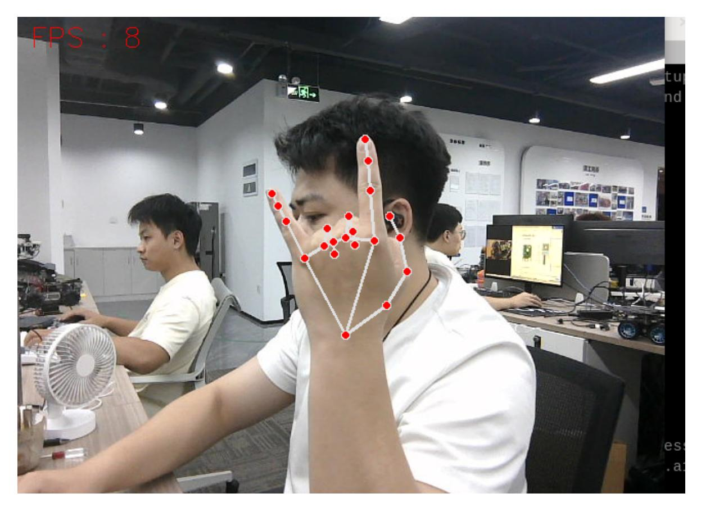

# MediaPipe Gesture Control of Arm Action Group

## 1. Content Description

This lesson captures color images, recognizes gestures with MediaPipe, and maps those gestures to predefined robotic-arm action groups.

This lesson requires terminal commands. Use the terminal that matches your mainboard. Raspberry Pi 5 and Jetson Nano users should open a terminal on the host system, enter the Docker container, and then run the commands from this lesson inside the container. For Docker entry steps, see **Configuration and Operation Guide - Enter the Docker (Jetson Nano and Raspberry Pi 5 users, see here)**.

Orin users can open a terminal directly on the robot and run the commands there.

## 2. Program Startup

Start the camera:

```bash
ros2 launch orbbec_camera dabai_dcw2.launch.py
```

After the camera starts successfully, open another terminal and start the arm gesture-control program:

```bash
ros2 run M3Pro_demo Gesture_Moving
```

After the program starts, the robotic arm moves to the recognition posture. The program recognizes the following gestures:

- `Yes`: The robotic arm performs a preset dance and then returns to the initial posture.
- `OK`: The robotic arm shakes left and right, then returns to the initial posture.
- `Thumb_down` / disdain gesture: The robotic arm kneels down and then returns to the initial posture.
- One-finger gesture: The robotic arm nods and then returns to the initial posture.
- Rock gesture: The thumb, middle finger, and ring finger are bent while the index finger and pinky are extended. The robotic arm stretches upward, shakes left and right, and then returns to the initial posture.
- Five-finger gesture: The robotic arm claps and then returns to the initial posture.

The following image shows the Rock gesture.



After making a gesture, press the spacebar. The robotic arm performs the action group for the recognized gesture. Press the spacebar each time you want to trigger recognition.

## 3. Core Code Analysis

Program code path:

Raspberry Pi 5 and Jetson Nano:

```text
/root/yahboomcar_ws/src/M3Pro_demo/M3Pro_demo/Gesture_Moving.py
```

Orin:

```text
/home/jetson/yahboomcar_ws/src/M3Pro_demo/M3Pro_demo/Gesture_Moving.py
```

Import the required libraries:

```python
import cv2
import os
from sensor_msgs.msg import Image
from cv_bridge import CvBridge
import cv2 as cv
from arm_msgs.msg import ArmJoints
from arm_msgs.msg import ArmJoint
import time
#Import the custom library, which contains the mediapipe related library
from M3Pro_demo.media_library import *
from rclpy.node import Node
import rclpy
import threading
```

Initialize the hand detector, publishers, subscriber, and action state:

```python
def __init__(self, name):
    super().__init__(name)
    self.init_joints = [90, 150, 12, 20, 90, 0]
    self.rgb_bridge = CvBridge()
    #Call the media_library library to create an object of the HandDetector
class
    self.hand_detector = HandDetector()
    self.move_flag = True
    self.pr_time = time.time()
    self.pTime = self.cTime = 0
    self.event = threading.Event()
    self.event.set()
    self.arm_status = False
    self.move = False
    #Define the topic publisher for controlling a single servo, and publish the
topic for controlling the angle of a single servo
    self.pub_SingleTargetAngle = self.create_publisher(ArmJoint, "arm_joint",
10)
    #Define the topic publisher for controlling 6 servos and publish the topic
for controlling the angles of 6 servos
    self.TargetAngle_pub = self.create_publisher(ArmJoints, "arm6_joints", 10)
    #Define subscribers for the color image topic
    self.sub_rgb =
self.create_subscription(Image,"/camera/color/image_raw",self.get_RGBImageCallBa
ck,100)
    time.sleep(2)
    self.pubSix_Arm(self.init_joints)
```

Color image callback:

```python
def get_RGBImageCallBack(self,color_msg):
    #Use CvBridge to convert color image message data into image data
    rgb_image = self.rgb_bridge.imgmsg_to_cv2(color_msg, "bgr8")
    # Pass the obtained image into the process function for gesture detection
    self.process(rgb_image)
```

The `process` function detects the hand and starts gesture-action execution when the spacebar is pressed:

```python
def process(self, frame):
    #Call the object method to perform palm detection and return the detected
image as well as the lmList list and bbox list
    frame, lmList, bbox = self.hand_detector.findHands(frame)
    key = cv2.waitKey(10)
    if key==32:
        self.move = True
    #Judge whether the palm is detected and whether the space bar is pressed. If
so, start the thread to execute the gesture.
    if len(lmList) != 0 and self.move == True:
        gesture = threading.Thread(target=self.Arm_Moving_threading, args=
(lmList,bbox))
        gesture.start()
    #Calculate frame rate display
    self.cTime = time.time()
    fps = 1 / (self.cTime - self.pTime)
```

```
self.pTime = self.cTime
    text = "FPS : " + str(int(fps))
    cv.putText(frame, text, (20, 30), cv.FONT_HERSHEY_SIMPLEX, 0.9, (0, 0, 255),
1)
    if cv.waitKey(1) & 0xFF == ord('q'):
        cv.destroyAllWindows()
    cv.imshow('frame', frame)
```

The `Arm_Moving_threading` function recognizes the gesture and runs the matching arm action group:

```python
def Arm_Moving_threading(self, lmList,bbox):
    if self.event.is_set():
        self.event.clear()
        #Call the finger extension detection function to check which fingers are
extended
        fingers = self.hand_detector.fingersUp(lmList)
        self.hand_detector.draw = False
        #Call the gesture function to get the current gesture
        gesture = self.hand_detector.get_gesture(lmList)
        #For the current gesture and finger extension, execute the corresponding
custom robotic arm action group function
        if gesture == "Yes":
            self.arm_status = False
            self.dance()
            time.sleep(0.5)
            self.init_pose()
            time.sleep(1.0)
            self.arm_status = True
        elif gesture == "OK":
            self.arm_status = False
            for i in range(3):
                time.sleep(0.1)
                self.pubSix_Arm([80, 135, 0, 15, 90, 180])
                time.sleep(0.5)
                self.pubSix_Arm([110, 135, 0, 15, 90, 90])
                time.sleep(0.5)
            self.init_pose()
            sleep(1.0)
            self.arm_status = True
        elif gesture == "Thumb_down":
            self.arm_status = False
            self.pubSix_Arm([90, 0, 180, 0, 90, 180])
            time.sleep(0.5)
            self.pubSix_Arm([90, 0, 180, 0, 90, 90])
            time.sleep(1.5)
            self.init_pose()
            time.sleep(1.0)
            self.arm_status = True
        elif sum(fingers) == 1:
            self.arm_status = False
            self.arm_nod()
            self.init_pose()
            time.sleep(1.0)
            self.arm_status = True
        elif fingers[1] == fingers[4] == 1 and sum(fingers) == 2:
            self.arm_status = False
```

```
self.shake()
    self.init_pose()
    time.sleep(1.0)
    self.arm_status = True
elif sum(fingers) == 5:
    self.arm_status = False
    self.arm_applaud()
    self.init_pose()
    time.sleep(1.0)
    self.arm_status = True
self.move = False
self.event.set()
```
