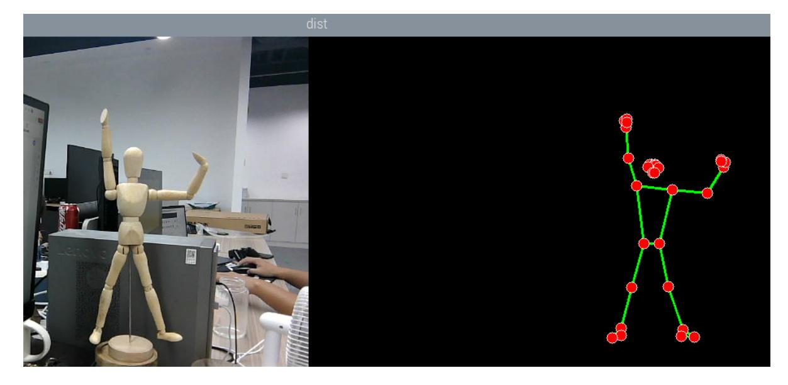

# Posture Detection

## 1. Content Description

This lesson captures color images from the camera and uses MediaPipe Pose to detect human body landmarks. The program displays the original image beside a landmark-only view of the detected pose.

This lesson requires terminal commands. Use the terminal that matches your mainboard. Raspberry Pi 5 and Jetson Nano users should open a terminal on the host system, enter the Docker container, and then run the commands from this lesson inside the container. For Docker entry steps, see **Configuration and Operation Guide - Enter the Docker (Jetson Nano and Raspberry Pi 5 users, see here)**.

Orin users can open a terminal directly on the robot and run the commands there.

## 2. Program Startup

Start the camera:

```bash
ros2 launch orbbec_camera dabai_dcw2.launch.py
```

After the camera starts successfully, open another terminal and start the pose-detection program:

```bash
ros2 run yahboomcar_mediapipe 02_PoseDetector
```

After the program starts, the detected pose landmarks are displayed on the right side of the image.



## 3. Core Code Analysis

Program code path:

Raspberry Pi 5 and Jetson Nano:

```text
/root/yahboomcar_ws/src/yahboomcar_mediapipe/yahboomcar_mediapipe/02_PoseDetector.py
```

Orin:

```text
/home/jetson/yahboomcar_ws/src/yahboomcar_mediapipe/yahboomcar_mediapipe/02_PoseDetector.py
```

Import the required libraries:

```python
import rclpy
from rclpy.node import Node
#mediapipe
import mediapipe as mp
import cv2 as cv
import numpy as np
import time
import os
from cv_bridge import CvBridge
from sensor_msgs.msg import Image
from arm_msgs.msg import ArmJoints
import cv2
print("import done")
```

Initialize the MediaPipe Pose detector, publishers, and subscribers:

```python
def __init__(self, name,mode=False, smooth=True, detectionCon=0.5,
trackCon=0.5):
    super().__init__(name)
     #Use the class in the mediapipe library to define a posture object
    self.mpPose = mp.solutions.pose
    self.mpDraw = mp.solutions.drawing_utils
    self.pose = self.mpPose.Pose(
    static_image_mode=mode,
    smooth_landmarks=smooth,
    min_detection_confidence=detectionCon,
    min_tracking_confidence=trackCon )
    #Define the properties of the joint connection line, which will be used in
the subsequent joint point connection function
    self.lmDrawSpec = mp.solutions.drawing_utils.DrawingSpec(color=(0, 0, 255),
thickness=-1, circle_radius=6)
    self.drawSpec = mp.solutions.drawing_utils.DrawingSpec(color=(0, 255, 0),
thickness=2, circle_radius=2)
    #create a publisher
    self.rgb_bridge = CvBridge()
    #Define the topic for controlling 6 servos and publish the detected posture
    self.TargetAngle_pub = self.create_publisher(ArmJoints, "arm6_joints", 10)
    self.init_joints = [90, 150, 10, 20, 90, 90]
    self.pubSix_Arm(self.init_joints)
    #Define subscribers for the color image topic
```

```
self.sub_rgb =
self.create_subscription(Image,"/camera/color/image_raw",self.get_RGBImageCallBa
ck,100)
```

Color image callback:

```python
def get_RGBImageCallBack(self,msg):
    #Use CvBridge to convert color image message data into image data
    rgb_image = self.rgb_bridge.imgmsg_to_cv2(msg, "bgr8")
    #Put the obtained image into the defined pubPosePoint function, draw=False
means not to draw the joint points on the original color image
    frame, img = self.pubPosePoint(rgb_image, draw=False)
    #Merge two images
    dist = self.frame_combine(frame, img)
    key = cv2.waitKey(1)
    cv.imshow('dist', dist)
```

The `pubPosePoint` function detects pose landmarks and draws them:

```python
def pubPosePoint(self, frame, draw=True):
    #Create a new image based on the incoming image size. The image data type is
uint8
    img = np.zeros(frame.shape, np.uint8)
    #Convert the color space of the incoming image from BGR to RGB to facilitate
subsequent image processing
    img_RGB = cv.cvtColor(frame, cv.COLOR_BGR2RGB)
    #Call the process function in the mediapipe library to process the image.
During init, the self.pose object is created and initialized.
    self.results = self.pose.process(img_RGB)
    #Judge whether self.results.multi_hand_landmarks exists, that is, whether the
posture is recognized
    if self.results.pose_landmarks:
        if draw: self.mpDraw.draw_landmarks(frame, self.results.pose_landmarks,
self.mpPose.POSE_CONNECTIONS, self.lmDrawSpec, self.drawSpec)
        #Connect each joint point on the blank image created previously
        self.mpDraw.draw_landmarks(img, self.results.pose_landmarks,
self.mpPose.POSE_CONNECTIONS, self.lmDrawSpec, self.drawSpec)
    return frame, img
```

The `frame_combine` image-stitching function is explained in [8.1 Hand Detection](../1.Hand%20detection/README.md).
