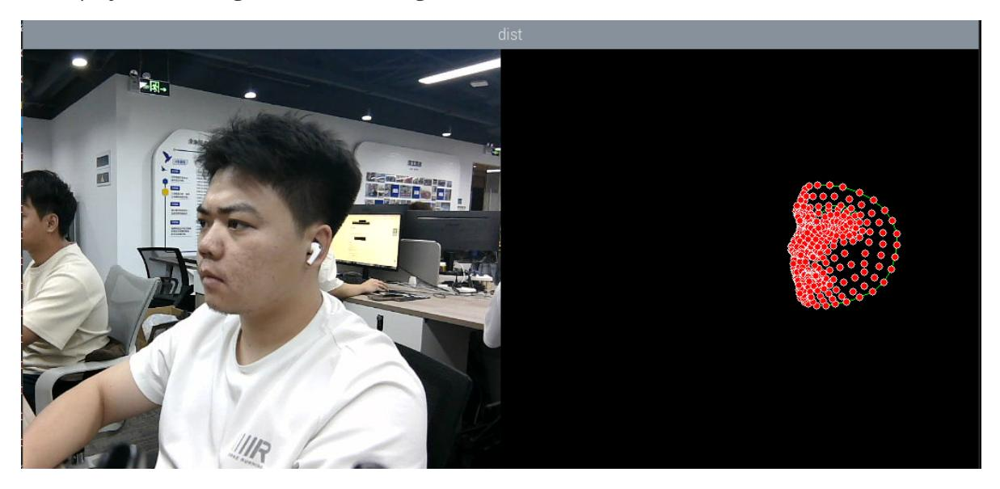

# Facial Landmark Detection

## 1. Content Description

This course implements color image acquisition and facial detection using the MediaPipe framework. This section requires entering commands in a terminal. The terminal you open depends on your motherboard. This section uses a Raspberry Pi 5 as an example.

For Raspberry Pi and Jetson Nano motherboards, you need to open a terminal on the host machine and enter the command to enter the Docker container. After entering the Docker container, enter the command mentioned in this course in the terminal. For the tutorial on entering the Docker container from the host machine, please refer to the content [Enter the Docker (Jetson Nano and Raspberry Pi 5 users see here)] in [0. Instructions and Installation Steps] of this product tutorial.

Simply open the terminal on the Orin motherboard and enter the commands mentioned in this section.

## 2. Program startup

First, in the terminal, enter the following command to start the camera,

```bash
ros2 launch orbbec_camera dabai_dcw2.launch.py
```

After successfully starting the camera, open another terminal and enter the following command in the terminal to start the face detection program.

```bash
ros2 run yahboomcar_mediapipe 04_FaceMesh
```

After the program is run, as shown in the figure below, the points where the face is detected will be displayed on the right side of the image.



## 3. Core code analysis

Program code path:

Raspberry Pi 5 and Jetson Nano board

```
The program code is in the running docker. The path in docker
is /root/yahboomcar_ws/src/yahboomcar_mediapipe/yahboomcar_mediapipe/04_FaceMesh.
py
```

Orin Motherboard

```
The program code path
is /home/jetson/yahboomcar_ws/src/yahboomcar_mediapipe/yahboomcar_mediapipe/04_Fa
ceMesh.py
```

Import the library files used,

```python
import rclpy
from rclpy.node import Node
#Import mediapipe library
import mediapipe as mp
import cv2 as cv
import numpy as np
import time
import os
from cv_bridge import CvBridge
from sensor_msgs.msg import Image
from arm_msgs.msg import ArmJoints
import cv2
print("import done")
```

Initialize data and define publishers and subscribers,

```python
def __init__(self, name,staticMode=False, maxFaces=2, minDetectionCon=0.5,
minTrackingCon=0.5):
    super().__init__(name)
    self.mpDraw = mp.solutions.drawing_utils
    #Use the class in the mediapipe library to define a face object
    self.mpFaceMesh = mp.solutions.face_mesh
    self.faceMesh = self.mpFaceMesh.FaceMesh(
    static_image_mode=staticMode,
    max_num_faces=maxFaces,
    min_detection_confidence=minDetectionCon,
    min_tracking_confidence=minTrackingCon )
    #Define the properties of the joint connection line, which will be used in
the subsequent joint point connection function
    self.lmDrawSpec = mp.solutions.drawing_utils.DrawingSpec(color=(0, 0, 255),
thickness=-1, circle_radius=3)
    self.drawSpec = self.mpDraw.DrawingSpec(color=(0, 255, 0), thickness=1,
circle_radius=1)
    self.rgb_bridge = CvBridge()
    #Define the topic for controlling 6 servos and publish the detected posture
    self.TargetAngle_pub = self.create_publisher(ArmJoints, "arm6_joints", 10)
    self.init_joints = [90, 150, 10, 20, 90, 90]
    self.pubSix_Arm(self.init_joints)
    #Define subscribers for the color image topic
```

```
self.sub_rgb =
self.create_subscription(Image,"/camera/color/image_raw",self.get_RGBImageCallBa
ck,100)
```

Color image callback function,

```python
def get_RGBImageCallBack(self,msg):
    #Use CvBridge to convert color image message data into image data
    rgb_image = self.rgb_bridge.imgmsg_to_cv2(msg, "bgr8")
    #Put the obtained image into the defined pubFaceMeshPoint function,
draw=False means not to draw joint points on the original color image
    frame, img = self.pubFaceMeshPoint(rgb_image, draw=False)
    #Merge two images
    dist = self.frame_combine(frame, img)
    key = cv2.waitKey(1)
    cv.imshow('dist', dist)
```

pubFaceMeshPoint function,

```python
def pubFaceMeshPoint(self, frame, draw=True):
    #Create a new image based on the incoming image size. The image data type is
uint8
    img = np.zeros(frame.shape, np.uint8)
    #Convert the color space of the incoming image from BGR to RGB to facilitate
subsequent image processing
    imgRGB = cv.cvtColor(frame, cv.COLOR_BGR2RGB)
    #Call the process function in the mediapipe library for image processing.
During init, the self.faceMesh object is created and initialized.
    self.results = self.faceMesh.process(imgRGB)
    #Judge whether self.results.multi_face_landmarks exists, that is, whether the
face is recognized
    if self.results.multi_face_landmarks:
        for i in range(len(self.results.multi_face_landmarks)):
            if draw: self.mpDraw.draw_landmarks(frame,
self.results.multi_face_landmarks[i], self.mpFaceMesh.FACEMESH_CONTOURS,
    #Connect each joint point on the blank image created previously
            self.mpDraw.draw_landmarks(img,
self.results.multi_face_landmarks[i], self.mpFaceMesh.FACEMESH_CONTOURS,
self.lmDrawSpec, self.drawSpec)
    return frame, img
```

The frame_combine image merging function was mentioned in the first lesson of this chapter. Please refer to [Meediapipe Visual Fun Game] - [1. Hand Detection] for an analysis of this function.
