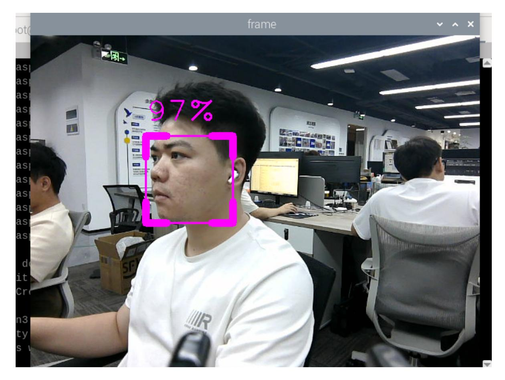

# Face Detection

## 1. Content Description

This lesson captures color images and uses MediaPipe Face Detection to locate faces in the camera image. The program draws a bounding box around each detected face and displays the detection confidence.

This lesson requires terminal commands. Use the terminal that matches your mainboard. Raspberry Pi 5 and Jetson Nano users should open a terminal on the host system, enter the Docker container, and then run the commands from this lesson inside the container. For Docker entry steps, see **Configuration and Operation Guide - Enter the Docker (Jetson Nano and Raspberry Pi 5 users, see here)**.

Orin users can open a terminal directly on the robot and run the commands there.

## 2. Program Startup

Start the camera:

```bash
ros2 launch orbbec_camera dabai_dcw2.launch.py
```

After the camera starts successfully, open another terminal and start the face-detection program:

```bash
ros2 run yahboomcar_mediapipe 07_FaceDetection
```

After the program starts, detected faces are framed and labeled with a confidence score. A higher score indicates a more confident detection.



## 3. Core Code Analysis

Program code path:

Raspberry Pi 5 and Jetson Nano:

```text
/root/yahboomcar_ws/src/yahboomcar_mediapipe/yahboomcar_mediapipe/07_FaceDetection.py
```

Orin:

```text
/home/jetson/yahboomcar_ws/src/yahboomcar_mediapipe/yahboomcar_mediapipe/07_FaceDetection.py
```

Import the required libraries:

```python
import time
import cv2 as cv
import numpy as np
import rclpy
from rclpy.node import Node
#Import mediapipe library
import mediapipe as mp
from cv_bridge import CvBridge
from sensor_msgs.msg import Image
from arm_msgs.msg import ArmJoints
import cv2
```

Initialize the MediaPipe face detector, publishers, and subscribers:

```python
def __init__(self, name):
```

```
super().__init__(name)
    self.minDetectionCon=0.5
    #Use the class in the mediapipe library to define a face detection object
    self.mpFaceDetection = mp.solutions.face_detection
    self.mpDraw = mp.solutions.drawing_utils
    self.facedetection =
self.mpFaceDetection.FaceDetection(min_detection_confidence=self.minDetectionCon
)
    self.rgb_bridge = CvBridge()
    #Define the topic for controlling 6 servos and publish the detected posture
    self.TargetAngle_pub = self.create_publisher(ArmJoints, "arm6_joints", 10)
    self.init_joints = [90, 150, 10, 20, 90, 90]
    self.pubSix_Arm(self.init_joints)
    #Define subscribers for the color image topic
    self.sub_rgb =
self.create_subscription(Image,"/camera/color/image_raw",self.get_RGBImageCallBa
ck,100)
```

Color image callback:

```python
def get_RGBImageCallBack(self,msg):
    #Use CvBridge to convert color image message data into image data
    rgb_image = self.rgb_bridge.imgmsg_to_cv2(msg, "bgr8")
    #Put the obtained image into the defined findFaces function to perform face
detection program
    frame,_ = self.findFaces(rgb_image)
    key = cv2.waitKey(1)
    cv.imshow('frame', frame)
```

The `findFaces` function detects faces and annotates the image:

```python
def findFaces(self, frame):
    #Convert the color space of the incoming image from BGR to RGB to facilitate
subsequent image processing
    img_RGB = cv.cvtColor(frame, cv.COLOR_BGR2RGB)
    #Call the process function in the mediapipe library for image processing.
During init, the self.facedetection object is created and initialized.
    self.results = self.facedetection.process(img_RGB)
    bboxs = []
    #Judge whether self.results.detections exists, that is, whether a face is
recognized
    if self.results.detections:
        #Traverse the id and detection data
        for id, detection in enumerate(self.results.detections):
            #Get bounding box coordinates
            bboxC = detection.location_data.relative_bounding_box
            ih, iw, ic = frame.shape
            bbox = int(bboxC.xmin * iw), int(bboxC.ymin * ih), \
            int(bboxC.width * iw), int(bboxC.height * ih)
            #Store test results
            bboxs.append([id, bbox, detection.score])
            #Call fancyDraw function to draw the bounding box
            frame = self.fancyDraw(frame, bbox)
            #Display the face recognition score on the image
            cv.putText(frame, f'{int(detection.score[0] * 100)}%',(bbox[0],
bbox[1] - 20), cv.FONT_HERSHEY_PLAIN,3, (255, 0, 255), 2)
```

The `fancyDraw` function draws a stylized bounding box from the detected face rectangle:

```python
def fancyDraw(self, frame, bbox, l=30, t=10):
    x, y, w, h = bbox
    x1, y1 = x + w, y + h
    cv.rectangle(frame, (x, y),(x + w, y + h), (255, 0, 255), 2)
    # Top left x,y
    cv.line(frame, (x, y), (x + l, y), (255, 0, 255), t)
    cv.line(frame, (x, y), (x, y + l), (255, 0, 255), t)
    # Top right x1,y
    cv.line(frame, (x1, y), (x1 - l, y), (255, 0, 255), t)
    cv.line(frame, (x1, y), (x1, y + l), (255, 0, 255), t)
    # Bottom left x1,y1
    cv.line(frame, (x, y1), (x + l, y1), (255, 0, 255), t)
    cv.line(frame, (x, y1), (x, y1 - l), (255, 0, 255), t)
    # Bottom right x1,y1
    cv.line(frame, (x1, y1), (x1 - l, y1), (255, 0, 255), t)
    cv.line(frame, (x1, y1), (x1, y1 - l), (255, 0, 255), t)
    return frame
```
