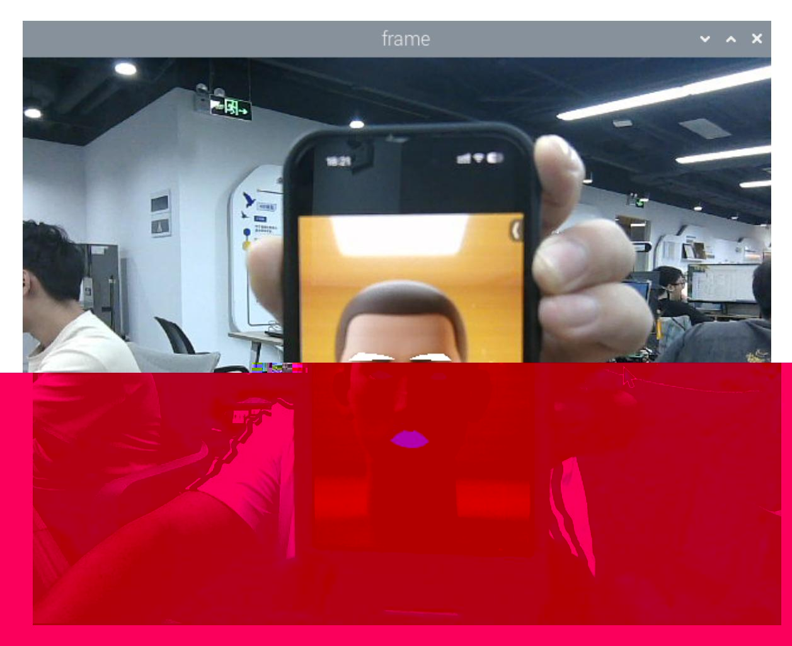

# Face Special Effects

## 1. Content Description

This lesson captures color images, uses the dlib library to detect facial landmarks, and applies simple special effects to the eyebrows, eyes, and mouth.

This lesson requires terminal commands. Use the terminal that matches your mainboard. Raspberry Pi 5 and Jetson Nano users should open a terminal on the host system, enter the Docker container, and then run the commands from this lesson inside the container. For Docker entry steps, see **Configuration and Operation Guide - Enter the Docker (Jetson Nano and Raspberry Pi 5 users, see here)**.

Orin users can open a terminal directly on the robot and run the commands there.

## 2. Program Startup

Start the camera:

```bash
ros2 launch orbbec_camera dabai_dcw2.launch.py
```

After the camera starts successfully, open another terminal and start the face-effects program:

```bash
ros2 run yahboomcar_mediapipe 06_FaceLandmarks
```

After the program starts, it detects the face and applies effects to the eyebrow, eye, and mouth regions.



## 3. Core Code Analysis

Program code path:

Raspberry Pi 5 and Jetson Nano:

```text
/root/yahboomcar_ws/src/yahboomcar_mediapipe/yahboomcar_mediapipe/06_FaceLandmarks.py
```

Orin:

```text
/home/jetson/yahboomcar_ws/src/yahboomcar_mediapipe/yahboomcar_mediapipe/06_FaceLandmarks.py
```

Import the required libraries:

```python
import time
#Import dlib library
import dlib
import cv2 as cv
import numpy as np
import rclpy
from rclpy.node import Node
from cv_bridge import CvBridge
from sensor_msgs.msg import Image
from arm_msgs.msg import ArmJoints
import cv2
```

dlib is a C++ toolkit with machine-learning algorithms used in robotics, embedded systems, mobile devices, and high-performance computing. In this example, dlib detects faces with `get_frontal_face_detector` and predicts 68 facial landmarks with `shape_predictor_68_face_landmarks.dat`. The landmarks identify facial regions such as eyebrows, eyes, nose, and mouth.

The 68 facial key points of dlib are arranged in the following order:

```
0-16: Chin contour
```

- 17-21: Right eyebrow
- 22-26: Left eyebrow
- 27-35: Nose bridge and nose tip
- 36-41: Right eye
- 42-47: Left eye
- 48-67: Lip contour

Initialize the dlib detector, publishers, and subscribers:

```python
def __init__(self,name):
    super().__init__(name)
    #Import database
    self.dat_file =
"/root/yahboomcar_ws/src/yahboomcar_mediapipe/yahboomcar_mediapipe/file/shape_pr
edictor_68_face_landmarks.dat"
    #Define face detection object
    self.hog_face_detector = dlib.get_frontal_face_detector()
    self.dlib_facelandmark = dlib.shape_predictor(self.dat_file)
    self.rgb_bridge = CvBridge()
    #Define the topic for controlling 6 servos and publish the detected posture
    self.TargetAngle_pub = self.create_publisher(ArmJoints, "arm6_joints", 10)
    self.init_joints = [90, 150, 10, 20, 90, 90]
    self.pubSix_Arm(self.init_joints)
    #Define subscribers for the color image topic
    self.sub_rgb =
self.create_subscription(Image,"/camera/color/image_raw",self.get_RGBImageCallBa
ck,100)
```

Color image callback:

```python
def get_RGBImageCallBack(self,msg):
    rgb_image = self.rgb_bridge.imgmsg_to_cv2(msg, "bgr8")
    #Put the obtained image into the defined get_face function and return the
detected image
    frame = self.get_face(rgb_image, draw=False)
    #Call the prettify_face function to perform special effects processing on the
image
    frame = self.prettify_face(frame, eye=True, lips=True, eyebrow=True,
draw=True)
    key = cv2.waitKey(1)
    cv.imshow('frame', frame)
```

The `get_face` function detects faces and optionally draws landmark IDs:

```python
def get_face(self, frame, draw=True):
    #Convert the image space and convert bgr into grayscale image to facilitate
subsequent image processing
    gray = cv.cvtColor(frame, cv.COLOR_BGR2GRAY)
    #Input grayscale image and detect faces
    self.faces = self.hog_face_detector(gray)
    for face in self.faces:
        self.face_landmarks = self.dlib_facelandmark(gray, face)
        if draw:
            for n in range(68):
                x = self.face_landmarks.part(n).x
                y = self.face_landmarks.part(n).y
                cv.circle(frame, (x, y), 2, (0, 255, 255), 2)
                cv.putText(frame, str(n), (x, y), cv.FONT_HERSHEY_SIMPLEX, 0.6,
(0, 255, 255), 2)
    return frame
```

The `prettify_face` function fills selected facial regions to create the effects:

```python
def prettify_face(self, frame, eye=True, lips=True, eyebrow=True, draw=True):
    #Eye
    if eye:
        leftEye = self.get_lmList(frame, 36, 42)
        rightEye = self.get_lmList(frame, 42, 48)
        if draw:
            if len(leftEye) != 0: frame = cv.fillConvexPoly(frame,
np.mat(leftEye), (0, 0, 0))
            if len(rightEye) != 0: frame = cv.fillConvexPoly(frame,
np.mat(rightEye), (0, 0, 0))
    #lips
    if lips:
        lipIndexlistA = [51, 52, 53, 54, 64, 63, 62]
        lipIndexlistB = [48, 49, 50, 51, 62, 61, 60]
        lipsUpA = self.get_lipList(frame, lipIndexlistA, draw=True)
        lipsUpB = self.get_lipList(frame, lipIndexlistB, draw=True)
        lipIndexlistA = [57, 58, 59, 48, 67, 66]
        lipIndexlistB = [54, 55, 56, 57, 66, 65, 64]
        lipsDownA = self.get_lipList(frame, lipIndexlistA, draw=True)
        lipsDownB = self.get_lipList(frame, lipIndexlistB, draw=True)
        if draw:
            if len(lipsUpA) != 0: frame = cv.fillConvexPoly(frame,
np.mat(lipsUpA), (249, 0, 226))
            if len(lipsUpB) != 0: frame = cv.fillConvexPoly(frame,
np.mat(lipsUpB), (249, 0, 226))
            if len(lipsDownA) != 0: frame = cv.fillConvexPoly(frame,
np.mat(lipsDownA), (249, 0, 226))
            if len(lipsDownB) != 0: frame = cv.fillConvexPoly(frame,
np.mat(lipsDownB), (249, 0, 226))
    #Eyebrow
    if eyebrow:
        lefteyebrow = self.get_lmList(frame, 17, 22)
        righteyebrow = self.get_lmList(frame, 22, 27)
        if draw:
            if len(lefteyebrow) != 0: frame = cv.fillConvexPoly(frame,
np.mat(lefteyebrow), (255, 255, 255))
            if len(righteyebrow) != 0: frame = cv.fillConvexPoly(frame,
np.mat(righteyebrow), (255, 255, 255))
```

The `get_lmList` function collects facial landmark coordinates in a specified index range:

```python
def get_lmList(self, frame, p1, p2, draw=True):
    #Define an empty list
    lmList = []
    # Determine whether a face is detected
    if len(self.faces) != 0:
         #Traverse the face list and get the xy coordinates of each point in the
interval
        for n in range(p1, p2):
            x = self.face_landmarks.part(n).x
            y = self.face_landmarks.part(n).y
            #Add the coordinates of the points on the face to the list
            lmList.append([x, y])
            if draw:
                next_point = n + 1
                if n == p2 - 1: next_point = p1
                x2 = self.face_landmarks.part(next_point).x
                y2 = self.face_landmarks.part(next_point).y
                cv.line(frame, (x, y), (x2, y2), (0, 255, 0), 1)
    return lmList
```
