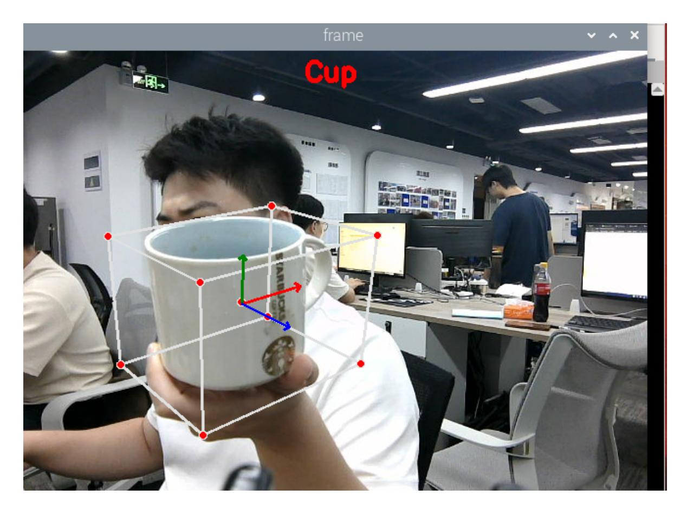

# 3D Object Recognition

## 1. Content Description

This lesson captures color images and uses MediaPipe Objectron for 3D object recognition. The demo includes four supported object categories: shoe, chair, cup, and camera.

This lesson requires terminal commands. Use the terminal that matches your mainboard. Raspberry Pi 5 and Jetson Nano users should open a terminal on the host system, enter the Docker container, and then run the commands from this lesson inside the container. For Docker entry steps, see **Configuration and Operation Guide - Enter the Docker (Jetson Nano and Raspberry Pi 5 users, see here)**.

Orin users can open a terminal directly on the robot and run the commands there.

## 2. Program Startup

Start the camera:

```bash
ros2 launch orbbec_camera dabai_dcw2.launch.py
```

After the camera starts successfully, open another terminal and start the 3D object-detection program:

```bash
ros2 run yahboomcar_mediapipe 08_Objectron
```

After the program starts, the default recognition target is `Shoe`. Press `F` to switch between supported object classes. The example below shows a detected cup.



## 3. Core Code Analysis

Program code path:

Raspberry Pi 5 and Jetson Nano:

```text
/root/yahboomcar_ws/src/yahboomcar_mediapipe/yahboomcar_mediapipe/08_Objectron.py
```

Orin:

```text
/home/jetson/yahboomcar_ws/src/yahboomcar_mediapipe/yahboomcar_mediapipe/08_Objectron.py
```

Import the required libraries:

```python
import cv2 as cv
import time
import rclpy
from rclpy.node import Node
#Import mediapipe library
import mediapipe as mp
from cv_bridge import CvBridge
from sensor_msgs.msg import Image
from arm_msgs.msg import ArmJoints
import cv2
print("import done")
```

Initialize the Objectron detector, publishers, and subscribers:

```python
def __init__(self,name):
```

```
super().__init__(name)
    self.staticMode=False
    self.maxObjects=5
    self.minDetectionCon=0.5
    self.minTrackingCon=0.99
    self.index=3
    self.modelNames = ['Shoe', 'Chair', 'Cup', 'Camera']
    #Use the class in the mediapipe library to define a 3D detection object
    self.mpObjectron = mp.solutions.objectron
    self.mpDraw = mp.solutions.drawing_utils
    self.mpobjectron = self.mpObjectron.Objectron(
    self.staticMode, self.maxObjects, self.minDetectionCon, self.minTrackingCon,
self.modelNames[self.index])
    self.rgb_bridge = CvBridge()
    #Define the topic for controlling 6 servos and publish the detected
positions
    self.TargetAngle_pub = self.create_publisher(ArmJoints, "arm6_joints", 10)
    self.init_joints = [90, 150, 10, 20, 90, 90]
    self.pubSix_Arm(self.init_joints)
    #Define subscribers for the color image topic
    self.sub_rgb =
self.create_subscription(Image,"/camera/color/image_raw",self.get_RGBImageCallBa
ck,100)
```

Color image callback:

```python
def get_RGBImageCallBack(self,msg):
    rgb_image = self.rgb_bridge.imgmsg_to_cv2(msg, "bgr8")
    action = cv2.waitKey(1)
    #Press the F key to switch the recognized objects
    if action == ord('f') or action == ord('F') : self.configUP()
    frame = self.findObjectron(rgb_image)
    cv.imshow('frame', frame)
```

The `configUP` function switches the recognition target by updating `self.index`. The available `self.modelNames` values are `['Shoe', 'Chair', 'Cup', 'Camera']`.

```python
def configUP(self):
    self.index += 1
    if self.index>=4:self.index=0
        self.mpobjectron = self.mpObjectron.Objectron(
        self.staticMode, self.maxObjects, self.minDetectionCon,
self.minTrackingCon,self.modelNames[self.index])
```

The `findObjectron` function runs Objectron recognition and draws the 3D box and axis:

```python
def findObjectron(self, frame):
    cv.putText(frame, self.modelNames[self.index], (int(frame.shape[1] / 2) -
30, 30),
    cv.FONT_HERSHEY_SIMPLEX, 0.9, (0, 0, 255), 3)
    #Convert the color space of the incoming image from BGR to RGB to facilitate
subsequent image processing
    img_RGB = cv.cvtColor(frame, cv.COLOR_BGR2RGB)
    #Call the process function in the mediapipe library to process the image.
During init, the self.pose object is created and initialized.
    results = self.mpobjectron.process(img_RGB)
```

```
# Determine whether the target object is recognized
    if results.detected_objects:
        for id, detection in enumerate(results.detected_objects):
            #Draw a coordinate system for the identified target object on the
image
            self.mpDraw.draw_landmarks(frame, detection.landmarks_2d,
self.mpObjectron.BOX_CONNECTIONS)
            self.mpDraw.draw_axis(frame, detection.rotation,
detection.translation)
    return frame
```
