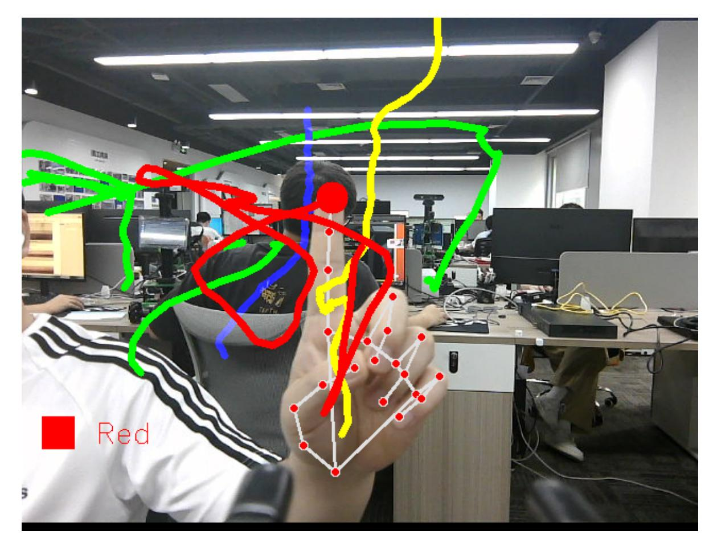
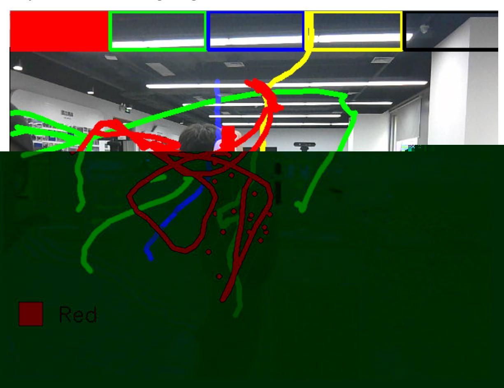
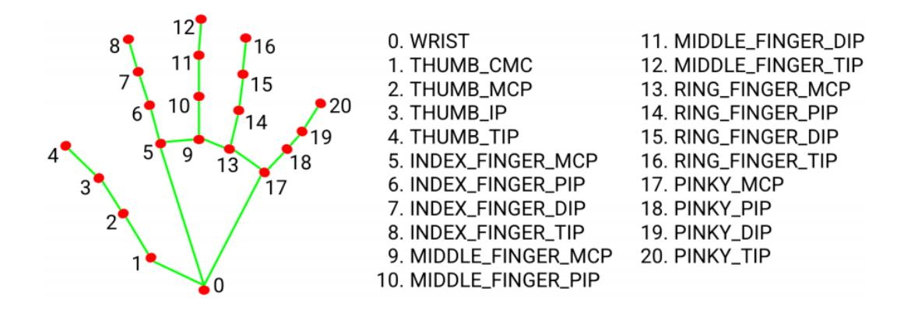

## Brush

## 1. Content Description

This course implements acquiring color images and using the MediaPipe framework to detect fingers. It then selects colors and draws a trajectory based on the detected finger movement.

This section requires entering commands in the terminal. The terminal you open depends on your motherboard type. This lesson uses the Raspberry Pi 5 as an example. For Raspberry Pi and Jetson Nano boards, you need to open a terminal on the host computer and enter the command to enter the Docker container. Once inside the Docker container, enter the commands mentioned in this section in the terminal. For instructions on entering the Docker container from the host computer, refer to this product tutorial **[Configuration and Operation Guide]--[Enter the Docker (Jetson Nano and Raspberry Pi 5 users, see here)]**.

Simply open the terminal on the Orin motherboard and enter the commands mentioned in this section.

## 2. Program startup

First, in the terminal, enter the following command to start the camera,

```
ros2 launch orbbec_camera dabai_dcw2.launch.py
```

After successfully starting the camera, open another terminal and enter the following command in the terminal to start the brush program.

```
ros2 run yahboomcar_mediapipe 09_VirtualPaint
```

After running the program, as shown in the figure below, the default fingertip color is red. When the index finger and middle finger of the right hand are combined, it is in the selection state, and a color selection box pops up. When the two fingertips move to the corresponding color position, the color is selected (black is the eraser); when the index finger and middle finger are separated, it is in the drawing state and can be drawn on the drawing board.

The index finger and middle finger start to draw.



Put your index and middle fingers together to enter the color selection mode.



## 3. Core code analysis

Program code path:

Raspberry Pi 5 and Jetson Nano board

The program code is in the running docker. The path in docker is /root/yahboomcar_ws/src/yahboomcar_mediapipe/yahboomcar_mediapipe/09_VirtualPa int.py

Orin Motherboard

The program code path is /home/jetson/yahboomcar_ws/src/yahboomcar_mediapipe/yahboomcar_mediapipe/09_Vi rtualPaint.py

Import the library files used,

```
import math
import time
import cv2 as cv
import numpy as np
import mediapipe as mp
import rclpy
from rclpy.node import Node
from cv_bridge import CvBridge
from sensor_msgs.msg import Image
from arm_msgs.msg import ArmJoints
import cv2
print("import done")
```

Initialize data and define publishers and subscribers,

```
def __init__(self,name):
    super().__init__(name)
    self.xp = self.yp = self.pTime = self.boxx = 0
    self.tipIds = [4, 8, 12, 16, 20]
    #Create an empty image with a resolution of 480*640
    self.imgCanvas = np.zeros((480, 640, 3), np.uint8)
    #Define the thickness of the brush (red, green, blue and yellow)
    self.brushThickness = 5
    #Define the thickness of the eraser (black)
    self.eraserThickness = 100
    #The y-coordinate threshold at the bottom of the color selection box. If it
is less than this value, it means entering the color selection mode.
    self.top_height = 50
    self.Color = "Red"
    #Define the brush color list followed by the RGB value of each color
    self.ColorList = {
    'Red': (0, 0, 255),
    'Green': (0, 255, 0),
    'Blue': (255, 0, 0),
    'Yellow': (0, 255, 255),
    'Black': (0, 0, 0),
    }
    #Define the ID of each fingertip, which will be used later to determine which
fingers are straightened
    self.tipIds = [4, 8, 12, 16, 20]
```

```
#Use the class in the mediapipe library to define a hand object
    self.mpHand = mp.solutions.hands
    self.mpDraw = mp.solutions.drawing_utils
    self.hands = self.mpHand.Hands(
    static_image_mode=False,
    max_num_hands=2,
    min_detection_confidence=0.85,
    min_tracking_confidence=0.5 )
    #Define the properties of the joint connection line, which will be used in
the subsequent joint point connection function
    self.lmDrawSpec = mp.solutions.drawing_utils.DrawingSpec(color=(0, 0, 255),
thickness=-1, circle_radius=15)
    self.drawSpec = mp.solutions.drawing_utils.DrawingSpec(color=(0, 255, 0),
thickness=10, circle_radius=10)
    self.rgb_bridge = CvBridge()
    #Define the topic for controlling 6 servos and publish the detected posture
    self.TargetAngle_pub = self.create_publisher(ArmJoints, "arm6_joints", 10)
    self.init_joints = [90, 150, 10, 20, 90, 90]
    self.pubSix_Arm(self.init_joints)
    #Define subscribers for the color image topic
    self.sub_rgb =
self.create_subscription(Image,"/camera/color/image_raw",self.get_RGBImageCallBa
ck,100)
```

Color image callback function,

```
def get_RGBImageCallBack(self,msg):
    #Use CvBridge to convert color image message data into image data
    rgb_image = self.rgb_bridge.imgmsg_to_cv2(msg, "bgr8")
    #Get the size of the color image to facilitate the subsequent selection of
color based on the coordinates of the fingertip
    h, w, c = rgb_image.shape
    frame,lmList = self.findHands(rgb_image, draw=False)
    key = cv2.waitKey(1)
    if len(lmList) != 0:
        # print(lmList)
        # tip of index and middle fingers
        #Get the coordinate values of the index and middle finger tips
        x1, y1 = lmList[8][1:]
        x2, y2 = lmList[12][1:]
        #Call the fingersUp function and return a list of straightened fingers
        fingers = self.fingersUp()
        #If the index finger and middle finger are both straight
        if fingers[1] and fingers[2]:
            # print("Seclection mode")
            if y1 < self.top_height:
                #Determine the selected color based on the coordinates of the
index finger and the size of the image
                if 0 < x1 < int(w / 5) - 1:
                    self.boxx = 0
                    self.Color = "Red"
                if int(w / 5) < x1 < int(w * 2 / 5) - 1:
                    self.boxx = int(w / 5)
                    self.Color = "Green"
                elif int(w * 2 / 5) < x1 < int(w * 3 / 5) - 1:
                    self.boxx = int(w * 2 / 5)
```

```
self.Color = "Blue"
                elif int(w * 3 / 5) < x1 < int(w * 4 / 5) - 1:
                    self.boxx = int(w * 3 / 5)
                    self.Color = "Yellow"
                elif int(w * 4 / 5) < x1 < w - 1:
                    self.boxx = int(w * 4 / 5)
                    self.Color = "Black"
            cv.rectangle(frame, (x1, y1 - 25), (x2, y2 + 25),
self.ColorList[self.Color], cv.FILLED)
            cv.rectangle(frame, (self.boxx, 0), (self.boxx + int(w / 5),
self.top_height), self.ColorList[self.Color], cv.FILLED)
            #Draw a color selection box for each color
            cv.rectangle(frame, (0, 0), (int(w / 5) - 1, self.top_height),
self.ColorList['Red'], 3)
            cv.rectangle(frame, (int(w / 5) + 2, 0), (int(w * 2 / 5) - 1,
self.top_height), self.ColorList['Green'], 3)
            cv.rectangle(frame, (int(w * 2 / 5) + 2, 0), (int(w * 3 / 5) - 1,
self.top_height), self.ColorList['Blue'], 3)
            cv.rectangle(frame, (int(w * 3 / 5) + 2, 0), (int(w * 4 / 5) - 1,
self.top_height), self.ColorList['Yellow'], 3)
            cv.rectangle(frame, (int(w * 4 / 5) + 2, 0), (w - 1,
self.top_height), self.ColorList['Black'], 3)
            #If the index finger and middle finger are not straightened at the
same time and the pixel distance between the fingertips is greater than 50, it
means they are in the open state and enter the drawing mode
        if fingers[1] and fingers[2] == False and math.hypot(x2 - x1, y2 - y1) >
50:
            # print("Drawing mode")
            if self.xp == self.yp == 0: self.xp, self.yp = x1, y1
            #If black, it is an eraser model, erasing the track of the painting;
if not, it draws the track on the image according to the selected color
            if self.Color == 'Black':
                cv.line(frame, (self.xp, self.yp), (x1, y1),
self.ColorList[self.Color], self.eraserThickness)
                cv.line(self.imgCanvas, (self.xp, self.yp), (x1, y1),
self.ColorList[self.Color], self.eraserThickness)
            else:
                cv.line(frame, (self.xp, self.yp), (x1, y1),
self.ColorList[self.Color], self.brushThickness)
                #Draw the selected color line on the created canvas
                cv.line(self.imgCanvas, (self.xp, self.yp), (x1, y1),
self.ColorList[self.Color], self.brushThickness)
            cv.circle(frame, (x1, y1), 15, self.ColorList[self.Color],
cv.FILLED)
            self.xp, self.yp = x1, y1
        else: self.xp = self.yp = 0
    #Convert the canvas color space to grayscale to facilitate subsequent image
processing
    imgGray = cv.cvtColor(self.imgCanvas, cv.COLOR_BGR2GRAY)
    #Thresholding is a method for grayscale images to classify the pixel values
of an image into two categories (for example, foreground and background) based on
a set threshold. It is one of the core methods of image binarization.
    _, imgInv = cv.threshold(imgGray, 50, 255, cv.THRESH_BINARY_INV)
    #Convert the color space to convert the grayscale image into a color BGR
image space
    imgInv = cv.cvtColor(imgInv, cv.COLOR_GRAY2BGR)
    #Do AND and OR operations on the images to combine them
    frame = cv.bitwise_and(frame, imgInv)
```

```
frame = cv.bitwise_or(frame, self.imgCanvas)
    #Draw the currently selected color box and color
    cv.rectangle(frame, (20, h - 100), (50, h - 70), self.ColorList[self.Color],
cv.FILLED)
    cv.putText(frame, self.Color, (70, h - 75), cv.FONT_HERSHEY_SIMPLEX, 0.9,
(0, 0, 255), 1)
    cv.imshow('frame', frame)
```

fingersUp finger straightening finger detection function,

```
def fingersUp(self):
    fingers=[]
    # Thumb, determine whether the angle of each joint of the thumb is greater
than 150 degrees. If so, the thumb can be considered straight.
    if (self.calc_angle(self.tipIds[0],
                        self.tipIds[0] - 1,
                        self.tipIds[0] - 2) > 150.0) and (
            self.calc_angle(
                self.tipIds[0] - 1,
                self.tipIds[0] - 2,
                self.tipIds[0] - 3) > 150.0): fingers.append(1)
    else: fingers.append(0)
    # 4 finger The remaining four fingers
    for id in range(1, 5):
        #Here we check whether the y value of the fingertip joint is smaller
than that of the middle joint. If so, the finger is straight (the origin of the
image is in the upper left, the y value increases as it goes down, and the x
value increases as it goes to the right)
        if self.lmList[self.tipIds[id]][2] < self.lmList[self.tipIds[id] - 2]
[2]:
            fingers.append(1)
        else:
            fingers.append(0)
    return fingers
```

As shown in the figure below, the ID of each joint of the finger,



findHands detects the palm function,

```
def findHands(self, frame, draw=True):
    #Create a test list and store the test results
    self.lmList = []
    img_RGB = cv.cvtColor(frame, cv.COLOR_BGR2RGB)
```

```
#Call the process function in the mediapipe library for image processing.
During init, the self.hands object is created and initialized.
    self.results = self.hands.process(img_RGB)
    if self.results.multi_hand_landmarks:
        for handLms in self.results.multi_hand_landmarks:
            if draw: self.mpDraw.draw_landmarks(frame, handLms,
self.mpHand.HAND_CONNECTIONS, self.lmDrawSpec, self.drawSpec)
            else: self.mpDraw.draw_landmarks(frame, handLms,
self.mpHand.HAND_CONNECTIONS)
        #Traverse the test results and add the test results to the self.lmList
list, which represents the ID of each person's joint and the xy coordinates of
the joint detected
        for id, lm in enumerate(self.results.multi_hand_landmarks[0].landmark):
            h, w, c = frame.shape
            cx, cy = int(lm.x * w), int(lm.y * h)
            # print(id, cx, cy)
            self.lmList.append([id, cx, cy])
    return frame, self.lmList
```
