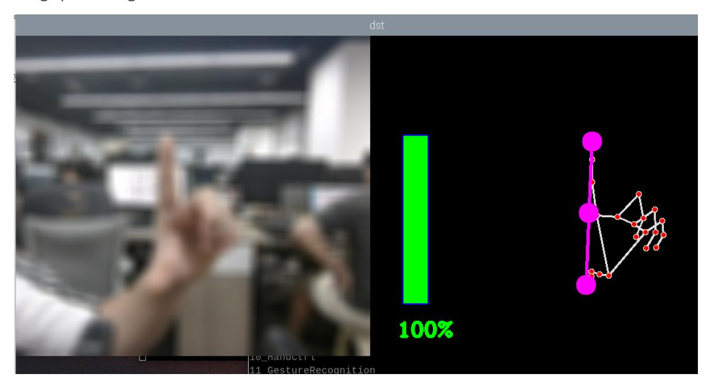
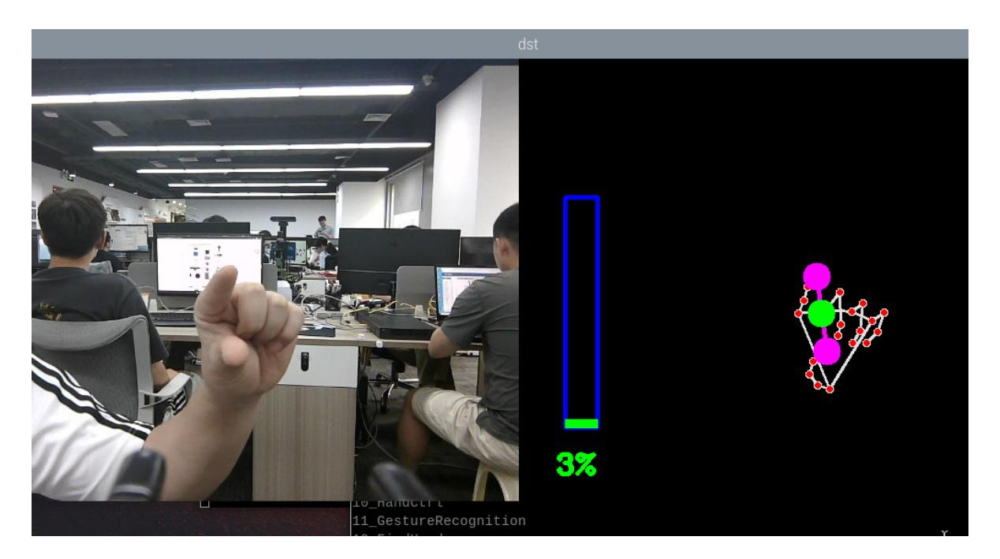
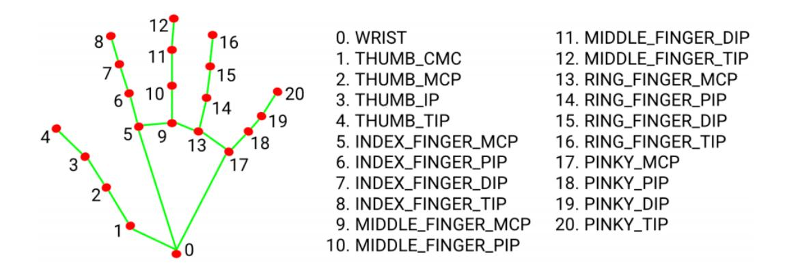

## Finger control

## 1. Content Description

This course implements color images and uses the mediapipe framework to detect fingers. It then calculates the angles formed by the thumb tip, wrist joint, and index finger tip to change the effect of image processing.

This section requires entering commands in the terminal. The terminal you open depends on your motherboard type. This lesson uses the Raspberry Pi 5 as an example. For Raspberry Pi and Jetson Nano boards, you need to open a terminal on the host computer and enter the command to enter the Docker container. Once inside the Docker container, enter the commands mentioned in this section in the terminal. For instructions on entering the Docker container from the host computer, refer to this product tutorial **[Configuration and Operation Guide]--[Enter the Docker (Jetson Nano and Raspberry Pi 5 users, see here)]**.

Simply open the terminal on the Orin motherboard and enter the commands mentioned in this section.

## 2. Program startup

First, in the terminal, enter the following command to start the camera,

```
ros2 launch orbbec_camera dabai_dcw2.launch.py
```

After successfully starting the camera, open another terminal and enter the following command in the terminal to start the finger control program.

```
ros2 run yahboomcar_mediapipe 10_HandCtrl
```

After the program is running, press the F key to switch the image processing effect, and then change the angle by changing the distance between the thumb and index finger to control the image processing effect.





## 3. Core code analysis

Program code path:

Raspberry Pi 5 and Jetson Nano board

The program code is in the running docker. The path in docker is /root/yahboomcar_ws/src/yahboomcar_mediapipe/yahboomcar_mediapipe/10_HandCtrl. py

Orin Motherboard

The program code path is /home/jetson/yahboomcar_ws/src/yahboomcar_mediapipe/yahboomcar_mediapipe/10_Ha ndCtrl.py

Import the necessary library files,

```
import math
import time
import cv2 as cv
import numpy as np
import mediapipe as mp
import rclpy
from rclpy.node import Node
from cv_bridge import CvBridge
from sensor_msgs.msg import Image
from arm_msgs.msg import ArmJoints
import cv2
```

Initialize data and define publishers and subscribers,

```
def __init__(self, name):
    super().__init__(name)
    #Define the image processing effect list
    self.effect = ["color", "thresh", "blur", "hue", "enhance"]
    self.volBar = 400
    self.pTime = self.cTime = self.volPer = self.value = self.index = 0
    #Use the class in the mediapipe library to define a hand object
```

```
self.mpHand = mp.solutions.hands
    self.mpDraw = mp.solutions.drawing_utils
    self.hands = self.mpHand.Hands(
        static_image_mode=False,
        max_num_hands=2,
        min_detection_confidence=0.5,
        min_tracking_confidence=0.5
    )
    #Define the properties of the joint connection line, which will be used in
the subsequent joint point connection function
    self.lmDrawSpec = mp.solutions.drawing_utils.DrawingSpec(color=(0, 0, 255),
thickness=-1, circle_radius=15)
    self.drawSpec = mp.solutions.drawing_utils.DrawingSpec(color=(0, 255, 0),
thickness=10, circle_radius=10)
    self.rgb_bridge = CvBridge()
    #Define the topic for controlling 6 servos and publish the detected posture
    self.TargetAngle_pub = self.create_publisher(ArmJoints, "arm6_joints", 10)
    self.init_joints = [90, 150, 10, 20, 90, 90]
    self.pubSix_Arm(self.init_joints)
    #Define subscribers for the color image topic
    self.sub_rgb =
self.create_subscription(Image,"/camera/color/image_raw",self.get_RGBImageCallBa
ck,100)
```

Color image callback function,

```
def get_RGBImageCallBack(self,msg):
    #Use CvBridge to convert color image message data into image data
    frame = self.rgb_bridge.imgmsg_to_cv2(msg, "bgr8")
    action = cv2.waitKey(1)
    #Call function to detect the palm and draw the palm joint connection diagram
    img = self.findHands(frame)
    #Call findPosition to get the coordinates of the finger joint list
    lmList = self.findPosition(frame, draw=False)
    if len(lmList) != 0:
        #Calculate the angle
        angle = self.calc_angle(4, 0, 8)
        x1, y1 = lmList[4][1], lmList[4][2]
        x2, y2 = lmList[8][1], lmList[8][2]
        cx, cy = (x1 + x2) // 2, (y1 + y2) // 2
        cv.circle(img, (x1, y1), 15, (255, 0, 255), cv.FILLED)
        cv.circle(img, (x2, y2), 15, (255, 0, 255), cv.FILLED)
        cv.line(img, (x1, y1), (x2, y2), (255, 0, 255), 3)
        cv.circle(img, (cx, cy), 15, (255, 0, 255), cv.FILLED)
        if angle <= 10: cv.circle(img, (cx, cy), 15, (0, 255, 0), cv.FILLED)
        #calculate
        self.volBar = np.interp(angle, [0, 70], [400, 150])
        self.volPer = np.interp(angle, [0, 70], [0, 100])
        self.value = np.interp(angle, [0, 70], [0, 255])
        # print("angle: {},value: {}".format(angle, value))
    # Perform a threshold binarization operation. Values greater than the
threshold value are represented by 255, and values less than the threshold value
are represented by 0.
    if self.effect[self.index]=="thresh":
        gray = cv.cvtColor(frame, cv.COLOR_BGR2GRAY)
        frame = cv.threshold(gray, self.value, 255, cv.THRESH_BINARY)[1]
```

```
# Perform Gaussian filtering, (21, 21) means that the length and width of the
Gaussian matrix are both 21, and the standard deviation is value
    elif self.effect[self.index]=="blur":
        frame = cv.GaussianBlur(frame, (21, 21), np.interp(self.value, [0, 255],
[0, 11]))
    # Color space conversion, HSV to BGR
    elif self.effect[self.index]=="hue":
        frame = cv.cvtColor(frame, cv.COLOR_BGR2HSV)
        frame[:, :, 0] += int(self.value)
        frame = cv.cvtColor(frame, cv.COLOR_HSV2BGR)
    # Adjust contrast
    elif self.effect[self.index]=="enhance":
        enh_val = self.value / 40
        clahe = cv.createCLAHE(clipLimit=enh_val, tileGridSize=(8, 8))
        lab = cv.cvtColor(frame, cv.COLOR_BGR2LAB)
        lab[:, :, 0] = clahe.apply(lab[:, :, 0])
        frame = cv.cvtColor(lab, cv.COLOR_LAB2BGR)
    #Press the F key to switch the processing effect
    if action == ord('f'):
        self.index += 1
        if self.index >= len(self.effect): self.index = 0
    cv.rectangle(img, (50, 150), (85, 400), (255, 0, 0), 3)
    cv.rectangle(img, (50, int(self.volBar)), (85, 400), (0, 255, 0), cv.FILLED)
    cv.putText(img, f'{int(self.volPer)}%', (40, 450), cv.FONT_HERSHEY_COMPLEX,
1, (0, 255, 0), 3)
    #Merge images
    dst = self.frame_combine(frame, img)
    cv.imshow('dst', dst)
```

findPosition obtains the id of each joint and the xy coordinates of each joint.

```
def findPosition(self, frame, draw=True):
    #Create a detection list to store the detection results
    self.lmList = []
    if self.results.multi_hand_landmarks:
        #Traverse the test results and add the test results to the self.lmList
list, which represents the ID of each person's joint and the xy coordinates of
the joint detected
        for id, lm in enumerate(self.results.multi_hand_landmarks[0].landmark):
            # print(id,lm)
            h, w, c = frame.shape
            cx, cy = int(lm.x * w), int(lm.y * h)
            # print(id, lm.x, lm.y, lm.z)
            self.lmList.append([id, cx, cy])
            if draw: cv.circle(frame, (cx, cy), 15, (0, 0, 255), cv.FILLED)
    return self.lmList
```

As shown in the figure below, the ID of each joint of the finger,



calc_angle calculates the angle, here we calculate the angle between the thumb tip, wrist joint and index finger tip.

```
def calc_angle(self, pt1, pt2, pt3):
    point1 = self.lmList[pt1][1], self.lmList[pt1][2]
    point2 = self.lmList[pt2][1], self.lmList[pt2][2]
    point3 = self.lmList[pt3][1], self.lmList[pt3][2]
    a = self.get_dist(point1, point2)
    b = self.get_dist(point2, point3)
    c = self.get_dist(point1, point3)
    try:
        radian = math.acos((math.pow(a, 2) + math.pow(b, 2) - math.pow(c, 2)) /
(2 * a * b))
        angle = radian / math.pi * 180
    except:
        angle = 0
    return abs(angle)
```
