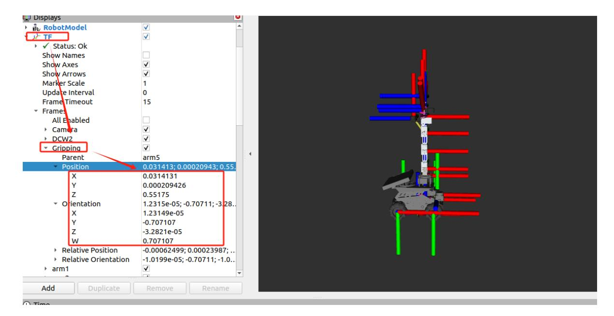

# Robotic arm solution

## 1. Content Description

This course implements the forward kinematics and inverse kinematics calculations of the robotic arm. Forward kinematics is the calculation of the end-point pose from the angle value of each servo of the robotic arm, while inverse kinematics is the calculation of the angle value of each servo from the end-point pose. Both play a vital role in three-dimensional space clamping. The forward kinematics algorithm can be used to determine the current pose of the end of the robotic arm. We need to know this value when performing coordinate system conversion. The inverse kinematics algorithm can be used to calculate the angle of each servo of the robotic arm in order for the end of the robotic arm to reach the target pose. Before clamping, this algorithm needs to be called to calculate the servo value and then control the servo to move to the clamping posture.

This section requires entering commands in the terminal. The terminal you open depends on your motherboard type. This lesson uses the Raspberry Pi 5 as an example. For Raspberry Pi and Jetson Nano boards, you need to open a terminal on the host computer and enter the command to enter the Docker container. Once inside the Docker container, enter the commands mentioned in this section in the terminal. For instructions on entering the Docker container from the host computer, refer to this product tutorial **[Configuration and Operation Guide]--[Enter the Docker (Jetson Nano and Raspberry Pi 5 users, see here)]**.

Simply open the terminal on the Orin motherboard and enter the commands mentioned in this section.

## 2. Program startup

In the terminal, enter the following command to start,

```bash
ros2 run arm_kin kin_srv
```

After startup, enter the terminal ros2 node list to view the node list,

/kinemarics_arm is the node that starts the forward and inverse solution. Enter ros2 node info /kinemarics_arm in the terminal to query the node information.

As shown in the figure above, the /kinemarics_arm node provides a service /get_kinemarics. The service type is arm_interface/srv/ArmKinemarics. Enter the terminal ros2 interface show arm_interface/srv/ArmKinemarics to view the content of this service data.

```
float64 tar_x
float64 tar_y
float64 tar_z
float64 roll
float64 pitch
float64 yaw
float64 cur_joint1
float64 cur_joint2
float64 cur_joint3
float64 cur_joint4
float64 cur_joint5
float64 cur_joint6
string kin_name
---
float64 joint1
float64 joint2
float64 joint3
float64 joint4
float64 joint5
float64 joint6
float64 x
float64 y
float64 z
float64 roll
float64 pitch
float64 yaw
```

---Divide the data into two parts, the upper part is the request and the lower part is the response. The request part is as follows,

```
#The x coordinate of the end position of the robotic arm, in meters
float64 tar_x
#The y coordinate of the end position of the robotic arm, in meters
float64 tar_y
#The z coordinate of the end position of the robotic arm, in meters
float64 tar_z
```

```
#Rotation value of the end-arm posture roll around the X-axis, in radians
float64 roll
#Rotation value of the pitch value of the end arm around the y-axis, in radians
float64 pitch
#The yaw value of the end position of the robot arm is the rotation value around
the z axis, in radians
float64 yaw
#Current value of Servo No. 1, in degrees
float64 cur_joint1
#Current value of Servo 2, in degrees
float64 cur_joint2
#Current value of Servo 3, in degrees
float64 cur_joint3
#Current value of Servo 4, in degrees
float64 cur_joint4
#Current value of servo No. 5, unit is degree
float64 cur_joint5
#Current value of servo No. 6, unit is degree
float64 cur_joint6
#Solution type: ik represents inverse kinematics solution, fk represents forward
kinematics solution
string kin_name
```

The response part is as follows,

```
#1 Servo Angle
float64 joint1
#2 Servo Angle
float64 joint2
#3 Servo Angle
float64 joint3
#4 Servo Angle
float64 joint4
#5 Servo Angle
float64 joint5
#6 Servo Angle
float64 joint6
#x coordinate of the end pose of the robotic arm
float64 x
#The end pose coordinates of the robotic arm
float64 y
#z coordinate of the end position of the robotic arm
float64 z
#Rotation value of the end-arm posture roll around the X-axis, in radians
float64 roll
#Rotation value of the pitch value of the end arm around the Y axis, in radians
float64 pitch
#The yaw value of the end-arm position is the rotation value around the Z axis,
in radians
float64 yaw
```

### 2.1. Call fk

We call fk to calculate: when the robot arm is straightened upward, what is the position of the end of the robot arm? First, we enter the following command to straighten the robot arm upward. After successfully connecting to the agent, enter the following command in the terminal,

```bash
ros2 topic pub /arm6_joints arm_msgs/msg/ArmJoints { "joint1: 90,joint2:
90,joint3: 90,joint4: 90,joint5: 90,joint6: 90,time: 1500" } --once
```

After running, the robotic arm will straighten upwards. Then, we enter the following command in the terminal to call the fk service.

```
ros2 service call /get_kinemarics arm_interface/srv/ArmKinemarics "{tar_x: 0.0,
tar_y: 0.0, tar_z: 0.0, roll: 0.0, pitch: 0.0, yaw: 0.0, cur_joint1: 90.0,
cur_joint2: 90.0, cur_joint3: 90.0, cur_joint4: 90.0, cur_joint5: 90.0,
cur_joint6: 90.0, kin_name: 'fk'}"
```

The values to be entered here are cur_joint1 to cur_joint6. We enter 90.0 for each. For the value of kin_name, we enter 'fk' to call the fk-positive solution service. The terminal will respond with the following content as shown below.

Check out the response section:

```
response:
arm_interface.srv.ArmKinemarics_Response (joint1 = 0 .0, joint2 = 0 .0, joint3 =
0 .0, joint4 = 0 .0, joint5 = 0 .0, joint6 = 0 .0, x = 0 .03141308752246765, y =
0 .00020942581836905875, z = 0 .5517500187814817, roll = 1 .5728637148906415,
pitch = -1 .5707324948694676, yaw = -1 .5728927150075942)
```

We only need to care about the following x, y, z, roll, pitch and yaw values. Here we represent the pose coordinates of the end of the robot arm, which means the position of the end of the robot arm in the world coordinate system, with base_link (0, 0, 0) as the reference point. When the robot arm is straightened upward, the values of xyz and rpy are x=0.03141308752246765, y=0.00020942581836905875, z=0.5517500187814817, roll=1.5728637148906415, pitch=-1.5707324948694676, yaw=-1.5728927150075942. Here, start the urdf display in the virtual machine and enter the following command in the virtual machine terminal to start the urdf display.

```bash
ros2 launch yahboom_M3Pro_description display_launch.py
```

As shown in the figure below, the TF plug-in is used to view the Gripping pose. The xyz coordinate values are almost the same as the response values, while the rpy value needs to be obtained by converting the quaternion to rpy.



### 2.2. call ik

We call fk to calculate: when the robot arm, the end of the robot arm pose is x=0.03141308752246765, y=0.00020942581836905875, z=0.5517500187814817, roll=1.5728637148906415, pitch=-1.5707324948694676, yaw=-1.5728927150075942, what is the value of each servo. In fact, this is reverse calculation. Theoretically, the result should be that the value of all six servos is 90.0. Enter the following command in the terminal,

```
ros2 service call /get_kinemarics arm_interface/srv/ArmKinemarics "{tar_x:
0.03141308752246765, tar_y: 0.00020942581836905875, tar_z: 0.5517500187814817,
roll: 1.5728637148906415, pitch: -1.5707324948694676, yaw: -1.5728927150075942,
cur_joint1: 0.0, cur_joint2: 0.0, cur_joint3: 0.0, cur_joint4: 0.0, cur_joint5:
0.0, cur_joint6: 0.0, kin_name: 'ik'}"
```

The values entered here are xyz and rpy. For cur_joint1-cur_joint6, we use the default values. The result is shown in the figure below.

The final response value returned is as follows:

```
arm_interface.srv.ArmKinemarics_Response(joint1=90.0, joint2=90.0, joint3=90.0,
joint4=90.0, joint5=90.0, joint6=0.0, x=0.0, y=0.0, z=0.0, roll=0.0, pitch=0.0,
yaw=0.0)
```

Here, we only need to focus on the values of joint1-joint5. Because the end of the robot arm is gripping and connected to servo No. 5, the value of servo No. 6 is not within the range of the inverse solution. Therefore, the value obtained here [90.0, 90.0, 90.0, 90.0, 90.0] is the same as the value of each servo in the current posture of the robot arm. Therefore, the result of the inverse solution can be considered correct.

## 3. Core code analysis

Program code path:

Raspberry Pi 5 and Jetson Nano board

The program code is in the running docker. The path in docker is /root/yahboomcar_ws/src/arm_kin/src/kin_srv.cpp

Orin Motherboard

The program code path is /home/jetson/yahboomcar_ws/src/arm_kin/src/kin_srv.cpp

Main function main,

```
int main ( int argc , char ** argv )
{
   rclcpp::init ( argc , argv );
   rcutils_logging_set_logger_level ( "kdl_parser" , RCUTILS_LOG_SEVERITY_ERROR
);
   auto node = rclcpp::Node::make_shared ( "kinemarics_arm" );
   //Create a service with the service name get_kinemarics and the service
callback function handle_service
   auto service = node -> create_service < arm_interface::srv::ArmKinemarics
> ( "get_kinemarics" , handle_service );
   rclcpp::spin ( node );
   rclcpp::shutdown ();
   return 0 ;
}
```

Service callback function handle_service,

```
void handle_service (
 const std::shared_ptr < arm_interface::srv::ArmKinemarics::Request > request
,
 std::shared_ptr < arm_interface::srv::ArmKinemarics::Response > response )
{
 cout << "-----------------" << endl ;
 cout << request -> kin_name << endl ;
     if ( request -> kin_name == "fk" ) {
       double joints []{ request -> cur_joint1 , request -> cur_joint2 ,
request -> cur_joint3 , request -> cur_joint4 ,
                       request -> cur_joint5 , request -> cur_joint6 };
       // Define the target joint angle container
       vector < double > initjoints ;
       // Define pose container
       vector < double > initpos ;
       // Target joint angle unit conversion, from degrees to radians
       for ( int i = 0 ; i < 6 ; ++ i ) initjoints . push_back (( joints [
i ] - 90 ) * DE2RA );
       //Call fk to get the target pose initpos
       arm_getFK ( urdf_file , initjoints , initpos );
       response -> x = initpos . at ( 0 );
       response -> y = initpos . at ( 1 );
       response -> z = initpos . at ( 2 );
       response -> roll = initpos . at ( 3 );
```

```
response -> pitch = initpos . at ( 4 );
       response -> yaw = initpos . at ( 5 );
       cout << "-----------------" << endl ;
   }
   if ( request -> kin_name == "ik" ) {
       // Grasping pose
       double Roll = request -> roll ;
       double Pitch = request -> pitch ;
       double Yaw = request- > yaw ;
       double x = request -> tar_x ;
       double y = request- > tar_y ;
       double z = request -> tar_z ;
       // End position (unit: m)
       double xyz []{ x , y , z };
       cout << x << y << z << endl ;
       // End attitude (unit: radians)
       //double rpy[]{Roll * DE2RA, Pitch * DE2RA, Yaw * DE2RA};
       double rpy []{ Roll , Pitch , Yaw };
       // Create output angle container
       vector < double > outjoints ;
       // Create the end position container
       vector < double > targetXYZ ;
       // Create an end gesture container
       vector < double > targetRPY ;
       for ( int k = 0 ; k < 3 ; ++ k ) targetXYZ . push_back ( xyz [ k
]);
       for ( int l = 0 ; l < 3 ; ++ l ) targetRPY . push_back ( rpy [ l
]);
       // //Call fk to get the target servo angle outjoints
       arm_getIK ( urdf_file , targetXYZ , targetRPY , outjoints );
       // Print the inverse solution
       for ( int i = 0 ; i < 5 ; i ++ ) cout << ( outjoints . at ( i ) *
RA2DE ) + 90 << "," ;
       cout << endl ;
       a ++ ;
       response -> joint1 = ( outjoints . at ( 0 ) * RA2DE ) + 90 ;
       response -> joint2 = ( outjoints . at ( 1 ) * RA2DE ) + 90 ;
       response -> joint3 = ( outjoints . at ( 2 ) * RA2DE ) + 90 ;
       response -> joint4 = ( outjoints . at ( 3 ) * RA2DE ) + 90 ;
       response -> joint5 = ( outjoints . at ( 4 ) * RA2DE ) + 90 ;
       cout << "-----------------" << endl ;
   }
}
```
