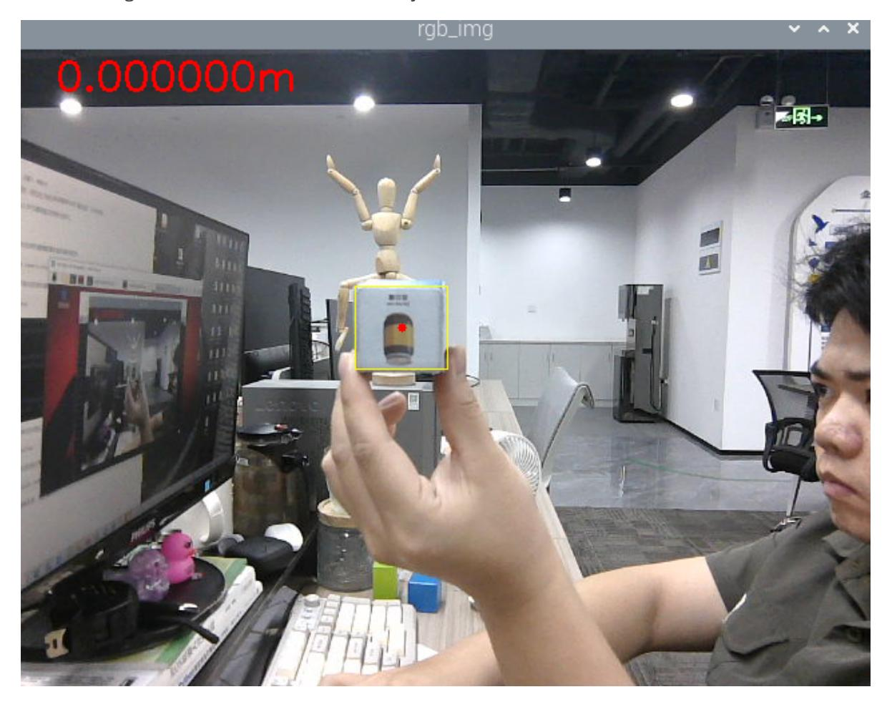

# KFC tracks gripped objects

### 1. Content Description

This function allows the program to acquire an image through the camera, then use the mouse to select the object to be tracked and gripped. After pressing the spacebar, slowly move the object to be tracked. The robotic arm will track the object, keeping its center at the center of the image. After the robotic arm stops tracking, the program will adjust the distance between the object and the robot's base_link and then control the robotic arm to grip the object.

#### Notice:

- The object you select should be as large as possible. If the object is too small, it will not be possible to accurately obtain depth information, resulting in the program being unable to control the robotic arm and chassis. It is recommended that the object has a cross-section of no more than 7 cm.
- The gripping angle of the robot arm's gripper needs to be adjusted according to the selected object. Otherwise, it will not be able to clamp firmly or clamp too tightly, which may burn out the No. 6 servo. For the first grip, you can prevent the gripper from gripping the object. Then, modify the No. 6 servo angle in the program and then grip again. The smaller the value, the wider the gripper opens. The minimum is 0 degrees, and the maximum value results in a smaller gripper opening.

This section requires entering commands in the terminal. The terminal you open depends on your motherboard type. This lesson uses the Raspberry Pi 5 as an example. For Raspberry Pi and Jetson Nano boards, you need to open a terminal on the host computer and enter the command to enter the Docker container. Once inside the Docker container, enter the commands mentioned in this section in the terminal. For instructions on entering the Docker container from the host computer, refer to this product tutorial **[Configuration and Operation Guide]--[Enter the Docker (Jetson Nano and Raspberry Pi 5 users, see here)]**.

Simply open the terminal on the Orin motherboard and enter the commands mentioned in this section.

## 2. Program startup

First, open the terminal and enter the following command to start the robot arm solver and camera driver,

ros2 launch M3Pro_demo camera_arm_kin.launch.py

Then, open another terminal and enter the following command to start the robotic arm gripping program:

ros2 run M3Pro_demo grasp

Then, open the third terminal and enter the following command to start the KCF tracking program:

```
ros2 run M3Pro_demo KCF_follow
```

Then open the fourth terminal and enter the following command to start the KCF program,

```
ros2 run M3Pro_KCF KCF_Tracker_Node
```

After starting, use the mouse to frame the object to be tracked, as shown below.



Then press the spacebar to start tracking. Slowly move the selected object, and the robotic arm will track the object, keeping the center of the selected object in the middle of the image. After stopping tracking, the program will determine whether the distance between the robot base_link and the machine code is within the range of [240, 260]. If so, the buzzer will sound, and the program will control the robotic arm to grab the selected object, place it in the set position, and finally return to the initial posture; if the distance between the robot base_link and the selected object is outside the range of [240, 260], the program will control the chassis to move forward

until the condition that both are within the range of [240, 260] is met, and then the gripping, placement, and homing operations will be performed.

### 3. Core code analysis

#### 3.1, KCF_Tracker_Node

Program code path:

Raspberry Pi and Jetson Nano board

The program code is in the running docker. The paths in docker are /root/yahboomcar_ws/src/M3Pro_KCF/src/KCF_Tracker.cpp and /root/yahboomcar_ws/src/M3Pro_KCF/include/M3Pro_KCF/KCF_Tracker.h

Orin Motherboard

The program code path is /home/jetson/yahboomcar_ws/src/M3Pro_KCF/src/KCF_Tracker.cpp, /home/jetson/yahboomcar_ws/src/M3Pro_KCF/include/M3Pro_KCF/KCF_Tracker.h

First, let's look at what publishers and subscribers are defined in KCF_Tracker.h.

```
//Color image topic subscriber
image_sub_=this->create_subscription<sensor_msgs::msg::Image>
("/camera/color/image_raw",1,std::bind(&ImageConverter::imageCb,this,_1));
//Dark image topic subscribers
depth_sub_=this->create_subscription<sensor_msgs::msg::Image>
("/camera/depth/image_raw",1,std::bind(&ImageConverter::depthCb,this,_1));
//Controller buttons control topic subscribers
Joy_sub_=this->create_subscription<std_msgs::msg::Bool>
("JoyState",1,std::bind(&ImageConverter::JoyCb,this,_1));
//Reset the topic subscribers of the pickup box
Reset_sub_=this->create_subscription<std_msgs::msg::Bool>
("reset_flag",1,std::bind(&ImageConverter::ResetStatusCb,this,_1));
//Publisher of the topic of publishing speed control
vel_pub_ =this->create_publisher<geometry_msgs::msg::Twist>("/cmd_vel",1);
//Publisher of the topic of object location information
pos_pub_ =this->create_publisher<arm_interface::msg::Position>("/pos_xyz",1);
```

In KCF_Tracker.cpp, the main functions are to subscribe to the color image and use the mouse to frame the object to be tracked, subscribe to the depth image to calculate the depth information of the tracked object and publish the position information of the tracked object, subscribe to the topic of resetting the object frame and publishing the stop command, etc. Next, take a look at the source code content of KCF_Tracker.cpp.

Import the necessary header files,

```
#include <iostream>
#include "KCF_Tracker.h"
#include <rclcpp/rclcpp.hpp>
#include <cv_bridge/cv_bridge.h>
#include "kcftracker.h"
#include <opencv2/core/core.hpp>
#include <opencv2/highgui/highgui.hpp>
```

```
void ImageConverter::imageCb(const std::shared_ptr<sensor_msgs::msg::Image> msg)
{
    cv_bridge::CvImagePtr cv_ptr;
    try {
        //Used to convert ROS image message (sensor_msgs::Image) to OpenCV image
format (cv::Mat) and ensure that the data is an independent copy
        cv_ptr = cv_bridge::toCvCopy(msg, sensor_msgs::image_encodings::BGR8);
    }
    catch (cv_bridge::Exception &e) {
        std::cout<<"cv_bridge exception"<<std::endl;
        return;
    }
    //Copy the image and store it as rgbimage
    cv_ptr->image.copyTo(rgbimage);
    //Set the mouse event callback function for the RGB_WINDOW window
    setMouseCallback(RGB_WINDOW, onMouse, 0);
    //If ROSI exists, that is, the object frame is drawn
    if (bRenewROI) {
         //The size of the judgment box must be greater than 0
         if (selectRect.width <= 0 || selectRect.height <= 0)
         {
             bRenewROI = false;
             return;
         }
        // Initialize the tracker and specify the initial target location,
providing the first frame image (Mat format) and the target's bounding box (Rect
format). The algorithm will extract features of the region (such as HOG, color
information, etc.) as a basis for tracking.
        tracker.init(selectRect, rgbimage);
        bBeginKCF = true;
        bRenewROI = false;
        enable_get_depth = false;
    }
    if (bBeginKCF) {
        // Track target
        result = tracker.update(rgbimage);
        //Frame the tracked object with a yellow frame
        rectangle(rgbimage, result, Scalar(0, 255, 255), 1, 8);
        //On the color image, mark the center point of the tracked object in red
        circle(rgbimage, Point(result.x + result.width / 2, result.y +
result.height / 2), 3, Scalar(0, 0, 255),-1);
    } else rectangle(rgbimage, selectRect, Scalar(255, 0, 0), 2, 8, 0);
    std::string text = std::to_string(get_depth);
    std::string units= "m";
    text = text + units;
    cv::Point org(30, 30);
    int fontFace = cv::FONT_HERSHEY_SIMPLEX;
    double fontScale = 1.0;
    int thickness = 2;
    cv::Scalar color(0, 0, 255);
    //Display depth distance information on the color image
    putText(rgbimage, text, org, fontFace, fontScale, color, thickness);
    imshow(RGB_WINDOW, rgbimage);
    int action = waitKey(1) & 0xFF;
    //If the q key is pressed, cancel tracking
    if (action == 'q' || action == ACTION_ESC) this->Cancel();
    //If you press the r key, reset the object frame
```

```
else if (action == 'r') this->Reset();
    //If you press the space bar, start getting the depth information of the
center point of the tracked object
    else if (action == ACTION_SPACE) enable_get_depth = true;
}
```

ImageConverter::depthCb depth image topic callback function,

```
void ImageConverter::depthCb(const std::shared_ptr<sensor_msgs::msg::Image> msg)
{
    cv_bridge::CvImagePtr cv_ptr;
    try {
        cv_ptr = cv_bridge::toCvCopy(msg,
sensor_msgs::image_encodings::TYPE_32FC1);
        cv_ptr->image.copyTo(depthimage);
    }
    catch (cv_bridge::Exception &e) {
        std::cout<<"Could not convert from to 'TYPE_32FC1'."<<std::endl;
    }
    //If you enable obtaining the depth information of the center point of the
tracking object
    if (enable_get_depth) {
        //Calculate the xy coordinates of the center point by taking the object
frame
        int center_x = (int)(result.x + result.width / 2);
        std::cout<<"center_x: "<<center_x<<std::endl;
        int center_y = (int)(result.y + result.height / 2);
        std::cout<<"center_y: "<<center_y<<std::endl;
        //Get the depth information of the 5 points around the center point
        dist_val[0] = depthimage.at<float>(center_y - 5, center_x - 5)/1000.0;
        dist_val[1] = depthimage.at<float>(center_y - 5, center_x + 5)/1000.0;
        dist_val[2] = depthimage.at<float>(center_y + 5, center_x + 5)/1000.0;
        dist_val[3] = depthimage.at<float>(center_y + 5, center_x - 5)/1000.0;
        dist_val[4] = depthimage.at<float>(center_y, center_x)/1000.0;
        std::cout<<"dist_val[0]: "<<dist_val[0]<<std::endl;
        std::cout<<"dist_val[1]: "<<dist_val[1]<<std::endl;
        std::cout<<"dist_val[2]: "<<dist_val[2]<<std::endl;
        std::cout<<"dist_val[3]: "<<dist_val[3]<<std::endl;
        std::cout<<"dist_val[4]: "<<dist_val[4]<<std::endl;
        float distance = 0;
        int num_depth_points = 5;
        //Traverse 5 depth information points
        for (int i = 0; i < 5; i++) {
            //If the depth information point is not 0, then accumulate the depth
information value
            if (dist_val[i] !=0 ) distance += dist_val[i];
            else num_depth_points--;
        }
        //Get the average value of the depth information of the valid points
        distance /= num_depth_points;
        //Define a data to store the position information of the tracking object
        arm_interface::msg::Position pos;
        pos.x = center_x;
        pos.y = center_y;
        if (std::isnan(distance))
        {
            //ROS_INFO("distance error!");
```

```
distance = 999;
        }
        pos.z = distance;
        get_depth = distance;
        //Publish topic message of object location information
        pos_pub_->publish(pos);
    }
    else{
        //If the depth information of the center point of the tracked object is
not enabled, then the parking information is released
        geometry_msgs::msg::Twist twist;
        vel_pub_->publish(twist);
    }
    waitKey(1);
}
```

#### 3.2, KCF_follow.py

Program code path:

Raspberry Pi and Jetson Nano board

The program code is in the running docker. The path in docker is /root/yahboomcar_ws/src/M3Pro_demo/M3Pro_demo/KCF_follow.py

Orin Motherboard

The program code path is /home/jetson/yahboomcar_ws/src/M3Pro_demo/M3Pro_demo/KCF_follow.py

Import the necessary library files,

```
import cv2
import os
import numpy as np
from cv_bridge import CvBridge
import cv2 as cv
from M3Pro_demo.Robot_Move import *
from arm_interface.srv import ArmKinemarics
from arm_interface.msg import AprilTagInfo,Position,CurJoints
from arm_msgs.msg import ArmJoints
from std_msgs.msg import Float32,Bool,UInt16
import time
from rclpy.node import Node
import rclpy
import transforms3d as tfs
import tf_transformations as tf
from message_filters import Subscriber,
TimeSynchronizer,ApproximateTimeSynchronizer
from sensor_msgs.msg import Image
from geometry_msgs.msg import Twist
from M3Pro_demo.PID import *
```

Program initialization and creation of publishers and subscribers,

```
def __init__(self, name):
    super().__init__(name)
    self.init_joints = [90, 150, 12, 20, 90, 0]
```

```
self.cur_distance = 0.0
    self.track_flag = True
    self.grasp_Dist = 240
    # Initialize chassis PID adjustment parameters
    self.linearx_PID = (0.5, 0.0, 0.2)
    self.camera_info_K = [477.57421875, 0.0, 319.3820495605469, 0.0,
477.55718994140625, 238.64108276367188, 0.0, 0.0, 1.0]
    self.EndToCamMat = np.array([[ 0 ,0 ,1 ,-1.00e-01],
                                 [-1 ,0 ,0 ,0],
                                 [0 ,-1 ,0 ,4.82000000e-02],
                                 [ 0.00000000e+00 , 0.00000000e+00 ,
0.00000000e+00 , 1.00000000e+00]])
    self.CurEndPos = [0.15326204031848129, 0.00021945213146852945,
0.3441362743447702, 6.061238269342215e-05, -0.03490672896787105,
-2.909509128997985e-05]
    self.x_offset = offset_config.get('x_offset')
    self.y_offset = offset_config.get('y_offset')
    self.z_offset = offset_config.get('z_offset')
    self.pub_SixTargetAngle = self.create_publisher(ArmJoints, "arm6_joints",
10)
    self.pubSixArm(self.init_joints)
    #Subscribe to the topic of object location information
    self.pos_sub = Subscriber(self, Position, '/pos_xyz')
    self.sub_grasp_status =
self.create_subscription(Bool,"grasp_done",self.get_graspStatusCallBack,100)
    self.pub_CurJoints = self.create_publisher(CurJoints,"Curjoints",1)
    self.pos_info_pub = self.create_publisher(AprilTagInfo,"PosInfo",1)
    self.reset_pub = self.create_publisher(Bool,"reset_flag",1)
    self.CmdVel_pub = self.create_publisher(Twist,"cmd_vel",1)
    self.pub_beep = self.create_publisher(UInt16, "beep", 10)
    self.cur_joints = self.init_joints
    self.pubSixArm(self.init_joints)
    self.pub_cur_joints = self.create_publisher(CurJoints,"Curjoints",1)
    self.client = self.create_client(ArmKinemarics, 'get_kinemarics')
    self.get_current_end_pos()
    self.ts = ApproximateTimeSynchronizer([self.pos_sub], 1,
0.5,allow_headerless=True)
    self.ts.registerCallback(self.callback)
    self.adjust_dist = False
    self.start_grasp = False
    self.px = 0.0
    self.py = 0.0
    self.target_servox=90
    self.target_servoy=180
    self.xservo_pid = PositionalPID(0.25, 0.1, 0.05)
    self.yservo_pid = PositionalPID(0.25, 0.1, 0.05)
    self.y_out_range = False
    self.x_out_range = False
    self.a = 0
    self.b = 0
    self.XY_Track_flag = True
    self.Done_flag = True
    self.PID_init()
```

callback object position information topic callback function,

```
def callback(self,msg):
```

```
center_x, center_y = msg.x,msg.y
    cur_depth = msg.z
    print("cur_depth: ",cur_depth)
    #If the center point of the object is not in the middle of the image and the
robot tracking is enabled, call self.XY_track to control the robot to track
    if (abs(center_x-320) >10 or abs(center_y-240)>10) and
self.XY_Track_flag==True:
        self.XY_track(center_x,center_y)
        print("Tracking")
        print("-------------------------------------")
    #If the center point of the object is in the middle of the image and the last
tracking and gripping is completed, then enable chassis control and disable robot
tracking
    if abs(center_x-320) <10 and abs(center_y-240)<10 and self.Done_flag==True:
        self.adjust_dist = True
        self.XY_Track_flag = False
        print("Adjust it.")
        print("-------------------------------------")
    #If the current distance is not equal to 999, it means the distance is valid
and chassis control is enabled, then calculate the distance between the object
and the car base_link
    if cur_depth!=999.0 and self.adjust_dist == True:
        get_dist = self.compute_heigh(center_x,center_y,cur_depth)
        self.cur_distance = math.sqrt(get_dist[1] ** 2 + get_dist[0]** 2)*1000
        print("cur_distance: ",self.cur_distance)
        #If the calculated distance is not in the range [240,260], call
self.move_dist to control the chassis to adjust the distance
        if abs(self.cur_distance - 250.0)>10:
            dist_adjust = self.cur_distance
            self.move_dist(dist_adjust)
        #If the calculated distance is in the interval [240,260], then enable
the grip flag and disable chassis control
        else:
            self.start_grasp = True
            self.adjust_dist = False
    #If the gripping flag is enabled, it means that the object's location
information topic can be published
    if self.start_grasp == True:
        self.pubCurrentJoints()
        self.start_grasp = False
        self.Done_flag = False
        self.pubVel(0,0,0)
        pos = AprilTagInfo()
        pos.x = center_x
        pos.y = center_y
        pos.z = cur_depth
        #Buzzer sounds once
        self.Beep_Loop()
        reset = Bool()
        reset.data = True
        #Publish a topic about resetting the object picking frame, and place it
in the process of picking to identify other objects
        self.reset_pub.publish(reset)
        self.pos_info_pub.publish(pos)
    # If the distance is invalid, then issue a stop command
    if cur_depth==999.0:
        print("Invalid depth.")
```
