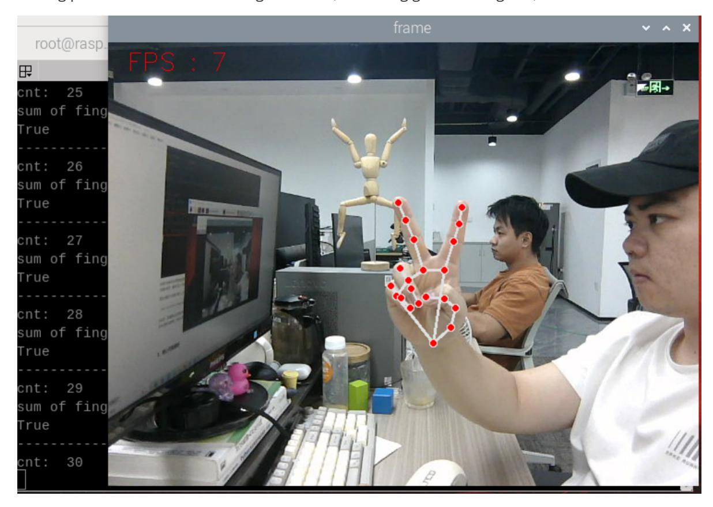
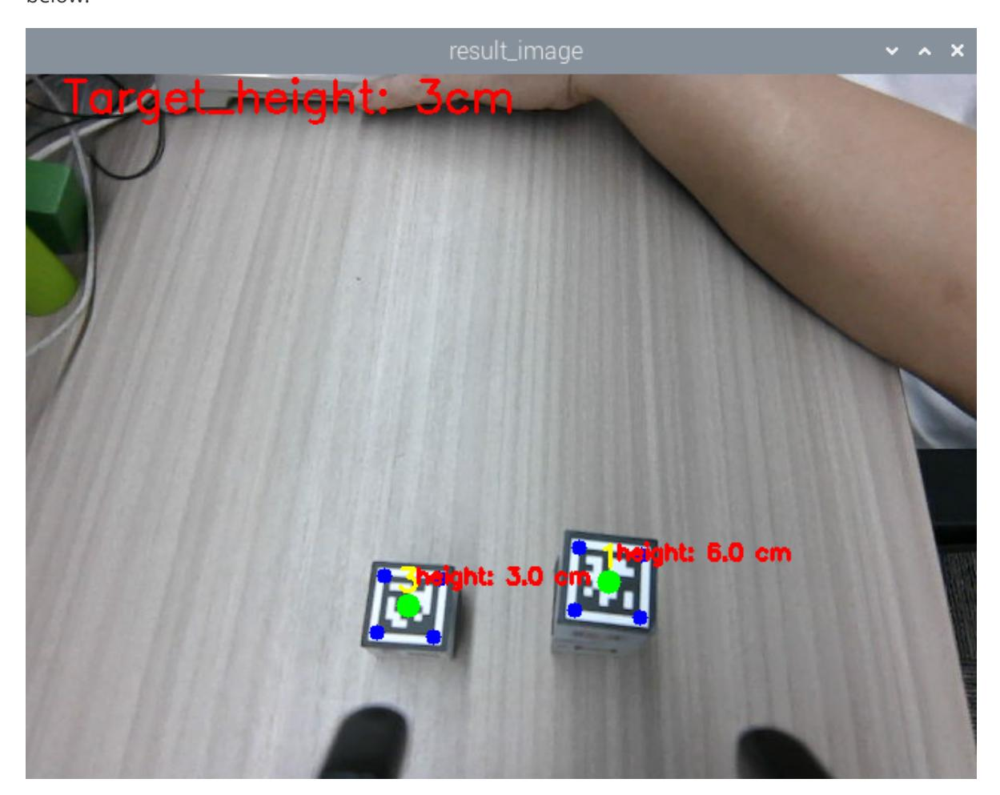

# Mediapipe gesture height sorting machine code

## 1. Content Description

This function implements the program capturing images through the camera and then recognizing gestures (1-4). The robotic arm then moves to a sorting posture. Based on the gesture results, a height threshold is calculated and the robotic block on the table that exceeds this height threshold is sorted. If a robotic block exceeds the height threshold, the robotic arm lowers its gripper to pick it up and place it at the designated location. If no robotic block exceeds the height threshold, the robotic arm shakes its head and returns to the gesture recognition posture.

This section requires entering commands in the terminal. The terminal you open depends on your motherboard type. This lesson uses the Raspberry Pi 5 as an example. For Raspberry Pi and Jetson Nano boards, you need to open a terminal on the host computer and enter the command to enter the Docker container. Once inside the Docker container, enter the commands mentioned in this section in the terminal. For instructions on entering the Docker container from the host computer, refer to this product tutorial **[Configuration and Operation Guide]--[Enter the Docker (Jetson Nano and Raspberry Pi 5 users, see here)]**.

Simply open the terminal on the Orin motherboard and enter the commands mentioned in this section.

The wooden blocks used in this lesson: **30x30x30mm Machine Code Blocks.**

## 2. Program startup

First, open the terminal and enter the following command to start the robot arm solver and camera driver,

```bash
ros2 launch M3Pro_demo camera_arm_kin.launch.py
```

Then, open another terminal and enter the following command to start the robotic arm gripping program:

```bash
ros2 run M3Pro_demo grasp_desktop
```

After running, it is as shown below:

Then enter the following command in the third terminal to start the Mediapipe gesture height sorting machine code program,

```bash
ros2 run M3Pro_demo apriltagHeight_gesture
```

After starting this command, the second terminal should receive the current angle topic information sent in one frame and calculate the current posture once, as shown in the figure below.

If the current angle information and the current pose are not received, the gripping pose will be inaccurately calculated during the coordinate system conversion. Therefore, you need to close the Mediapipe gesture height sorting machine code program by pressing Ctrl+C and restart the Mediapipe gesture height sorting machine code program until the robot arm gripping program obtains the current angle information and calculates the current end-point pose.

Then enter the following command in the fourth terminal to start the Mediapipe gesture recognition program,

```bash
ros2 run M3Pro_demo mediapipe_detect
```

After starting, the robot arm will move to the recognition posture and begin to recognize gestures. The recognized gestures are 1-4. Gesture 1 represents one finger stretched out, gesture 2 represents two fingers stretched out, gesture 3 represents three fingers stretched out, and gesture 4 represents four fingers stretched out. Keep the gesture in mind and wait for the buzzer

to sound, indicating that the gesture recognition is complete. The robot arm will move to the sorting posture. As shown in the figure below, assuming gesture 2 is given,



Once in sorting mode, it will begin recognizing the **30x30x30mm** machine code on the table. Here, we treat two 3cm machine codes stacked together as a 6cm height, as shown in the image below.



A height threshold appears in the upper left corner of the image. The height threshold is calculated by adding one to the gesture result. For example, if the gesture recognized above is 2, then the height threshold is 2 plus 1, which equals 3.

After waiting for 8 seconds, if a machine code exceeding the height threshold is found, the program will determine whether the distance between the machine code block with the height threshold and the car base_link is within the range of [210, 220]. If so, the lower claw will directly clamp the machine code block with the height threshold, and then place it at the set position, and finally the robotic arm returns to the sorting posture; if the distance between the machine code block with the height threshold and the car base_link is not within the range of [210, 220], the program will control the chassis to adjust the distance, adjust the distance between the two to be within the range of [210, 220], and then clamp it with the lower claw, and then place it at the set position, and finally the robotic arm returns to the sorting posture.

If the machine code of the height threshold is not found or no machine code is found, the buzzer on the car will sound, then the robotic arm will shake its head and finally return to the gesture recognition posture.

## 3. Core code analysis

Program code path:

Raspberry Pi and Jetson Nano board

The program code is in the running docker. The path in docker is /root/yahboomcar_ws/src/M3Pro_demo/M3Pro_demo/ apriltagHeight_gesture

Orin Motherboard

The program code path is /home/jetson/yahboomcar_ws/src/M3Pro_demo/M3Pro_demo/apriltagHeight_gesture

Import the necessary library files,

```python
import cv2
import os
import numpy as np
import message_filters
from M3Pro_demo . vutils import draw_tags
from dt_apriltags import Detector
from cv_bridge import CvBridge
import cv2 as cv
from arm_interface .srv import ArmKinemarics
from arm_interface .msg import AprilTagInfo , CurJoints
from arm_msgs . msg import ArmJoints
from arm_msgs . msg import ArmJoint
from M3Pro_demo . Robot_Move import *
from M3Pro_demo .compute_joint5 import *
from std_msgs . msg import Float32 , Bool , UInt16 , Int16
import time
import yaml
import math
from rclpy . node import Node
import rclpy
from message_filters import Subscriber ,
TimeSynchronizer , ApproximateTimeSynchronizer
from sensor_msgs . msg import Image
from geometry_msgs . msg import Twist
```

```python
import transforms3d as tfs
import tf_transformations as tf
```

The program initializes and creates publishers and subscribers,

```python
def __init__ ( self , name ):
    super (). __init__ ( name )
    #Robot arm sorting posture
    self . init_joints = [ 90 , 120 , 0 , 0 , 90 , 90 ]
    self . identify_joints = [ 90 , 150 , 12 , 20 , 90 , 0 ]
    #Define the array to store the end posture of the robotic arm
    self . CurEndPos = [ 0.1458589529828534 , 0.00022969568906952754 ,
0.18566515428310748 , 0.00012389155580734876 , 1.0471973953319513 ,
8.297829493472317e-05 ]
    self . rgb_bridge = CvBridge ()
    self . depth_bridge = CvBridge ()
    self . pubPos_flag = False
    self . at_detector = Detector ( searchpath =[ 'apriltags' ],
                                families = 'tag36h11' ,
                                nthreads = 8 ,
                                quad_decimate = 2.0 ,
                                quad_sigma = 0.0 ,
                                refine_edges = 1 ,
                                decode_sharpening = 0.25 ,
                                debug = 0 )
    self . Center_x_list = []
    self . Center_y_list = []
    self . pos_info_pub = self . create_publisher ( AprilTagInfo , "PosInfo" , 1
)
    self . CmdVel_pub = self . create_publisher ( Twist , "cmd_vel" , 1 )
    self . sub_grasp_status = self . create_subscription ( Bool , "grasp_done" ,
self . get_graspStatusCallBack , 100 )
    self . pub_cur_joints = self . create_publisher ( CurJoints , "Curjoints" ,
1 )
    self . TargetJoint5_pub = self . create_publisher ( Int16 , "set_joint5" ,
10 )
    #Define the publisher of the reset gesture result topic
    self . pub_reset_gesture = self . create_publisher ( Bool , "reset_gesture"
, 1 )
    self . TargetAngle_pub = self . create_publisher ( ArmJoints , "arm6_joints"
, 10 )
    self . pub_SingleTargetAngle = self . create_publisher ( ArmJoint ,
"arm_joint" , 10 )
    self . rgb_image_sub = Subscriber ( self , Image , '/camera/color/image_raw'
)
    self . depth_image_sub = Subscriber ( self , Image ,
'/camera/depth/image_raw' )
    self . client = self . create_client ( ArmKinemarics , 'get_kinemarics' )
    self . get_current_end_pos ()
    self . pubCurrentJoints ()
    #Define the subscriber who subscribes to the gesture recognition result
topic
    self . sub_GesturetId = self . create_subscription ( Int16 , "GesturetId" ,
self . get_GesturetIdCallBack , 1 )
    self . ts = ApproximateTimeSynchronizer ([ self . rgb_image_sub , self .
depth_image_sub ], 1 , 0.5 )
```

```
self . pub_beep = self . create_publisher ( UInt16 , "beep" , 10 )
    self . ts . registerCallback ( self . callback )
    self . camera_info_K = [ 477.57421875 , 0.0 , 319.3820495605469 , 0.0 ,
477.55718994140625 , 238.64108276367188 , 0.0 , 0.0 , 1.0 ]
    self . EndToCamMat = np . array ([[ 0 , 0 , 1 , - 1.00e-01 ],
                                [ - 1 , 0 , 0 , 0 ],
                                [ 0 , - 1 , 0 , 4.82000000e-02 ],
                                [ 0.00000000e+00 , 0.00000000e+00 ,
0.00000000e+00 , 1.00000000e+00 ]])
    time . sleep ( 2 )
    # Initialize the height threshold variable
    self . Target_height = 1
    #Define the flag bit for finding the target machine code block. If the value
is True, it means that the target machine code block has been found.
    self . detect_flag = False
    self . x_offset = offset_config . get ( 'x_offset' )
    self . y_offset = offset_config . get ( 'y_offset' )
    self . z_offset = offset_config . get ( 'z_offset' )
    self . adjust_dist = True
    self . linearx_PID = ( 0.5 , 0.0 , 0.2 )
    self . linearx_pid = simplePID ( self . linearx_PID [ 0 ] / 1000.0 , self .
linearx_PID [ 1 ] / 1000.0 , self . linearx_PID [ 2 ] / 1000.0 )
    self . done_flag = True
    #Record the array subscript of the target machine code
    self . index = 0
    #Define the flag for calculating height. If the value is True, it means that
the machine code height can be calculated.
    self . compute_height = True
    self . joint5 = Int16 ()
    self . count = False
    print ( "Init done." )
```

callback image topic callback function,

```python
def callback ( self , color_msg , depth_msg ):
    rgb_image = self . rgb_bridge . imgmsg_to_cv2 ( color_msg , "rgb8" )
    depth_image = self . depth_bridge . imgmsg_to_cv2 ( depth_msg , "32FC1" )
    depth_to_color_image = cv . applyColorMap ( cv . convertScaleAbs (
depth_image , alpha = 1.0 ), cv . COLORMAP_JET )
    frame = cv . resize ( depth_image , ( 640 , 480 ))
    depth_image_info = frame . astype ( np . float32 )
    tags = self . at_detector . detect ( cv2 . cvtColor ( rgb_image , cv2 .
COLOR_RGB2GRAY ), False , None , 0.025 )
    self . Center_x_list = list ( range ( len ( tags )))
    self . Center_y_list = list ( range ( len ( tags )))
    draw_tags ( rgb_image , tags , corners_color =( 0 , 0 , 255 ), center_color
=( 0 , 255 , 0 ))
    Target_height = "Target_height: " + str ( self . Target_height ) + "cm"
    cv . putText ( rgb_image , Target_height , ( 25 , 25 ), cv .
FONT_HERSHEY_SIMPLEX , 1 , ( 255 , 0 , 0 ), 2 )
    key = cv2.waitKey ( 10 )
    if key == 32 :
        self . pubPos_flag = True
        self . pubSix_Arm ( self . init_joints )
    #Time for 8 seconds. After 8 seconds, enable self.pubPos_flag to indicate
that the machine code position message can be published.
```

```
if self . count == True :
        if ( time . time () - self . start_time ) > 8 :
            self . pubPos_flag = True
            self . count = False
    #If the machine code is detected and the last sorting action is completed
    if len ( tags ) > 0 and self . done_flag == True :
        for i in range ( len ( tags )):
            center_x , center_y = tags [ i ]. center
            self . Center_x_list [ i ] = center_x
            self . Center_y_list [ i ] = center_y
            cur_id = tags [ i ]. tag_id
            cx = center_x
            cy = center_y
            cz = depth_image_info [ int ( cy ), int ( cx )] / 1000
            #Calculate the position of the machine code block in world
coordinates
            pose = self . compute_heigh ( cx , cy , cz )
            #Calculate the height of the machine code
            compute_height = round ( pose [ 2 ], 2 ) * 100
            height = 'height: ' + str ( compute_height ) + ' cm'
            cv . putText ( rgb_image , height , ( int ( cx ) + 5 , int ( cy ) -
15 ), cv . FONT_HERSHEY_SIMPLEX , 0.5 , ( 255 , 0 , 0 ), 2 )
            #If the height of the current machine code is greater than the
height threshold
            if compute_height > self . Target_height and self . pubPos_flag
== True and self . compute_height == True :
                print ( "Found the target." )
                print ( "compute_height: " , compute_height )
                #Disabled calculator code wood block height
                self . compute_height = False
                #Store the array index of tags of the target machine code
                self . index = i
                print ( "cur_id: " , cur_id )
                #Change the value of self.detect_flag to indicate that the target
machine code has been found
                self . detect_flag = True
            if self . detect_flag == True and self . index ! = None :
                center_x , center_y = tags [ self . index ]. center
                cx = center_x
                cy = center_y
                cz = depth_image_info [ int ( cy ), int ( cx )] / 1000
                pose = self . compute_heigh ( cx , cy , cz )
                dist_detect = math . sqrt ( pose [ 1 ] ** 2 + pose [ 0 ] **
 2 )
                dist_detect = dist_detect * 1000
                dist = 'dist: ' + str ( dist_detect ) + 'mm'
                #If the target ID machine code is found and chassis adjustment is
enabled, and the distance between the machine code block and the car base_link is
outside the range [210, 220]
                if abs ( dist_detect - 215.0 ) > 5 :
                    if self . adjust_dist == True :
                        print ( "dist_detect: " , dist_detect )
                        #Call move_dist to control the chassis movement and
adjust the distance
                        self . move_dist ( dist_detect )
                #If the target ID machine code is found and the distance between
the machine code block and the car base_link is within the range of [210, 220]
```

```
else :
                    print ( "----------------------" )
                    self . pubVel ( 0 , 0 , 0 )
                    self . adjust_dist = False
                    tag = AprilTagInfo ()
                    tag . id = tags [ self . index ]. tag_id
                    #Find the target machine code through the array subscript
and extract the center coordinates xy
                    tag . x = float ( self . Center_x_list [ self . index ])
                    tag . y = float ( self . Center_y_list [ self . index ])
                    tag . z = float ( depth_image_info [ int ( tag . y ), int (
tag . x )] / 1000 )
                    vx = int ( tags [ i ]. corners [ 0 ] [ 0 ]) - int ( tags [
i ]. corners [ 1 ] [ 0 ])
                    vy = int ( tags [ i ]. corners [ 0 ] [ 1 ]) - int ( tags [
i ]. corners [ 1 ] [ 1 ])
                    target_joint5 = compute_joint5 ( vx , vy )
                    print ( "target_joint5: " , target_joint5 )
                    self . joint5 . data = int ( target_joint5 )
                    if tag . z ! = 0 and self . pubPos_flag == True :
                        self . TargetJoint5_pub . publish ( self . joint5 )
                        self . index = None
                        self . pos_info_pub . publish ( tag )
                        self . pubPos_flag = False
                        self . done_flag = False
                    else :
                        print ( "Invalid distance." )
        #If the machine code location topic is enabled but the target machine
code is not found, the buzzer sounds once and the reset gesture topic is
published
        if self . detect_flag == False and self . Target_height ! = 1 and self
. pubPos_flag == True :
            self . pubPos_flag = False
            self . Beep_Loop ()
            self . shake ()
            print ( "Did not find the target." )
            self . Target_height = 1
            reset = Bool ()
            reset . data = True
            self . pub_reset_gesture . publish ( reset )
    #If the machine code location topic is enabled but no machine code is found,
the buzzer sounds and the reset gesture topic is published
    elif self . pubPos_flag == True and len ( tags ) == 0 :
        self . pubVel ( 0 , 0 , 0 )
        self . Beep_Loop ()
        self . shake ()
        self . pubPos_flag = False
        print ( "Did not find any apriltag." )
        reset = Bool ()
        reset . data = True
        self . pub_reset_gesture . publish ( reset )
    rgb_image = cv2 . cvtColor ( rgb_image , cv2 . COLOR_RGB2BGR )
    cv2 .imshow ( " result_image" , rgb_image )
    key = cv2.waitKey ( 1 )
```
