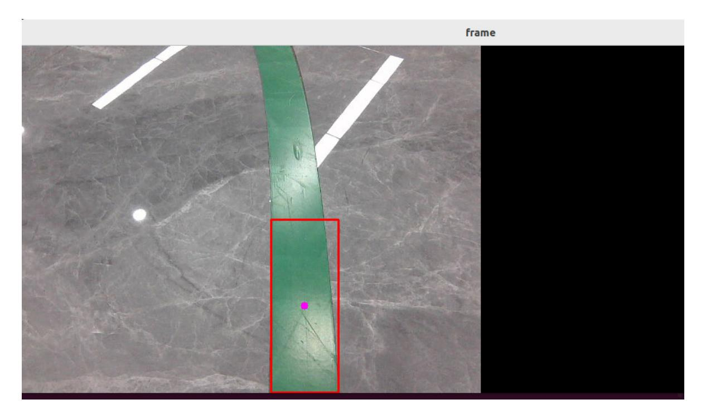
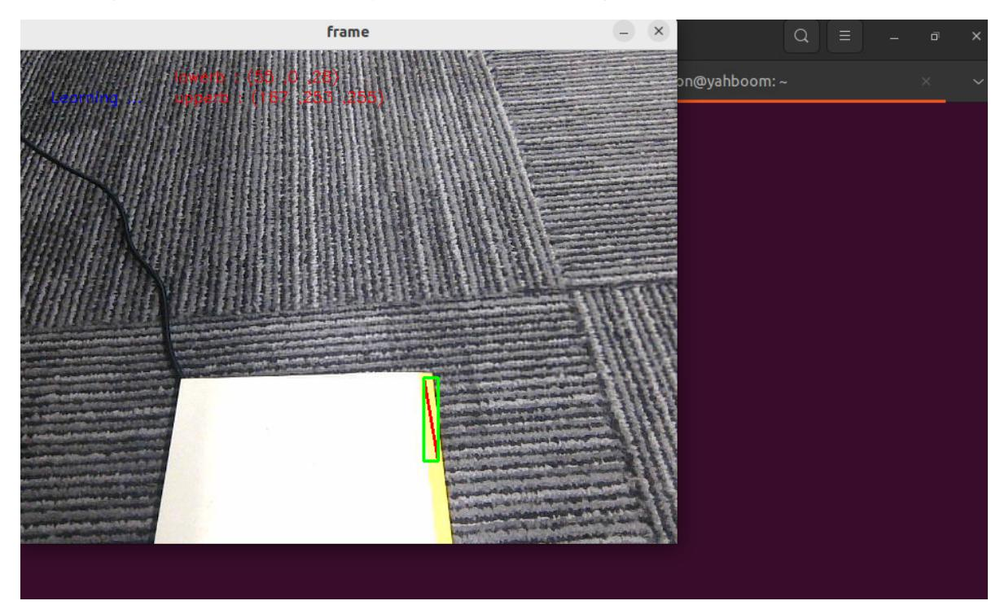

# Line Patrol and Obstacle Removal

## 1. Content Description

This lesson captures camera images, recognizes the color of the patrol line, and controls the robot to follow the line. While the robot patrols, LiDAR scans for obstacles on the path. If an obstacle is detected, the robot stops. If a machine-code block appears on the route, the robot adjusts its pose, grasps the block with the lower gripper, places it aside, and then continues following the line.

This lesson requires terminal commands. Use the terminal that matches your mainboard. Raspberry Pi 5 and Jetson Nano users should open a terminal on the host system, enter the Docker container, and then run the commands from this lesson inside the container. For Docker entry steps, see **Configuration and Operation Guide - Enter the Docker (Jetson Nano and Raspberry Pi 5 users, see here)**.

Orin users can open a terminal directly on the robot and run the commands there.

Machine-code blocks used in this lesson: **30x30x30mm**.

## 2. Program Startup

Start the robotic-arm solver and camera driver:

```bash
ros2 launch M3Pro_demo camera_arm_kin.launch.py
```

Open another terminal and start the robotic-arm grasping program:

```bash
ros2 run M3Pro_demo grasp_desktop
```

Open a third terminal and start the line patrol and obstacle removal program:

```bash
ros2 run M3Pro_demo follow_line
```

After startup, a graphics window titled **frame** opens. The detection box marks the line in the image. Press the spacebar to start line patrol. If an obstacle appears ahead, the robot stops and the buzzer sounds an alarm. After the obstacle is removed, the robot continues moving until the line ends and the terminal prints **Not Found**, indicating that no line was detected.



If the robot encounters a machine-code block, it stops and adjusts the distance between the chassis and the block according to the detected tag position. After reaching the target distance, the robotic arm lowers the gripper, grasps the block, places it aside, and then continues following the line.

### 2.1. Color Calibration

The robot is factory-calibrated for a specific line color. If line-color recognition is unreliable during patrol, or if you need to use a different line color, recalibrate the line-patrol color.

After the `frame` window opens from the previous `ros2 run M3Pro_demo follow_line` command, press `R` to select the color. Hold the left mouse button and drag a rectangle over the line color area. Keep the rectangle fully inside the target color area. Release the mouse button to confirm automatically.



After recalibration, the terminal prints **Reset success!!!**, and color calibration is complete.

## 3. Core Code Analysis

Program code path:

Raspberry Pi 5 and Jetson Nano:

```text
/root/yahboomcar_ws/src/M3Pro_demo/M3Pro_demo/follow_line.py
```

Orin:

```text
/home/jetson/yahboomcar_ws/src/M3Pro_demo/M3Pro_demo/follow_line.py
```

Import the required libraries:

```python
#ros lib
import rclpy
from rclpy.node import Node
from std_msgs.msg import Bool,Int16,UInt16
from geometry_msgs.msg import Twist
from sensor_msgs.msg import LaserScan, Image
#common lib
import os
import threading
import math
from M3Pro_demo.follow_common import *
RAD2DEG = 180 / math.pi
import cv2
from arm_msgs.msg import ArmJoints
from message_filters import Subscriber,
TimeSynchronizer,ApproximateTimeSynchronizer
from cv_bridge import CvBridge
encoding = ['16UC1', '32FC1']
from dt_apriltags import Detector
from M3Pro_demo.vutils import draw_tags
import numpy as np
from arm_interface.msg import AprilTagInfo,CurJoints
from M3Pro_demo.compute_joint5 import *
```

Initialize the node and create the publishers and subscribers:

```python
def __init__(self,name):
    super().__init__(name)
    #create a publisher
    self.pub_cmdVel = self.create_publisher(Twist,"/cmd_vel",1)
    self.pub_rgb = self.create_publisher(Image,"/linefollow/rgb",1)
    self.pub_Buzzer = self.create_publisher(UInt16,'/beep',1)
    #create a subscriber
    self.sub_JoyState =
self.create_subscription(Bool,"/JoyState",self.JoyStateCallback,1)
    self.sub_laser =
self.create_subscription(LaserScan,"/scan",self.registerScan,1)
    self.sub_JoyState = self.create_subscription(Bool,'/JoyState',
self.JoyStateCallback,1)
```

```
self.rgb_image_sub = Subscriber(self, Image, '/camera/color/image_raw')
    self.depth_image_sub = Subscriber(self, Image, '/camera/depth/image_raw')
    self.pub_SixTargetAngle = self.create_publisher(ArmJoints, "arm6_joints",
10)
    self.pos_info_pub = self.create_publisher(AprilTagInfo,"PosInfo",1)
    self.TargetJoint5_pub = self.create_publisher(Int16, "set_joint5", 10)
    self.TargetJoint6_pub = self.create_publisher(Int16, "set_joint6", 10)
    self.pub_cur_joints = self.create_publisher(CurJoints,"Curjoints",1)
    while not self.client.wait_for_service(timeout_sec=1.0):
        self.get_logger().info('Service not available, waiting again...')
    self.get_current_end_pos()
    while not self.pub_SixTargetAngle.get_subscription_count():
        self.pubSixArm(self.init_joints)
        time.sleep(0.1)
    self.pubSixArm(self.init_joints)
    while not self.pub_cur_joints.get_subscription_count():
        self.pubCurrentJoints()
        time.sleep(0.1)
    self.pubCurrentJoints()
    self.sub_grasp_status =
self.create_subscription(Bool,"grasp_done",self.get_graspStatusCallBack,100)
    self.ts = ApproximateTimeSynchronizer([self.rgb_image_sub,
self.depth_image_sub], 1, 0.5)
    self.ts.registerCallback(self.callback)
    self.init_joints = [90, 90, 12, 20, 90, 0]
    self.rgb_bridge = CvBridge()
    self.depth_bridge = CvBridge()
    self.at_detector = Detector(searchpath=['apriltags'],
                                families='tag36h11',
                                nthreads=8,
                                quad_decimate=2.0,
                                quad_sigma=0.0,
                                refine_edges=1,
                                decode_sharpening=0.25,
                                debug=0)
    self.move_flag = True
    self.pubPos_flag = True
    self.declare_param()
    self.Joy_active = False
    self.img = None
    self.circle = ()
    self.hsv_range = ()
    self.Roi_init = ()
    self.warning = 1
    self.Start_state = True
    self.dyn_update = False
    self.Buzzer_state = False
    self.select_flags = False
    self.Track_state = 'identify'
    self.windows_name = 'frame'
    self.cols, self.rows = 0, 0
```

```
self.Mouse_XY = (0, 0)
    #Store the hsv value of the patrol line color
    self.hsv_text =
"/root/yahboomcar_ws/src/M3Pro_demo/M3Pro_demo/LineFollowHSV.text"
    self.color = color_follow()
    self.scale = 1000
    #Line patrol PID control parameters, mainly used to calculate the angular
velocity value
    self.FollowLinePID = (50, 0, 10)
    #PID control parameters when adjusting the distance when machine code
obstacles are found
    self.RemovePID = (40, 0, 15.0)
    #Line speed of the line patrol
    self.linear = 0.2
    self.PID_init()
    self.img_flip = False
    self.refresh = False
    self.tags = []
    self.depth_image_info = []
    self.joint5 = Int16()
    self.joint6 = Int16()
    self.joint6.data = 120
    self.Start_ = False
    self.start_time = time.time()
    self.count = True
    self.front_warning = 0
    self.Joy_active = False
    self.declare_parameter("LaserAngle",60.0)
    self.LaserAngle =
self.get_parameter('LaserAngle').get_parameter_value().double_value
    self.declare_parameter("ResponseDist",0.8)
    self.ResponseDist =
self.get_parameter('ResponseDist').get_parameter_value().double_value
    print("Init Done.")
    print("----------------------------")
    print("self.LaserAngle: ",self.LaserAngle)
    print("self.ResponseDist: ",self.ResponseDist)
```

The color-image callback processes camera frames:

```python
def callback(self,color_frame,depth_frame):
    # Convert the image to opencv format
    rgb_image = self.rgb_bridge.imgmsg_to_cv2(color_frame,'rgb8')
    rgb_image = np.copy(rgb_image)
    depth_image = self.depth_bridge.imgmsg_to_cv2(depth_frame, encoding[1])
    depth_img = cv2.resize(depth_image, (640, 480))
    self.depth_image_info = depth_img.astype(np.float32)
    # Check the machine code
    self.tags = self.at_detector.detect(cv2.cvtColor(rgb_image,
cv2.COLOR_RGB2GRAY), False, None, 0.025)
    self.tags = sorted(self.tags, key=lambda tag: tag.tag_id)
    draw_tags(rgb_image, self.tags, corners_color=(0, 0, 255), center_color=(0,
255, 0))
    frame = cv2.resize(depth_image, (640, 480))
    action = cv2.waitKey(1)
    if self.count==True and self.Start_==True:
```

```
if (time.time() - self.start_time)>3:
            self.Track_state = 'tracking'
            self.count = False
    #Enter the image processing function process
    result_img,bin_img = self.process(rgb_image,action)
    result_img = cv2.cvtColor(result_img, cv2.COLOR_RGB2BGR)
    if len(bin_img) != 0: cv.imshow('frame', ManyImgs(1, ([result_img,
bin_img])))
    else:cv.imshow('frame', result_img)
```

The `process` function performs image processing:

```python
def process(self, rgb_img, action):
    #print("************************************")
    binary = []
    rgb_img = cv.resize(rgb_img, (640, 480))
    if self.img_flip == True: rgb_img = cv.flip(rgb_img, 1)
    #Run the program according to the key value 32 means the spacebar is pressed,
and the line patrol mode is started.
    if action == 32: self.Track_state = 'tracking'
    #Press i to enter the recognition mode and load the hsv file to identify the
color of the line
    elif action == ord('i') or action == 105: self.Track_state = "identify"
    #Press r to reselect color and enter init mode
    elif action == ord('r') or action == 114: self.Reset()
    if self.Track_state == 'init':
        cv.namedWindow(self.windows_name, cv.WINDOW_AUTOSIZE)
        cv.setMouseCallback(self.windows_name, self.onMouse, 0)
        if self.select_flags == True:
            cv.line(rgb_img, self.cols, self.rows, (255, 0, 0), 2)
            cv.rectangle(rgb_img, self.cols, self.rows, (0, 255, 0), 2)
            if self.Roi_init[0]!=self.Roi_init[2] and
self.Roi_init[1]!=self.Roi_init[3]:
                rgb_img, self.hsv_range = self.color.Roi_hsv(rgb_img,
self.Roi_init)
                self.dyn_update = True
        else:
                self.Track_state = 'init'
    elif self.Track_state == "identify":
        if os.path.exists(self.hsv_text): self.hsv_range =
read_HSV(self.hsv_text)
        else: self.Track_state = 'init'
    if self.Track_state != 'init' and len(self.hsv_range) != 0:
        rgb_img, binary, self.circle = self.color.line_follow(rgb_img,
self.hsv_range)
        if self.dyn_update == True:
            write_HSV(self.hsv_text, self.hsv_range)
            self.Hmin =
rclpy.parameter.Parameter('Hmin',rclpy.Parameter.Type.INTEGER,self.hsv_range[0]
[0])
            self.Smin =
rclpy.parameter.Parameter('Smin',rclpy.Parameter.Type.INTEGER,self.hsv_range[0]
[1])
```

```python
self.Vmin =
rclpy.parameter.Parameter('Vmin',rclpy.Parameter.Type.INTEGER,self.hsv_range[0]
[2])
            self.Hmax =
rclpy.parameter.Parameter('Hmax',rclpy.Parameter.Type.INTEGER,self.hsv_range[1]
[0])
            self.Smax =
rclpy.parameter.Parameter('Smax',rclpy.Parameter.Type.INTEGER,self.hsv_range[1]
[1])
            self.Vmax =
rclpy.parameter.Parameter('Vmax',rclpy.Parameter.Type.INTEGER,self.hsv_range[1]
[2])
-
            all_new_parameters =
[self.Hmin,self.Smin,self.Vmin,self.Hmax,self.Smax,self.Vmax]
            self.set_parameters(all_new_parameters)
            self.dyn_update = False
    #If you enter the tracking mode, then execute the execute function
    if self.Track_state == 'tracking' :
        if len(self.circle) != 0:
            threading.Thread(target=self.execute, args=(self.circle[0],
self.circle[2])).start()
    else:
        if self.Start_state == True:
            #self.pub_cmdVel.publish(Twist())
            self.Start_state = False
    if len(self.tags)>0 and self.Track_state!="Remove":
        self.Track_state = "identify"
        self.pub_cmdVel.publish(Twist())
        print("Find the apriltag.")
        self.Track_state = "Remove"
    if self.Track_state == "Remove":
        print("len(tags) = ",len(self.tags))
        if len(self.tags)>0 :
            #Get the center coordinates of the machine code
            center_x, center_y = self.tags[0].center
            #If the center coordinate of the machine code is not within the
center range, then execute remove_obstacle to control the car according to the
center value of the machine code and adjust the distance between the car and the
machine code
            if (abs(center_x-320) >10 or abs(center_y-400)>10) and
self.move_flag == True:
                print("adjusting.")
                self.remove_obstacle(center_x, center_y)
            if abs(center_x-320) <10 and abs(center_y-400)<10:
                self.pubVel(0.0, 0.0)
                print("start crawling.")
                #Get the depth value of the center point coordinates of the
machine code
                c_dist = self.depth_image_info[int(center_y),int(center_x)]/1000
                #If the current center coordinate value is valid and the value of
self.pubPos_flag is True, it means that the position information of the machine
code can be published.
                if c_dist!=0 and self.pubPos_flag == True:
                    self.move_flag = False
                    self.pubPos_flag = False
                    pos = AprilTagInfo()
```

```
pos.id = self.tags[0].tag_id
                    pos.x = center_x
                    pos.y = center_y
                    pos.z = c_dist
                    #Get the corner coordinates of the machine code and
calculate the reference value of the No. 5 servo based on the corner coordinates
                    vx = int(self.tags[0].corners[0][0]) -
int(self.tags[0].corners[1][0])
                    vy = int(self.tags[0].corners[0][1]) -
int(self.tags[0].corners[1][1])
                    target_joint5 = compute_joint5(vx,vy)
                    print("target_joint5: ",target_joint5)
                    self.joint5.data = int(target_joint5)
                    print("tag_id: ",self.tags[0].tag_id)
                    print("center_x, center_y: ",center_x, center_y)
                    print("depth: ",c_dist)
                    self.pos_info_pub.publish(pos)
                    self.TargetJoint5_pub.publish(self.joint5)
                else:
                    print("Invalid distance.")
    return rgb_img, binary
```

The `execute` function runs line patrol:

```python
def execute(self, point_x, color_radius):
    #If the R2 button on the remote control is pressed, then return directly and
press it again to modify self.Joy_active to False
    if self.Joy_active == True:
        if self.Start_state == True:
            self.PID_init()
            self.Start_state = False
        return
    self.Start_state = True
    #If there is no identification line, then publish the parking speed
    if color_radius == 0:
        print("Not Found")
        self.pub_cmdVel.publish(Twist())
    else:
        twist = Twist()
        b = UInt16()
        #Calculate the angular velocity
        [z_Pid, _] = self.PID_controller.update([(point_x - 320)*1.0/16, 0])
        if self.img_flip == True: twist.angular.z = -z_Pid #-z_Pid
        else: twist.angular.z = +z_Pid
        twist.linear.x = self.linear
        #If the radar detects an obstacle ahead, it will issue a stop command
and a buzzer command
        if self.front_warning > 10:
            print("Obstacles ahead !!!")
            self.pub_cmdVel.publish(Twist())
            self.Buzzer_state = True
            b.data = 1
            self.pub_Buzzer.publish(b)
        else:
            if self.Buzzer_state == True:
                b.data = 0
```

```
for i in range(3): self.pub_Buzzer.publish(b)
    self.Buzzer_state = False
if abs(point_x-320)<40:
    twist.angular.z=0.0
if self.Joy_active == False:
    self.pub_cmdVel.publish(twist)
else:
    twist.angular.z=0.0
```
