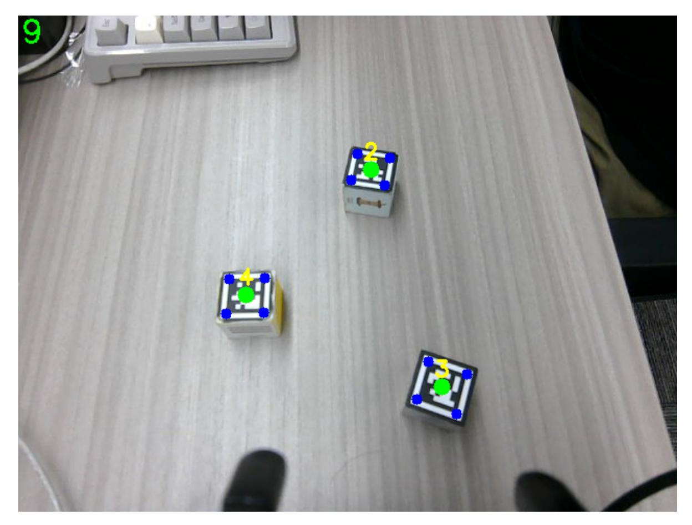

# Machine code ID sorting

## 1. Content Description

This function enables the program to obtain images through the camera and recognize the machine code in the image. The robot arm's lower claw grabs the machine code and places it in different positions according to the machine code ID.

This section requires entering commands in the terminal. The terminal you open depends on your motherboard type. This lesson uses the Raspberry Pi 5 as an example. For Raspberry Pi and Jetson Nano boards, you need to open a terminal on the host computer and enter the command to enter the Docker container. Once inside the Docker container, enter the commands mentioned in this section in the terminal. For instructions on entering the Docker container from the host computer, refer to this product tutorial **[Configuration and Operation Guide]--[Enter the Docker (Jetson Nano and Raspberry Pi 5 users, see here)]**.

Simply open the terminal on the Orin motherboard and enter the commands mentioned in this section.

The wooden blocks used in this lesson: **30x30x30mm Machine Code Blocks**.

### 1.1 Machine Code

AprilTag's "machine code" refers to its internal encoding structure, a binary matrix composed of black and white squares. This design enables efficient decoding by computer vision algorithms and is used for tasks such as pose estimation and object recognition. AprilTag is a twodimensional barcode with a typical structure consisting of:

- **Border**: The outer black frame helps the algorithm locate the marker quickly.
- **Coding area (Payload)**: The black and white square inside stores the unique ID (machine code).
- **Error Correction**: Some AprilTag families support error correction to improve anti-occlusion capabilities.

AprilTag has multiple predefined "families", each with different encoding rules and capacities:

- tag16h5: 4×4 matrix, small, low redundancy
- tag25h9: 5×5 matrix, balancing size and reliability
- tag36h11: 6×6 matrix, high capacity, strong anti-blocking ability
- tagCircle21h7: circular design, suitable for rotating scenes

h5, h9 etc. suffixes indicate distance (error correction capability). The larger the number, the stronger the fault tolerance.

## 2. Program startup

First, open the terminal and enter the following command to start the robot arm solver and camera driver,

ros2 launch M3Pro_demo camera_arm_kin.launch.py

Then, open another terminal and enter the following command to start the robotic arm gripping program:

```
ros2 run M3Pro_demo grasp_desktop
```

After running, it is shown as follows:

Finally, open the third terminal and enter the following command to start the machine code ID sorting program:

```
ros2 run M3Pro_demo apriltag_detect
```

After starting this command, the second terminal should receive the current angle topic information sent in one frame and calculate the current posture once, as shown in the figure below.

If the current angle information is not received and the current posture is not calculated, the gripping posture will be inaccurate when the coordinate system is converted. Therefore, you need to close the machine code ID sorting program by pressing Ctrl+C and restart the machine code ID sorting program until the robot arm gripping program obtains the current angle information and calculates the current end position.

After the machine code ID sorting program is started, it will subscribe to the color image and depth image topics. Place the machine code block that comes with the product under the camera. If the machine code appears in the image, the program will recognize the machine code, as shown in the figure below.



Press the spacebar to start the clamping process. There are two situations:

- If the distance between the machine code block and the block is within [215, 225], the robot arm will directly grab the block and place it at the set position according to the ID value.
- If the machine code block is outside [215, 225], the robot will first move and adjust it to within [215, 225] according to the distance between the machine code block and the robot base coordinate system (base_link), then lower the claw to clamp it, and finally place it at the set position according to the ID value.

## 3. Core code analysis

### 3.1, apriltag_detect.py

Program code path:

Raspberry Pi and Jetson Nano board The program code is in the running docker. The path in docker is /root/yahboomcar_ws/src/M3Pro_demo/M3Pro_demo/ apriltag_detect.py

Orin Motherboard

The program code path is /home/jetson/yahboomcar_ws/src/M3Pro_demo/M3Pro_demo/apriltag_detect.py

Import the necessary library files,

```
import cv2
import os
import numpy as np
from sensor_msgs.msg import Image
#Import the function of drawing machine code information
from M3Pro_demo.vutils import draw_tags
#Import the function to calculate the angle value of servo No. 5
```

```
from M3Pro_demo.compute_joint5 import *
#Import the library for detecting machine code
from dt_apriltags import Detector
from cv_bridge import CvBridge
import cv2 as cv
from arm_interface.srv import ArmKinemarics
from arm_interface.msg import AprilTagInfo,CurJoints
from arm_msgs.msg import ArmJoints
from std_msgs.msg import Float32,Bool,Int16
encoding = ['16UC1', '32FC1']
import time
import transforms3d as tfs
import tf_transformations as tf
import yaml
import math
#Import chassis PID operation related libraries
from M3Pro_demo.Robot_Move import *
from rclpy.node import Node
import rclpy
from message_filters import Subscriber,
TimeSynchronizer,ApproximateTimeSynchronizer
from sensor_msgs.msg import Image
from geometry_msgs.msg import Twist
```

Import the robot arm offset parameter file to compensate for the deviation caused by the servo virtual position

```
offset_file = "/root/yahboomcar_ws/src/arm_kin/param/offset_value.yaml"
with open(offset_file, 'r') as file:
    offset_config = yaml.safe_load(file)
```

Program initialization and creation of publishers and subscribers,

```
def __init__(self, name):
   super().__init__(name)
   self.init_joints = [90, 120, 0, 0, 90, 90]
   self.rgb_bridge = CvBridge()
   self.depth_bridge = CvBridge()
   #Define the flag for publishing machine code information. When the value is
True, it means publishing, and when it is False, it means not publishing
   self.pubPos_flag = False
   self.pr_time = time.time()
   #Create an object that recognizes machine code. The parameters include
    '''families:要检测的标签家族
   nthreads:使用的线程数
   quad_decimate:检测四边形时的降采样比率,值越大检测越快但精度越低
   quad_sigma:高斯模糊的标准差
   refine_edges:是否优化边缘检测,1表示是,0表示否
   decode_sharpening:解码时的锐化程度
   debug:是否启用调试模式,1表示是,0表示否
   families: tag families to be detected
   nthreads: number of threads used
   quad_decimate: Downsampling ratio when detecting quadrilaterals. The larger
the value, the faster the detection but the lower the accuracy.
```

```
quad_sigma: standard deviation of Gaussian blur
    refine_edges: whether to optimize edge detection, 1 means yes, 0 means no
    decode_sharpening: The degree of sharpening during decoding
    debug: Whether to enable debug mode, 1 means yes, 0 means no
    '''self.at_detector = Detector(searchpath=['apriltags'],
                                families='tag36h11',
                                nthreads=8,
                                quad_decimate=2.0,
                                quad_sigma=0.0,
                                refine_edges=1,
                                decode_sharpening=0.25,
                                debug=0)
    #Define the array that stores the current end pose coordinates
    self.CurEndPos = [0.1279009179959246, 0.00023254956548456117,
0.1674898062979958, 0.00036263794618046863, 1.3962632350758744,
0.0003332603981328959]
    #Dabai_DCW2 camera internal parameters
    self.camera_info_K = [477.57421875, 0.0, 319.3820495605469, 0.0,
477.55718994140625, 238.64108276367188, 0.0, 0.0, 1.0]
    #Rotation matrix from the end to the camera
    self.EndToCamMat = np.array([[ 0 ,0 ,1 ,-0.101],
                                 [-1 ,0 ,0 ,0.002],
                                 [0 ,-1 ,0 ,4.82000000e-02],
                                 [ 0.00000000e+00 , 0.00000000e+00 ,
0.00000000e+00 , 1.00000000e+00]])
    #Create a publisher to publish the machine code location topic. The published
message includes the x and y pixel coordinates of the center point, the depth
value corresponding to the center point, and the id value of the machine code
    self.pos_info_pub = self.create_publisher(AprilTagInfo,"PosInfo",1)
    #Create a publisher for the speed topic
    self.CmdVel_pub = self.create_publisher(Twist,"cmd_vel",1)
    #Create a subscriber to subscribe to the topic
    self.sub_grasp_status =
self.create_subscription(Bool,"grasp_done",self.get_graspStatusCallBack,100)
    #Create a publisher to control the 6 servo angle topics
    self.TargetAngle_pub = self.create_publisher(ArmJoints, "arm6_joints", 10)
    #Create a publisher for the topic of servo angle No. 5
    self.TargetJoint5_pub = self.create_publisher(Int16, "set_joint5", 10)
    #Create a subscriber to subscribe to the color image topic
    self.rgb_image_sub = Subscriber(self, Image, '/camera/color/image_raw')
    #Create a subscriber to subscribe to the depth image topic
    self.depth_image_sub = Subscriber(self, Image, '/camera/depth/image_raw')
    #Create a client that calls the robotic arm solution service
    self.client = self.create_client(ArmKinemarics, 'get_kinemarics')
    #Create a topic publisher to publish the current robot arm's 6 servo angles
    self.pub_cur_joints = self.create_publisher(CurJoints,"Curjoints",1)
    self.ts = ApproximateTimeSynchronizer([self.rgb_image_sub,
self.depth_image_sub], 1, 0.5)
    self.ts.registerCallback(self.callback)
    #Get the current position of the end of the robotic arm
    self.get_current_end_pos()
    self.pubSix_Arm(self.init_joints)
    #Call the function to publish the current six servo angle values of the
robotic arm
    self.pubCurrentJoints()
    #Get the compensation values in the xyz directions in the offset table
    self.x_offset = offset_config.get('x_offset')
```

```
self.y_offset = offset_config.get('y_offset')
    self.z_offset = offset_config.get('z_offset')
    # Initialize PID parameters
    self.linearx_PID = (0.5, 0.0, 0.2)
    #Create PID control object
    self.linearx_pid = simplePID(self.linearx_PID[0] / 1000.0,
self.linearx_PID[1] / 1000.0, self.linearx_PID[2] / 1000.0)
    self.joint5 = Int16()
    #Define the minimum distance value in millimeters
    self.min_dist = 450
    #Define the subscript of the machine code detection list of the current
minimum distance value
    self.index = None
    #Define the flag for calculating distance. If the value is True, the distance
is calculated. If the value is False, the distance is not calculated.
    self.compute_flag = True
```

callbackImage topic callback function

```
def callback(self,color_frame,depth_frame):
    #Get color image topic data and use CvBridge to convert message data into
image data
    rgb_image = self.rgb_bridge.imgmsg_to_cv2(color_frame,'rgb8')
    result_image = np.copy(rgb_image)
    result_image = cv.resize(result_image, (640, 480))
    #depth_image
    #Get the deep image topic data and use CvBridge to convert the message data
into image data
    depth_image = self.depth_bridge.imgmsg_to_cv2(depth_frame, encoding[1])
    depth_to_color_image = cv2.applyColorMap(cv2.convertScaleAbs(depth_image,
alpha=1.0), cv2.COLORMAP_JET)
    frame = cv.resize(depth_image, (640, 480))
    depth_image_info = frame.astype(np.float32)
    #Call the machine code detection program, pass in the color image for
detection, and return a tags list containing information about all the detected
machine codes
    tags = self.at_detector.detect(cv2.cvtColor(rgb_image, cv2.COLOR_RGB2GRAY),
False, None, 0.025)
    #Sort the test results according to the machine code id
    tags = sorted(tags, key=lambda tag: tag.tag_id)
    #Draw the center and corner points of the machine code on the color image
    draw_tags(result_image, tags, corners_color=(0, 0, 255), center_color=(0,
255, 0))
    #Detect key input. If the key is a space, change the value of
self.pubPos_flag to True
    key = cv2.waitKey(10)
    if key == 32:
        self.pubPos_flag = True
    #If the length of the test result is not 0, it means that the machine code
has been detected
    if len(tags) > 0 :
        #If self.compute_flag is true, it means that the distance between the
machine code and the car base coordinate system base_link is to be calculated
        if self.compute_flag == True:
            #Traverse the list of machine code detection results
            for i in range(len(tags)):
                #Get the center coordinates of the machine code
```

```
center_x, center_y = tags[i].center
                cx = center_x
                cy = center_y
                #Calculate the depth value of the center coordinate
                cz = depth_image_info[int(cy),int(cx)]/1000
                #Calculate the pose of the machine code in the world coordinate
system
                pose = self.compute_heigh(cx,cy,cz)
                #Calculate the distance between the center of the machine code
and the base coordinate base_link
                dist_detect = math.sqrt(pose[1] ** 2 + pose[0]** 2)
                dist_detect = dist_detect*1000
                #Judge whether the distance of the current machine code is valid
and the minimum value, if so, extract the i value
                if dist_detect<self.min_dist and dist_detect>180.0:
                    self.min_dist = dist_detect
                    self.index = i
            #After the traversal is completed, stop calculating the distance
between all machine codes and the car base coordinate system base_link
            self.compute_flag = False
        #If self.pubPos_flag is True and the smallest array subscript is not
None, it means that the machine code with the current minimum distance has been
found
        if self.pubPos_flag == True and self.index!=None:
            #Get the center coordinates of the machine code
            center_x, center_y = tags[self.index].center
            cx = center_x
            cy = center_y
            #Calculate the depth value of the center coordinate
            cz = depth_image_info[int(cy),int(cx)]/1000
            #Calculate the pose of the machine code in the world coordinate
system
            pose = self.compute_heigh(cx,cy,cz)
            #Calculate the distance between the center of the machine code and
the base coordinate base_link pose[0] represents the x coordinate, pose[1]
represents the y coordinate
            dist_detect = math.sqrt(pose[1] ** 2 + pose[0]** 2)
            dist_detect = dist_detect*1000
            dist = 'dist: ' + str(dist_detect) + 'mm'
            cv.putText(result_image, dist, (int(cx)+5, int(cy)+15),
cv.FONT_HERSHEY_SIMPLEX, 0.5, (255, 0, 0), 2)
            #Judge whether the distance is within the range of [215, 225]. If
not, move the chassis to adjust the distance. If yes, issue a stop command.
            if abs(dist_detect - 220.0)>5:
                self.move_dist(dist_detect)
            else:
                self.pubVel(0,0,0)
                #Create a machine code information location message object and
assign it
                tag = AprilTagInfo()
                tag.id = tags[self.index].tag_id
                tag.x = tags[self.index].center[0]
                tag.y = tags[self.index].center[1]
                print(tags[self.index].center)
                c_y = tag.y
                #Calculate the depth information of the center point and assign
it to the z position in the machine code information
                tag.z = depth_image_info[int(c_y),int(tag.x)]/1000
```

```
#Calculate the value of servo No. 5 based on the corner
coordinates
                vx = int(tags[self.index].corners[0][0]) -
int(tags[self.index].corners[1][0])
                vy = int(tags[self.index].corners[0][1]) -
int(tags[self.index].corners[1][1])
                target_joint5 = compute_joint5(vx,vy)
                self.joint5.data = int(target_joint5)
                #Judge whether the depth information of the center point is
valid. If it is not 0, it means it is valid
                if tag.z!=0:
                    #Reset array index and minimum distance
                    self.index = None
                    self.min_dist = 450
                    #Publish the topic message of the angle value of the No. 5
servo
                    self.TargetJoint5_pub.publish(self.joint5)
                    #Publish machine code location information topic message
                    self.pos_info_pub.publish(tag)
                    self.pubPos_flag = False
                else:
                    print("Invalid distance.")
    else:
        self.pubVel(0,0,0)
    result_image = cv2.cvtColor(result_image, cv2.COLOR_RGB2BGR)
    cur_time = time.time()
    fps = str(int(1/(cur_time - self.pr_time)))
    self.pr_time = cur_time
    cv2.putText(result_image, fps, (10, 30), cv2.FONT_HERSHEY_SIMPLEX, 1, (0,
255, 0), 2)
    cv2.imshow("result_image", result_image)
    #cv2.imshow("depth_image", depth_to_color_image)
    key = cv2.waitKey(1)
```

move_dist chassis movement adjustment distance function,

```
def move_dist(self,dist):
    #Call the pid calculation function, the value passed in is the current
distance value
    linear_x = self.linearx_pid.compute(dist, 220)
    #Release speed topic data
    self.pubVel(linear_x,0,0)
```

compute_heigh calculates the machine code pose function. The parameters passed in are the xy pixel coordinates of the center point and the depth distance information corresponding to the center point.

```
def compute_heigh(self,x,y,z):
    #Calculate the three-dimensional coordinates of the center point and convert
it from the image coordinate system to the camera coordinate system
    camera_location = self.pixel_to_camera_depth((x,y),z)
    #print("camera_location: ",camera_location)
    #Convert the camera coordinate system to the coordinate system at the end of
the robotic arm to obtain the rotation transformation matrix of the machine code
at the end of the robotic arm
```

```
PoseEndMat = np.matmul(self.EndToCamMat,
self.xyz_euler_to_mat(camera_location, (0, 0, 0)))
    #Get the rotation transformation matrix of the current robotic arm end
position
    EndPointMat = self.get_end_point_mat()
    #Convert the coordinate system of the end of the robot arm to the base
coordinate system to obtain the rotation transformation matrix of the machine
code under the base coordinate system
    WorldPose = np.matmul(EndPointMat, PoseEndMat)
    #WorldPose = np.matmul(PoseEndMat,EndPointMat)
    #Convert the rotation transformation matrix into translation transformation
and rotation transformation. Start pose_T to represent translation
transformation, that is, xyz, and pose_R to represent rotation transformation,
that is, rpy
    pose_T, pose_R = self.mat_to_xyz_euler(WorldPose)
    #Extract the translation transformation value and add the offset to get the
value of the machine code in the world coordinate system.
    pose_T[0] = pose_T[0] + self.x_offset
    pose_T[1] = pose_T[1] + self.y_offset
    pose_T[2] = pose_T[2] + self.z_offset
    print("pose_T: ",pose_T)
    return pose_T
```

get_current_end_pos gets the current end position function of the robotic arm.

```
def get_current_end_pos(self):
    #Create service request data
    request = ArmKinemarics.Request()
    #Assign values to cur_joint1 to cur_joint5 in the request data. The assigned
values are the joint angle values of the current robot arm.
    request.cur_joint1 = float(self.cur_joints[0])
    request.cur_joint2 = float(self.cur_joints[1])
    request.cur_joint3 = float(self.cur_joints[2])
    request.cur_joint4 = float(self.cur_joints[3])
    request.cur_joint5 = float(self.cur_joints[4])
    #Call fk to calculate the end-of-arm posture coordinates from various angles
    request.kin_name = "fk"
    future = self.client.call_async(request)
    future.add_done_callback(self.get_fk_respone_callback)
```

get_fk_respone_callback receives the callback function that returns the result of calling the fk service.

```
def get_fk_respone_callback(self, future):
    try:
        #Receive the result returned after calling the service
        response = future.result()
        #self.get_logger().info(f'Response received: {response.x}')
        #Assign values to self.CurEndPos. The values are the response data,
including xyz and rpy.
        self.CurEndPos[0] = response.x
        self.CurEndPos[1] = response.y
        self.CurEndPos[2] = response.z
        self.CurEndPos[3] = response.roll
        self.CurEndPos[4] = response.pitch
        self.CurEndPos[5] = response.yaw
```

```
#self.get_logger().info(f'Response received: {self.CurEndPos}')
    print("self.CurEndPose: ",self.CurEndPos)
except Exception as e:
    self.get_logger().error(f'Service call failed: {e}')
```

#### 3.2. compute_joint5 function

Program source code path:

Raspberry Pi 5 and Jetson board

The program code is in the running docker. The path in docker is /root/yahboomcar_ws/src/M3Pro_demo/M3Pro_demo/ compute_joint5.py

Orin Motherboard

The program code path is /home/jetson/yahboomcar_ws/src/M3Pro_demo/M3Pro_demo/compute_joint5.py

```
import math
#Calculate the inverse tangent of the incoming value to get the offset angle of
the machine code
def compute_joint5(vy,vx):
    angle_radians = math.atan2(vy, vx)
    angle_degrees = math.degrees(angle_radians)
    return angle_degrees
```

### 3.3, grab_desktop.py

Program source code path:

Raspberry Pi 5 and Jetson board

The program code is in the running docker. The path in docker is /root/yahboomcar_ws/src/M3Pro_demo/M3Pro_demo/ grasp_desktop.py

Orin Motherboard

The program code path is /home/jetson/yahboomcar_ws/src/M3Pro_demo/M3Pro_demo/grasp_desktop.py

Import the necessary library files,

```
import rclpy
import numpy as np
from std_msgs.msg import Bool,Int16
import time
import math
from arm_msgs.msg import ArmJoints
from arm_msgs.msg import ArmJoint
from arm_interface.srv import *
from arm_interface.msg import AprilTagInfo,CurJoints
import transforms3d as tfs
import tf_transformations as tf
import threading
import yaml
from rclpy.node import Node
```

Import the robot arm offset parameter file to compensate for the deviation caused by the servo virtual position.

```
offset_file = "/root/yahboomcar_ws/src/arm_kin/param/offset_value.yaml"
with open(offset_file, 'r') as file:
    offset_config = yaml.safe_load(file)
print(offset_config)
```

Program initialization and creation of publishers and subscribers,

```
def __init__(self, name):
    super().__init__(name)
    #Define the flag for clamping. When the value is True, it means that clamping
can be performed.
    self.grasp_flag = True
    #Define the initial robotic arm posture
    self.init_joints = [90, 150, 12, 20, 90, 0]
    #Define the posture of the robot arm's lower claw placement
    self.down_joint = [155, 35, 70, 5, 60,130]
    #Define the angle of servo 5
    self.gripper_joint = 90
    #Define the array that stores the current end pose coordinates
    self.CurEndPos = [0.1279009179959246, 0.00023254956548456117,
0.1674898062979958, 0.00036263794618046863, 1.3962632350758744,
0.0003332603981328959]
    #Dabai_DCW2 camera internal parameters
    self.camera_info_K = [477.57421875, 0.0, 319.3820495605469, 0.0,
477.55718994140625, 238.64108276367188, 0.0, 0.0, 1.0]
    #Rotation matrix from the end to the camera
    self.EndToCamMat = np.array([[ 0 ,0 ,1 ,-1.000e-01],
                                 [-1 ,0 ,0 ,0],
                                 [0 ,-1 ,0 ,4.99000000e-02],
                                 [ 0.00000000e+00 , 0.00000000e+00 ,
0.00000000e+00 , 1.00000000e+00]])
    #Create a subscriber to subscribe to the machine code location topic
    self.sub_pos_info =
self.create_subscription(AprilTagInfo,"PosInfo",self.pos_info_callback,1)
    #Create a subscriber to subscribe to the topic of servo angle value No. 5
    self.sub_joint5 =
self.create_subscription(Int16,"set_joint5",self.get_joint5_callback,1)
    #Create a subscriber to subscribe to the topic of the angle value of the
servo gripper 6
    self.sub_joint6 =
self.create_subscription(Int16,"set_joint6",self.get_joint6_callback,1)
    #Create a publisher to control the 6 servo angle topics
    self.pub_SixTargetAngle = self.create_publisher(ArmJoints, "arm6_joints",
10)
    #Create a publisher to control the angle of a single servo
    self.pub_SingleTargetAngle = self.create_publisher(ArmJoint, "arm_joint",
10)
    #Create a subscriber to subscribe to the topic of the robot arm's 6 servo
angle values
    self.sub_cur_joints =
self.create_subscription(CurJoints,"Curjoints",self.get_cur_joint_callback,1)
    #Create a publisher to publish the topic of clamp placement completion
    self.pubGraspStatus = self.create_publisher(Bool,"grasp_done",1)
    #Create a client that calls the robotic arm solution service
    self.client = self.create_client(ArmKinemarics, 'get_kinemarics')
    while not self.client.wait_for_service(timeout_sec=1.0):
```

```
self.get_logger().info('Service not available, waiting again...')
    print('init done')
    #Take the initial posture of the robot arm as the current posture
    self.cur_joints = self.init_joints
    #Get the current position of the end of the robotic arm
    self.get_current_end_pos()
    #Subscribe to the angle value of the gripper gripper
    self.joint6 = 130
    #Subscribe to the id value of the current machine code to determine the
placement point
    self.cur_tagId = 0
    #Get the compensation values in the xyz directions in the offset table
    self.x_offset = offset_config.get('x_offset')
    self.y_offset = offset_config.get('y_offset')
    self.z_offset = offset_config.get('z_offset')
```

pos_info_callback machine code position information topic callback function,

```
def pos_info_callback(self,msg):
    print(msg)
    pos_x = msg.x
    pos_y = msg.y
    pos_z = msg.z
    self.cur_tagId = msg.id
    if pos_z!=0.0:
        #Calculate the three-dimensional coordinates of the center point and
convert it from the image coordinate system to the camera coordinate system
        camera_location = self.pixel_to_camera_depth((pos_x,pos_y),pos_z)
        #Convert the camera coordinate system to the coordinate system at the
end of the robotic arm to obtain the rotation transformation matrix of the
machine code at the end of the robotic arm
        PoseEndMat = np.matmul(self.EndToCamMat,
self.xyz_euler_to_mat(camera_location, (0, 0, 0)))
        #Get the rotation transformation matrix of the current robotic arm end
position
        EndPointMat = self.get_end_point_mat()
        #Convert the coordinate system of the end of the robot arm to the base
coordinate system to obtain the rotation transformation matrix of the machine
code under the base coordinate system
        WorldPose = np.matmul(EndPointMat, PoseEndMat)
        #Convert the rotation transformation matrix into translation
transformation and rotation transformation, where pose_T represents translation
transformation, i.e. xyz, and pose_R represents rotation transformation, i.e.
rpy
        pose_T, pose_R = self.mat_to_xyz_euler(WorldPose)
        print("pose_T: ",pose_T)
        #Extract the translation transformation value and add the offset to get
the value of the machine code in the world coordinate system
        pose_T[0] = pose_T[0] + self.x_offset
        pose_T[1] = pose_T[1] + self.y_offset
        pose_T[2] = pose_T[2] + self.z_offset
        print("pose_T_add_offset: ",pose_T)
        print("pose_R: ",pose_R)
        if self.grasp_flag == True :
            print("Take it now.")
            self.grasp_flag = False
```

```
#Start the thread to execute the grab function, the parameter passed
in is the value of xyz
            grasp = threading.Thread(target=self.grasp, args=(pose_T,))
            grasp.start()
            grasp.join()
```

grasp

```
def grasp(self,pose_T):
    print("------------------------------------------------")
    #print("pose_T: ",pose_T)
    #Create service request data
    request = ArmKinemarics.Request()
    #Assign the requested pose coordinates of the end of the robotic arm
    request.tar_y = pose_T[1]
    #1.5cm back. The purpose of doing this is that the robot arm is moving its
claws diagonally downwards. In order to move the end of the robot arm closer to
the middle, reduce the value in the x direction.
    request.tar_x = pose_T[0] - 0.015
    #Call the ik inverse solution to calculate the end-of-arm posture coordinates
from various angles
    request.kin_name = "ik"
    request.roll = 0.0
    request.pitch = 1.3962614348313127 #If the clamping effect is not good ,
you can adjust this parameter
    request.yaw = 0.0
    print("calcutelate_request: ",request)
    #The client calls the get_kinemarics service
    future = self.client.call_async(request)
    future.add_done_callback(self.get_ik_respone_callback)
```

get_ik_respone_callback receives the callback function that returns the result of calling the ik service.

```
def get_ik_respone_callback(self, future):
    try:
        response = future.result()
        print("response: ",response)
        joints = [0.0, 0.0, 0.0, 0.0, 0.0,0.0]
        #Assign values to servos 1-3. The assigned values are the values of the
responses returned after the service is processed.
        joints[0] = 180 - int(response.joint1) #response.joint1
        joints[1] = int(response.joint2)
        joints[2] = int(response.joint3)
        # Check if the value of servo 4 is greater than 90 degrees. If so, limit
its maximum angle to 90 degrees.
        if response.joint4>90:
            joints[3] = 90
        else:
            joints[3] = int(response.joint4)
        #Determine the final value of servo No. 5 based on the value of servo
No. 5 received in the topic. This is related to the offset angle of the machine
code block currently placed.
        if self.gripper_joint<0:
            joints[4] = abs(self.gripper_joint)
            if abs(self.gripper_joint)<90:
```

```
joints[4] =180-joints[0]+joints[4] -90
            else:
                joints[4]= joints[4] - joints[0] + 90
            if joints[4] >135:
                joints[4] = joints[4] -90
            elif joints[4]<45:
                joints[4] = joints[4] + 90
        if self.gripper_joint>0:
            joints[4] = 180 - abs(self.gripper_joint)
            if self.gripper_joint<90:
                joints[4] = joints[4] - joints[0]
            else :
                joints[4] = joints[4] - (joints[0] - 90)
            if joints[4] >135:
                joints[4] = joints[4] -90
            elif joints[4]<45:
                joints[4] = joints[4] + 90
         #6 Servo is set to 30 degrees and turned on
        joints[5] = 30
        print("compute_joints: ",joints)
        #Call the function to publish the topic of controlling the angles of the
six servos, so that the robotic arm can move its claws downwards
        self.pubSixArm(joints)
        time.sleep(3.5)
        #Execute the function of grabbing and placing
        self.move()
    except Exception as e:
        self.get_logger().error(f'Service call failed: {e}')
```

Move robot arm gripping and placement function,

```
def move(self):
    #Call the function to publish the topic of controlling the angle of servo No.
6, so that the robot arm clamps
    self.pubSingleArm(6, self.joint6, 2000)
    time.sleep(2.5)
    #Call the function to publish the topic of controlling the angle of servo 2
to raise the robotic arm
    self.pubSingleArm(2, 120, 2000)
    time.sleep(2.5)
    #According to the id value of the current machine code obtained from the
received topic, modify self.down_joint, which represents the placement point
    if self.cur_tagId == 1:
        self.down_joint = [155, 35, 70, 5, 60,self.joint6]
    elif self.cur_tagId == 2:
        self.down_joint = [180, 35, 60, 0, 90,self.joint6]
    elif self.cur_tagId == 3:
        self.down_joint = [28, 30, 70, 2, 90,self.joint6]
    elif self.cur_tagId == 4:
        self.down_joint = [0, 43, 48, 6, 90,self.joint6]
    self.pubSixArm(self.down_joint)
    time.sleep(2.5)
    #Release the clamping jaws
    self.pubSingleArm(6, 30, 2000)
```

```
time.sleep(2.5)
    #Raise the robotic arm
    self.pubSingleArm(2, 90, 2000)
    time.sleep(2.5)
    print("self.cur_joints: ",self.cur_joints)
    # Return to the initial posture
    self.pubSixArm(self.cur_joints)
    time.sleep(2.5)
    self.grasp_flag = True
    grasp_done = Bool()
    #Publish the topic message that the clamp placement is completed. True
indicates completion.
    grasp_done.data = True
    self.pubGraspStatus.publish(grasp_done)
```
