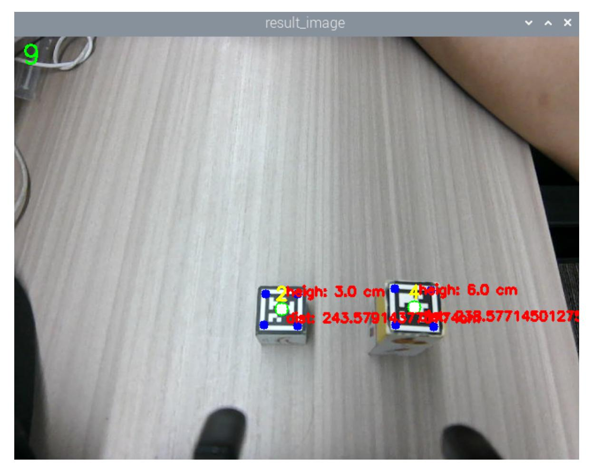

# AprilTag Height-Anomaly Sorting

## 1. Content Description

This lesson captures camera images, recognizes AprilTag machine-code blocks, calculates the height of each detected block, and removes blocks taller than 4 cm.

This lesson requires terminal commands. Use the terminal that matches your mainboard. Raspberry Pi 5 and Jetson Nano users should open a terminal on the host system, enter the Docker container, and then run the commands from this lesson inside the container. For Docker entry steps, see **Configuration and Operation Guide - Enter the Docker (Jetson Nano and Raspberry Pi 5 users, see here)**.

Orin users can open a terminal directly on the robot and run the commands there.

Wooden blocks used in this lesson: **30x30x30mm and 30x30x60mm machine-code blocks**.

## 2. Program Startup

Start the robotic-arm solver and camera driver:

```bash
ros2 launch M3Pro_demo camera_arm_kin.launch.py
```

Open another terminal and start the robotic-arm grasping program:

```bash
ros2 run M3Pro_demo grasp_desktop
```

After it starts, the display appears as shown below.

Open a third terminal and start the height-anomaly sorting program:

```bash
ros2 run M3Pro_demo apriltag_list
```

After this command starts, the second terminal should receive one frame of current-angle topic information and calculate the current arm pose, as shown below.

If the current-angle information is not received and the current pose is not calculated, coordinate conversion will produce an inaccurate grasping pose. Press Ctrl+C to stop the height-anomaly sorting program, then restart it until the grasping program receives the current-angle information and calculates the current end position.

After the sorting program starts, it subscribes to the color and depth image topics. Place the included machine-code block under the camera.

When a tag appears in the image, the program recognizes it as shown below.



The program prints the machine-code height and its distance from `base_link`. Press the spacebar, and the robotic arm lowers its gripper to remove the 6 cm machine-code block. There are two cases:

- If the target machine-code block is within `[215, 225]`, the robotic arm directly grasps the block with its lower gripper and places it according to the ID value.
- If the target block is outside `[215, 225]`, the robot adjusts the chassis distance until the block is within range, lowers the gripper, grasps the block, and places it according to the ID value.

## 3. Core Code Analysis

Program code path:

Raspberry Pi 5 and Jetson Nano:

```text
/root/yahboomcar_ws/src/M3Pro_demo/M3Pro_demo/apriltag_list.py
```

Orin:

```text
/home/jetson/yahboomcar_ws/src/M3Pro_demo/M3Pro_demo/apriltag_list.py
```

Import the required libraries:

```python
import cv2
import os
import numpy as np
from sensor_msgs.msg import Image
```

```python
#Import the function of drawing machine code information
from M3Pro_demo.vutils import draw_tags
#Import the function to calculate the angle value of servo No. 5
from M3Pro_demo.compute_joint5 import *
#Import the library for detecting machine code
from dt_apriltags import Detector
from cv_bridge import CvBridge
import cv2 as cv
from arm_interface.srv import ArmKinemarics
from arm_interface.msg import AprilTagInfo,CurJoints
from arm_msgs.msg import ArmJoints
from std_msgs.msg import Float32,Bool,Int16
encoding = ['16UC1', '32FC1']
import time
import transforms3d as tfs
import tf_transformations as tf
import yaml
import math
#Import chassis PID operation related libraries
from M3Pro_demo.Robot_Move import *
from rclpy.node import Node
import rclpy
from message_filters import Subscriber,
TimeSynchronizer,ApproximateTimeSynchronizer
from sensor_msgs.msg import Image
from geometry_msgs.msg import Twist
```

Import the robotic-arm offset parameter file to compensate for servo virtual-position deviation:

```
offset_file = "/root/yahboomcar_ws/src/arm_kin/param/offset_value.yaml"
with open(offset_file, 'r') as file:
    offset_config = yaml.safe_load(file)
```

Initialize the node and create the publishers and subscribers:

```python
def __init__(self, name):
    super().__init__(name)
    self.init_joints = [90, 120, 0, 0, 90, 90]
    self.rgb_bridge = CvBridge()
    self.depth_bridge = CvBridge()
    #Define the flag for publishing machine code information. When the value is
True, it means publishing, and when it is False, it means not publishing
    self.pubPos_flag = False
    self.pr_time = time.time()
    self.at_detector = Detector(searchpath=['apriltags'],
                                families='tag36h11',
                                nthreads=8,
                                quad_decimate=2.0,
                                quad_sigma=0.0,
                                refine_edges=1,
                                decode_sharpening=0.25,
                                debug=0)
    #Define the array that stores the current end pose coordinates
```

```
self.CurEndPos = [0.1458589529828534, 0.00022969568906952754,
0.18566515428310748, 0.00012389155580734876, 1.0471973953319513,
8.297829493472317e-05]
    #Dabai_DCW2 camera internal parameters
    self.camera_info_K = [477.57421875, 0.0, 319.3820495605469, 0.0,
477.55718994140625, 238.64108276367188, 0.0, 0.0, 1.0]
    #Rotation matrix from the end to the camera
    self.EndToCamMat = np.array([[ 0 ,0 ,1 ,-1.00e-01],
                                 [-1 ,0 ,0 ,0],
                                 [0 ,-1 ,0 ,4.82000000e-02],
                                 [ 0.00000000e+00 , 0.00000000e+00 ,
0.00000000e+00 , 1.00000000e+00]])
    #Create a publisher to publish the machine code location topic. The published
message includes the x and y pixel coordinates of the center point, the depth
value corresponding to the center point, and the id value of the machine code
    self.pos_info_pub = self.create_publisher(AprilTagInfo,"PosInfo",1)
    #Create a subscriber to subscribe to the topic
    self.sub_grasp_status =
self.create_subscription(Bool,"grasp_done",self.get_graspStatusCallBack,100)
    #Create a publisher for the speed topic
    self.CmdVel_pub = self.create_publisher(Twist,"cmd_vel",1)
    #Create a publisher to control the 6 servo angle topics
    self.TargetAngle_pub = self.create_publisher(ArmJoints, "arm6_joints", 10)
    #Create a publisher for the topic of servo angle No. 5
    self.TargetJoint5_pub = self.create_publisher(Int16, "set_joint5", 10)
    #Create a subscriber to subscribe to the color image topic
    self.rgb_image_sub = Subscriber(self, Image, '/camera/color/image_raw')
    #Create a subscriber to subscribe to the depth image topic
    self.depth_image_sub = Subscriber(self, Image, '/camera/depth/image_raw')
    #Create a client that calls the robotic arm solution service
    self.client = self.create_client(ArmKinemarics, 'get_kinemarics')
    #Create a topic publisher to publish the current robot arm's 6 servo angles
    self.pub_cur_joints = self.create_publisher(CurJoints,"Curjoints",1)
    #Get the current position of the end of the robotic arm
    self.get_current_end_pos()
    self.pubSix_Arm(self.init_joints)
    self.pubCurrentJoints()
    self.ts = ApproximateTimeSynchronizer([self.rgb_image_sub,
self.depth_image_sub], 1, 0.5)
    self.ts.registerCallback(self.callback)
    #Get the compensation values in the xyz directions in the offset table
    self.x_offset = offset_config.get('x_offset')
    self.y_offset = offset_config.get('y_offset')
    self.z_offset = offset_config.get('z_offset')
    self.adjust_dist = True
    # Initialize PID parameters
    self.linearx_PID = (0.5, 0.0, 0.2)
    #Create PID control object
    self.linearx_pid = simplePID(self.linearx_PID[0] / 1000.0,
self.linearx_PID[1] / 1000.0, self.linearx_PID[2] / 1000.0)
    self.joint5 = Int16()
```

The image-topic callback processes camera frames:

```python
def callback(self,color_frame,depth_frame):
    #Get color image topic data and use CvBridge to convert message data into
image data
```

```
rgb_image = self.rgb_bridge.imgmsg_to_cv2(color_frame,'rgb8')
    result_image = np.copy(rgb_image)
    result_image = cv.resize(result_image, (640, 480))
    #Get the deep image topic data and use CvBridge to convert the message data
into image data
    depth_image = self.depth_bridge.imgmsg_to_cv2(depth_frame, encoding[1])
    depth_to_color_image = cv2.applyColorMap(cv2.convertScaleAbs(depth_image,
alpha=1.0), cv2.COLORMAP_JET)
    frame = cv.resize(depth_image, (640, 480))
    depth_image_info = frame.astype(np.float32)
    #Call the machine code detection program, pass in the color image for
detection, and return a tags list containing information about all the detected
machine codes
    tags = self.at_detector.detect(cv2.cvtColor(rgb_image, cv2.COLOR_RGB2GRAY),
False, None, 0.025)
    #Sort the test results according to the machine code id
    tags = sorted(tags, key=lambda tag: tag.tag_id)
    #Draw the center and corner points of the machine code on the color image
    draw_tags(result_image, tags, corners_color=(0, 0, 255), center_color=(0,
255, 0))
    #Detect key input. If the key is a space, change the value of
self.pubPos_flag to True
    key = cv2.waitKey(10)
    if key == 32:
        self.pubPos_flag = True
    #If the length of the test result is not 0, it means that the machine code
has been detected
    if len(tags) > 0 :
        for i in range(len(tags)):
            #Get the center point coordinates of the current machine code
            center_x, center_y = tags[i].center
            cx = center_x
            cy = center_y
            #Calculate the depth information of the center point coordinates
            cz = depth_image_info[int(cy),int(cx)]/1000
            cv2.circle(result_image,(int(cx),int(cy)),1,(255,255,255),10)
            #Calculate the pose of the machine code in the world coordinate
system
            pose = self.compute_heigh(cx,cy,cz)
            #Calculate the height of the machine code pose[2] represents the z-
axis coordinate, the unit is centimeters
            compute_heigh = round(pose[2],2)*100
            heigh = 'heigh: ' + str(compute_heigh) + ' cm'
            dist_detect = math.sqrt(pose[1] ** 2 + pose[0]** 2)
            dist_detect = dist_detect*1000
            dist = 'dist: ' + str(dist_detect) + 'cm'
            cv.putText(result_image, heigh, (int(cx)+5, int(cy)-15),
cv.FONT_HERSHEY_SIMPLEX, 0.5, (255, 0, 0), 2)
            cv.putText(result_image, dist, (int(cx)+5, int(cy)+15),
cv.FONT_HERSHEY_SIMPLEX, 0.5, (255, 0, 0), 2)
            if self.pubPos_flag == True :
                #If the height of the current machine code is greater than 4 cm
                if compute_heigh >4.0:
                    #print("found the target.")
                    #Judge whether the distance is within the range of [215,
225]. If not, move the chassis to adjust the distance. If yes, issue a stop
command.
```

```
if abs(dist_detect - 220.0)>5 and self.adjust_dist==True:
                        self.move_dist(dist_detect)
                    else:
                        self.pubVel(0,0,0)
                        #Create a machine code information location message
object and assign it
                        tag = AprilTagInfo()
                        center_x, center_y = tags[i].center
                        tag.id = tags[i].tag_id
                        tag.x = center_x
                        tag.y = center_y
                        tag.z = depth_image_info[int(tag.y),int(tag.x)]/1000
                        #Calculate the offset angle of the machine code block
based on the corner coordinates
                        vx = int(tags[i].corners[0][0]) - int(tags[i].corners[1]
[0])
                        vy = int(tags[i].corners[0][1]) - int(tags[i].corners[1]
[1])
                        target_joint5 = compute_joint5(vx,vy)
                        print("target_joint5: ",target_joint5)
                        self.joint5.data = int(target_joint5)
                        #Judge whether the depth information of the center point
is valid. If it is not 0, it means it is valid
                        if tag.z!=0:
                            #Publish the topic message of the angle value of the
No. 5 servo
                            self.TargetJoint5_pub.publish(self.joint5)
                            #Publish machine code location information topic
message
                            self.pos_info_pub.publish(tag)
                            self.pubPos_flag = False
                        else:
                            print("Invalid distance.")
    else:
        self.pubVel(0,0,0)
    result_image = cv2.cvtColor(result_image, cv2.COLOR_RGB2BGR)
    cur_time = time.time()
    fps = str(int(1/(cur_time - self.pr_time)))
    self.pr_time = cur_time
    cv2.putText(result_image, fps, (10, 30), cv2.FONT_HERSHEY_SIMPLEX, 1, (0,
255, 0), 2)
    cv2.imshow("result_image", result_image)
    key = cv2.waitKey(1)
```
