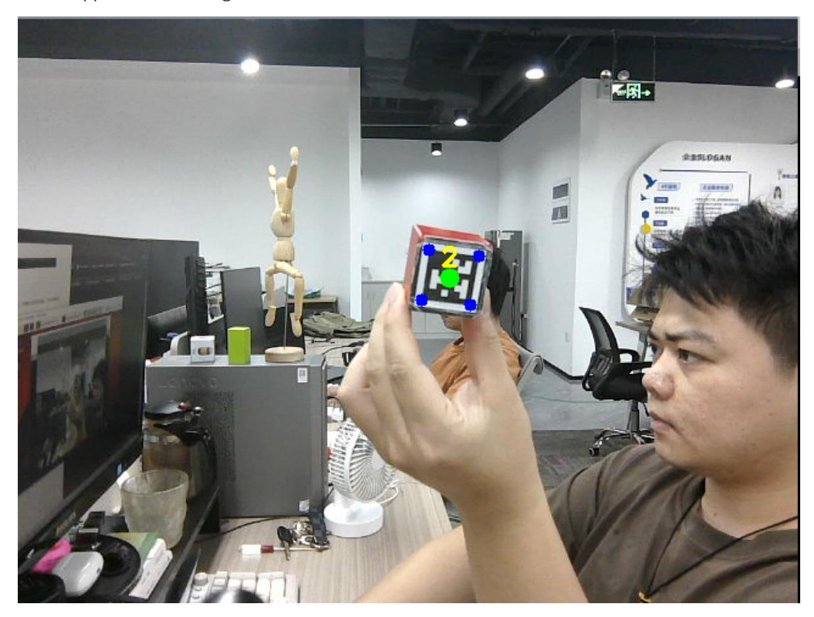

## Tracking and gripping machine code

## 1. Content Description

This function enables the program to capture images through the camera and recognize the machine code in the image. When the handheld machine code moves, the robotic arm will move with it, keeping the center point of the machine code in the middle of the image. When the robotic arm stops tracking, the program will calculate the distance between the machine code and the car's base_link at this time. If the distance is greater than 24 cm, the program will adjust it forward until the distance between the two is less than 24 cm. If the distance between the two is less than 24 cm, the robotic arm will be controlled to grab the machine code block and place it in the set position.

This section requires entering commands in the terminal. The terminal you open depends on your motherboard type. This lesson uses the Raspberry Pi 5 as an example. For Raspberry Pi and Jetson Nano boards, you need to open a terminal on the host computer and enter the command to enter the Docker container. Once inside the Docker container, enter the commands mentioned in this section in the terminal. For instructions on entering the Docker container from the host computer, refer to this product tutorial **[Configuration and Operation Guide]--[Enter the Docker (Jetson Nano and Raspberry Pi 5 users, see here)]**.

Simply open the terminal on the Orin motherboard and enter the commands mentioned in this section.

The wooden blocks used in this lesson: **40x40x40mm Machine Code Blocks**.

## 2. Program startup

First, open the terminal and enter the following command to start the robot arm solver and camera driver,

```
ros2 launch M3Pro_demo camera_arm_kin.launch.py
```

Then, open another terminal and enter the following command to start the robotic arm gripping program:

```
ros2 run M3Pro_demo grasp
```

After running, it is shown as follows:

Finally, open the third terminal and enter the following command to start the tracking and grabbing machine code program:

ros2 run M3Pro_demo apriltag_follow_2D

After the program is run, the 4 cm machine code wooden block that comes with the handheld device appears in the image, as shown below.



Slowly move the robot code block. The robotic arm will track it, keeping the center of the code in the center of the image. After stopping tracking, the program will determine whether the distance between the robot base_link and the robot code is less than 24 cm. If so, a buzzer will sound, and the program will control the robotic arm to grab the robot code, place it in the set position, and finally return to the initial position. If the distance between the robot base_link and the robot code is greater than 24 cm, the program will control the chassis to move forward until the distance between the two is less than 24 cm, and then proceed with the grab, placement, and return operations.

## 3. Core code analysis

Program code path:

- Raspberry Pi and Jetson Nano board
  - The program code is in the running docker. The path in docker is /root/yahboomcar_ws/src/M3Pro_demo/M3Pro_demo/apriltag_follow_2D.py
- Orin Motherboard

The program code path is /home/jetson/yahboomcar_ws/src/M3Pro_demo/M3Pro_demo/apriltag_follow_2D.py

Import the necessary library files,

```
import cv2
import os
import numpy as np
from sensor_msgs.msg import Image
#Import the function of drawing machine code information
from M3Pro_demo.vutils import draw_tags
#Import the library for detecting machine code
from dt_apriltags import Detector
from cv_bridge import CvBridge
import cv2 as cv
from M3Pro_demo.Robot_Move import *
from arm_interface.srv import ArmKinemarics
from arm_interface.msg import AprilTagInfo,CurJoints
from arm_msgs.msg import ArmJoints
from std_msgs.msg import Bool,Int16,UInt16
import time
import transforms3d.euler as t3d_euler
import math
from rclpy.node import Node
import rclpy
from message_filters import Subscriber,
TimeSynchronizer,ApproximateTimeSynchronizer
from geometry_msgs.msg import Twist
import threading
#Import the library for servo PID adjustment
from M3Pro_demo.PID import *
from M3Pro_demo.compute_joint5 import *
```

Import the robot arm offset parameter file to compensate for the deviation caused by the servo virtual position

```
offset_file = "/root/yahboomcar_ws/src/arm_kin/param/offset_value.yaml"
with open(offset_file, 'r') as file:
    offset_config = yaml.safe_load(file)
```

Program initialization and creation of publishers and subscribers,

```
def __init__(self, name):
    super().__init__(name)
    self.init_joints = [90, 150, 12, 20, 90, 0]
    self.rgb_bridge = CvBridge()
    self.depth_bridge = CvBridge()
    self.cur_distance = 0.0
    self.grasp_Dist = 240
    # Initialize chassis PID adjustment parameters
    self.linearx_PID = (0.5, 0.0, 0.2)
    self.camera_info_K = [477.57421875, 0.0, 319.3820495605469, 0.0,
477.55718994140625, 238.64108276367188, 0.0, 0.0, 1.0]
    self.EndToCamMat = np.array([[ 0 ,0 ,1 ,-1.00e-01],
                                 [-1 ,0 ,0 ,0],
                                 [0 ,-1 ,0 ,4.82000000e-02],
                                 [ 0.00000000e+00 , 0.00000000e+00 ,
0.00000000e+00 , 1.00000000e+00]])
    self.CurEndPos = [0.0, 0.0, 0.0, 0.0, 0.0, 0.0]
    self.x_offset = offset_config.get('x_offset')
    self.y_offset = offset_config.get('y_offset')
```

```
self.z_offset = offset_config.get('z_offset')
    self.at_detector = Detector(searchpath=['apriltags'],
                                families='tag36h11',
                                nthreads=8,
                                quad_decimate=2.0,
                                quad_sigma=0.0,
                                refine_edges=1,
                                decode_sharpening=0.25,
                                debug=0)
    self.rgb_image_sub = Subscriber(self, Image, '/camera/color/image_raw')
    self.sub_grasp_status =
self.create_subscription(Bool,"grasp_done",self.get_graspStatusCallBack,100)
    self.depth_image_sub = Subscriber(self, Image, '/camera/depth/image_raw')
    self.CmdVel_pub = self.create_publisher(Twist,"cmd_vel",1)
    self.pos_info_pub = self.create_publisher(AprilTagInfo,"PosInfo",1)
    self.pub_SixTargetAngle = self.create_publisher(ArmJoints, "arm6_joints",
10)
    self.TargetJoint5_pub = self.create_publisher(Int16, "set_joint5", 10)
    self.pub_beep = self.create_publisher(UInt16, "beep", 10)
    self.pub_cur_joints = self.create_publisher(CurJoints,"Curjoints",1)
    self.client = self.create_client(ArmKinemarics, 'get_kinemarics')
    self.pubSixArm(self.init_joints)
    self.cur_joints = self.init_joints
    self.get_current_end_pos()
    self.ts = ApproximateTimeSynchronizer([self.rgb_image_sub,
self.depth_image_sub], 1, 0.5)
    self.ts.registerCallback(self.callback)
    #Define the flag to start the clamping program. When the value is True, the
machine code location information is calculated and the machine code location
information topic is published.
    self.start_grasp = False
    #Define the flag for adjusting the distance. When the value is True, the
chassis moves to adjust the distance.
    self.adjust_dist = False
    #The initial value of the robot arm tracking x direction (left and right)
    self.target_servox=90
    #The initial value of the robot arm tracking the y direction (left and
right)
    self.target_servoy=180
    # Initialize the robot arm PID adjustment parameters in the x direction
    self.xservo_pid = PositionalPID(0.25, 0.1, 0.05)
    # Initialize the robot arm PID adjustment parameters in the y direction
    self.yservo_pid = PositionalPID(0.25, 0.1, 0.05)
    #Define whether the y value threshold is exceeded. When the value is True, it
means that the y value threshold is exceeded.
    self.y_out_range = False
    #Define whether the x-value threshold is exceeded. When the value is True, it
means that the y-value threshold is exceeded.
    self.x_out_range = False
    self.a = 0
    self.b = 0
    #Define the flag for publishing machine code information. When the value is
True, it means publishing, and when it is False, it means not publishing
    self.pubPos_flag = False
    #Define the flag bit for the robot to track the machine code. When the value
is True, the robot will track the machine code.
    self.XY_Track_flag = True
```

```
self.joint5 = Int16()
    #Define the end flag of the tracking and clamping program. When the value is
True, it means that the next tracking and clamping can be performed.
    self.Done_flag = True
    # Chassis PID initialization program
    self.PID_init()
```

callback image topic callback function,

```
def callback(self,color_frame,depth_frame):
    #Get color image topic data and use CvBridge to convert message data into
image data
    rgb_image = self.rgb_bridge.imgmsg_to_cv2(color_frame,'rgb8')
    result_image = np.copy(rgb_image)
    #Get the deep image topic data and use CvBridge to convert the message data
into image data
    depth_image = self.depth_bridge.imgmsg_to_cv2(depth_frame, encoding[1])
    frame = cv2.resize(depth_image, (640, 480))
    depth_image_info = frame.astype(np.float32)
    #Call the machine code detection program, pass in the color image for
detection, and return a tags list containing information about all the detected
machine codes
    tags = self.at_detector.detect(cv2.cvtColor(rgb_image, cv2.COLOR_RGB2GRAY),
False, None, 0.025)
    #Sort the test results according to the machine code id
    tags = sorted(tags, key=lambda tag: tag.tag_id)
    #Draw the center and corner points of the machine code on the color image
    draw_tags(result_image, tags, corners_color=(0, 0, 255), center_color=(0,
255, 0))
    #Start the thread and execute the function to display the image
    show_frame = threading.Thread(target=self.img_out, args=(result_image,))
    show_frame.start()
    show_frame.join()
    #If the length of the test result is not 0, it means that the machine code
has been detected
    if len(tags) > 0 :
        #print("tag: ",tags)
        #Get the center point coordinates and corner point coordinates of the
machine code
        center_x, center_y = tags[0].center
        corners = tags[0].corners
        #print("corners: ",corners)
        #Calculate the depth information of the center point
        cur_depth = depth_image_info[int(center_y),int(center_x)]
        #Calculate the pose of the machine code in the world coordinate system
        get_dist = self.compute_heigh(center_x,center_y,cur_depth/1000.0)
        #Calculate the distance between the center of the machine code and the
base coordinate base_link
        self.cur_distance = math.sqrt(get_dist[1] ** 2 + get_dist[0]** 2)*1000
        #If the difference between the center coordinates of the machine code
and the center point (320,240) in the image is greater than 10 pixels and the
robot tracking machine code flag is True, then execute the XY_Track function
        if (abs(center_x-320) >10 or abs(center_y-240)>10) and
self.XY_Track_flag==True:
            self.XY_track(center_x,center_y)
            print("Tracking")
            print("-------------------------------------")
```

```
#If the difference between the center coordinates of the machine code
and the center point (320,240) in the figure is less than 10 pixels and the
tracking and gripping program end flag is ended, then change the
self.XY_Track_flag flag to False, indicating that the robot arm tracking is
complete.
        if abs(center_x-320) <10 and abs(center_y-240)<10 and
self.Done_flag==True:
            self.adjust_dist = True
            #self.pubCurrentJoints()
            self.XY_Track_flag = False
            print("self.cur_distance: ",self.cur_distance)
            print("Adjust it.")
            print("-------------------------------------")
        #If the chassis adjustment flag is True, it means that the chassis can
be moved to adjust the distance
        if self.adjust_dist== True:
            #If the current distance is greater than 24 cm, then execute the
move_dist function to control the movement of the chassis
            if self.cur_distance>240:
                dist_adjust = self.cur_distance
                self.move_dist(dist_adjust)
            #If the current distance is less than 24 cm, it means it is within
the gripping range. Control the chassis to adjust the distance, change the value
of self.adjust_dist to False and the value of self.start_grasp to True,
indicating that you can start calculating the position information of the machine
code and publish the position information topic of the machine code
            else:
                self.adjust_dist = False
                self.start_grasp = True
                #self.pubVel(0,0,0)
        if self.start_grasp == True:
            #Get the center point coordinates of the current machine code and
calculate the depth information of the center point coordinates
            c_x, c_y = tags[0].center
            depth_dist = depth_image_info[int(c_y),int(c_x)]/1000
            #If the depth value is not 0, it means it is valid, then the
location message topic of the machine code is assigned and published.
            if depth_dist!=0:
                print("depth_dist: ",depth_dist)
                tag = AprilTagInfo()
                tag.id = tags[0].tag_id
                cur_x, cur_y = tags[0].center
                tag.x = cur_x
                tag.y = cur_y
                tag.z = depth_image_info[int(tag.y),int(tag.x)]/1000
                #Publish the topic of the current posture of the robotic arm
                self.pubCurrentJoints()
                self.Done_flag = False
                self.start_grasp = False
                #Execute the Beep_Loop function to let the buzzer publish the
topic
                self.Beep_Loop()
                self.pubVel(0,0,0)
                #Get the corner coordinates to calculate the rotation angle of
the machine code at this time
                vx = int(tags[0].corners[0][0]) - int(tags[0].corners[1][0])
                vy = int(tags[0].corners[0][1]) - int(tags[0].corners[1][1])
```

```
target_joint5 = compute_joint5(vx,vy)
            print("target_joint5: ",target_joint5)
            self.joint5.data = int(target_joint5)
            #Publish a topic message about controlling Servo No. 5
            self.TargetJoint5_pub.publish(self.joint5)
            #Publish the machine code location topic message
            self.pos_info_pub.publish(tag)
            print("Publish tag info.")
        else:
            print("Invalid distance.")
else:
    self.pubVel(0,0,0)
```
