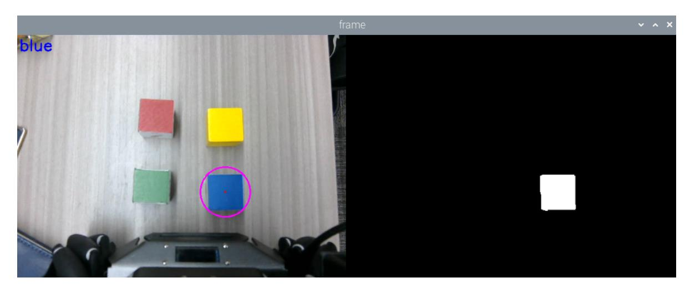
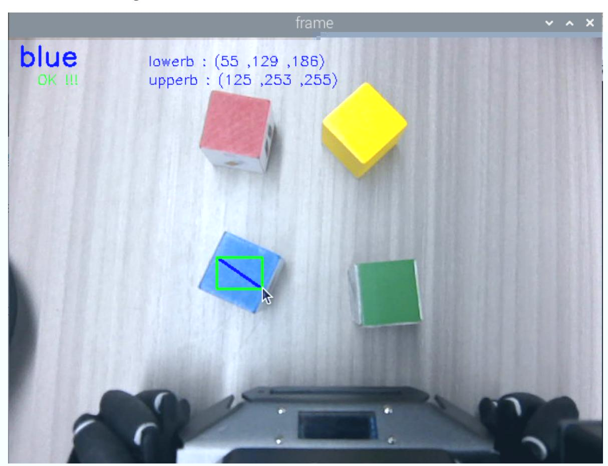
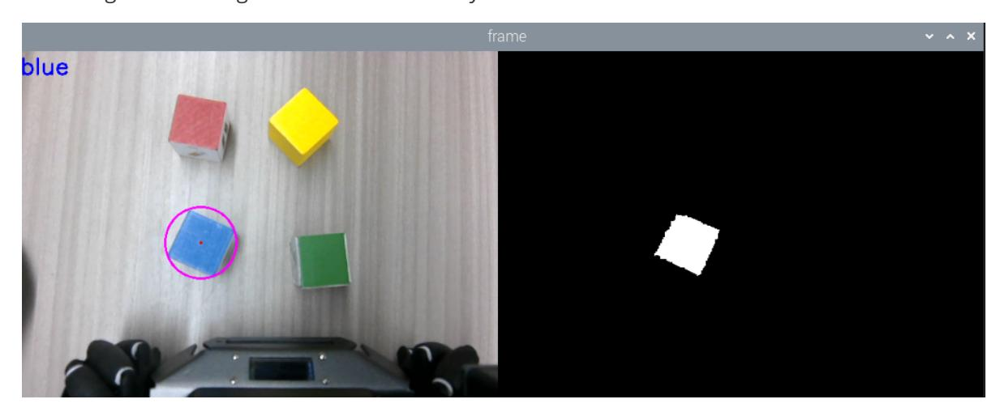

# Color Block Sorting

## 1. Content Description

This lesson captures camera images, lets the user select the target block color with the keyboard, identifies the matching color block, grasps it with the lower gripper, and places it at the configured position.

This lesson requires terminal commands. Use the terminal that matches your mainboard. Raspberry Pi 5 and Jetson Nano users should open a terminal on the host system, enter the Docker container, and then run the commands from this lesson inside the container. For Docker entry steps, see **Configuration and Operation Guide - Enter the Docker (Jetson Nano and Raspberry Pi 5 users, see here)**.

Orin users can open a terminal directly on the robot and run the commands there.

Wooden blocks used in this lesson: **30x30x30mm color blocks**.

## 2. Program Startup

Start the robotic-arm solver and camera driver:

```bash
ros2 launch M3Pro_demo camera_arm_kin.launch.py
```

Open another terminal and start the robotic-arm grasping program:

```bash
ros2 run M3Pro_demo grasp_desktop
```

Open a third terminal and start the color sorting program:

```bash
ros2 run M3Pro_demo color_recognize
```

After this command starts, the second terminal should receive one frame of current-angle topic information and calculate the current arm pose, as shown below.

If the current-angle information is not received and the current pose is not calculated, coordinate conversion will produce an inaccurate grasping pose. Press Ctrl+C to stop the color sorting program, then restart it until the grasping program receives the current-angle information and calculates the current end position.

After the color-block sorting program starts, it subscribes to the color and depth image topics. Place the included **30x30x30mm color block** under the camera. When the block appears in the image, use these keys to select or calibrate the target color:

- Press `R` or `r`: sort red blocks
- Press `G` or `g`: sort green blocks
- Press `B` or `b`: sort blue blocks
- Press `Y` or `y`: sort yellow blocks
- Press `C` or `c`: calibrate the selected block color

After a color is selected, the selected color is printed in the upper-left corner of the image. The right side shows a binary mask for the selected color. In the example below, `b` is pressed to select the blue block.



Press the spacebar to begin grasping. The program checks the distance between the blue block and `base_link`. If the distance is within `[215, 225]`, the arm lowers the gripper, grasps the block, and places it at the configured location. If the distance is outside `[215, 225]`, the chassis first adjusts the block to the required distance, then the arm grasps and places it.

### 2.1. Color Block Calibration

Lighting changes can make the preset HSV values inaccurate. Press `C` or `c`, then drag a rectangle over the target color with the mouse to recalibrate the HSV range. In the example below, blue was selected with `B` or `b`, but the binary image on the right does not isolate the blue block correctly. Press `C` or `c` to enter calibration mode and select the blue block area. The program samples the HSV values inside the green box.



Release the mouse to complete calibration. Press `B` or `b` again, and the binary image on the right should isolate the blue block clearly.



## 3. Core Code Analysis

### 3.1. color_recognize.py

Program code path:

Raspberry Pi 5 and Jetson Nano:

```text
/root/yahboomcar_ws/src/M3Pro_demo/M3Pro_demo/color_recognize.py
```

Orin:

```text
/home/jetson/yahboomcar_ws/src/M3Pro_demo/M3Pro_demo/color_recognize.py
```

Import the required libraries:

```python
import cv2
import os
import numpy as np
from sensor_msgs.msg import Image
from cv_bridge import CvBridge
import cv2 as cv
from M3Pro_demo.Robot_Move import *
#Import color recognition library
from M3Pro_demo.color_common import *
from arm_interface.srv import ArmKinemarics
from arm_interface.msg import AprilTagInfo,CurJoints
from arm_msgs.msg import ArmJoints
from std_msgs.msg import Bool,Int16
import time
import transforms3d as tfs
import tf_transformations as tf
import yaml
import math
from rclpy.node import Node
import rclpy
from message_filters import Subscriber,
TimeSynchronizer,ApproximateTimeSynchronizer
from geometry_msgs.msg import Twist
from ament_index_python.packages import get_package_share_directory
import threading
```


```python
def __init__(self, name):
    super().__init__(name)
    self.init_joints = [90, 100, 0, 0, 90, 0]
    self.rgb_bridge = CvBridge()
    self.depth_bridge = CvBridge()
    #Define the flag for publishing color block information. When the value is
True, it means publishing. When it is False, it means not publishing.
    self.pub_pos_flag = True
    #Define the array that stores the current end pose coordinates
    self.CurEndPos = [0.1279009179959246, 0.00023254956548456117,
0.1484898062979958, 0.00036263794618046863, 1.3962632350758744,
0.0003332603981328959]
    #Dabai_DCW2 camera internal parameters
    self.camera_info_K = [477.57421875, 0.0, 319.3820495605469, 0.0,
477.55718994140625, 238.64108276367188, 0.0, 0.0, 1.0]
    #Rotation matrix from the end to the camera
    self.EndToCamMat = np.array([[ 0 ,0 ,1 ,-1.00e-01],
                                 [-1 ,0 ,0 ,0],
                                 [0 ,-1 ,0 ,4.82000000e-02],
                                 [ 0.00000000e+00 , 0.00000000e+00 ,
0.00000000e+00 , 1.00000000e+00]])
    self.rgb_image_sub = Subscriber(self, Image, '/camera/color/image_raw')
    self.sub_grasp_status =
self.create_subscription(Bool,"grasp_done",self.get_graspStatusCallBack,100)
    self.depth_image_sub = Subscriber(self, Image, '/camera/depth/image_raw')
    self.CmdVel_pub = self.create_publisher(Twist,"cmd_vel",1)
    self.pub_cur_joints = self.create_publisher(CurJoints,"Curjoints",1)
    self.pos_info_pub = self.create_publisher(AprilTagInfo,"PosInfo",1)
    self.pub_SixTargetAngle = self.create_publisher(ArmJoints, "arm6_joints",
10)
    self.client = self.create_client(ArmKinemarics, 'get_kinemarics')
    self.pub_beep = self.create_publisher(Bool, "beep", 10)
    self.TargetJoint5_pub = self.create_publisher(Int16, "set_joint5", 10)
    self.pubCurrentJoints()
    self.pubSixArm(self.init_joints)
    #Get the current robot arm end pose coordinates
    self.get_current_end_pos()
    self.ts = ApproximateTimeSynchronizer([self.rgb_image_sub,
self.depth_image_sub], 1, 0.5)
    self.ts.registerCallback(self.callback)
    #Get the compensation values in the xyz directions in the offset table
    self.x_offset = offset_config.get('x_offset')
    self.y_offset = offset_config.get('y_offset')
    self.z_offset = offset_config.get('z_offset')
    self.adjust_dist = False
    self.linearx_PID = (0.5, 0.0, 0.2)
    self.linearx_pid = simplePID(self.linearx_PID[0] / 1000.0,
self.linearx_PID[1] / 1000.0, self.linearx_PID[2] / 1000.0)
    self.target_color = 0
    #Read the HSV values of four colors
    self.red_hsv_text = os.path.join(package_pwd, 'red_colorHSV.text')
    self.green_hsv_text = os.path.join(package_pwd, 'green_colorHSV.text')
    self.blue_hsv_text = os.path.join(package_pwd, 'blue_colorHSV.text')
```

```
self.yellow_hsv_text = os.path.join(package_pwd, 'yellow_colorHSV.text')
    #Define the variable to store hsv, which will eventually be passed to the
color recognition function
    self.hsv_range = ()
    #Select the color block area flag. When the value is True, it means that the
mouse selects the area in the color block.
    self.select_flags = False
    self.windows_name = 'frame'
    #Define state variables, there are three values: init, select, identify
    self.Track_state = 'init'
    #Define storage of mouse coordinates
    self.Mouse_XY = (0, 0)
    self.cols, self.rows = 0, 0
    #Define the region of interest, here refers to the area on the selected color
block
    self.Roi_init = ()
    #Create a color recognition object
    self.color = color_detect()
    #Define a variable to record the current color
    self.cur_color = None
    #Define the RGB value of the currently selected color
    self.text_color = (0,0,0)
    #The center x coordinate of the target color block
    self.cx = 0
    #The center y coordinate of the target color block
    self.cy = 0
    #The radius of the minimum circumscribed circle of the target color block
    self.circle_r = 0
    #Valid distance flag, the value is True means the current distance is valid
    self.valid_dist = True
    self.joint5 = Int16()
    self.corners = np.empty((4, 2), dtype=np.int32)
    #Define the color value of the current target color block, 1-4 represents
red, green, blue, and yellow respectively
    self.cur_target_color = 0
    #Indicates the update HSV value flag. When the value is True, it means that
the HSV value of the selected color can be updated.
    self.updata_flag = False
```

The image-topic callback processes camera frames:

```python
def callback(self,color_frame,depth_frame):
    #Get color image topic data and use CvBridge to convert message data into
image data
    rgb_image = self.rgb_bridge.imgmsg_to_cv2(color_frame,'rgb8')
    rgb_image = cv2.cvtColor(rgb_image, cv2.COLOR_RGB2BGR)
    result_image = np.copy(rgb_image)
    #Get the deep image topic data and use CvBridge to convert the message data
into image data
    depth_image = self.depth_bridge.imgmsg_to_cv2(depth_frame, encoding[1])
    frame = cv.resize(depth_image, (640, 480))
    depth_to_color_image = cv2.applyColorMap(cv2.convertScaleAbs(depth_image,
alpha=1.0), cv2.COLORMAP_JET)
    depth_image_info = frame.astype(np.float32)
    key = cv2.waitKey(10)& 0xFF
    #Call the defined process function to perform key processing and image
processing
```

```
result_frame, binary = self.process(rgb_image,key)
    #Call thread function to display image
    show_frame = threading.Thread(target=self.img_out, args=
(result_frame,binary,))
    show_frame.start()
    show_frame.join()
    if key == 32:
        self.adjust_dist = True
    #If self.cx and self.cy are not 0, it means that a color block of the target
color has been detected. At the same time, the radius of the minimum
circumscribed circle of the current color block must be greater than 30. This is
to filter out some small areas that are misidentified.
    if self.cx!=0 and self.cy!=0 and self.circle_r>30:
        cx = int(self.cx)
        cy = int(self.cy)
        dist = depth_image_info[int(cy),int(cx)]/1000
        #Calculate the position of the color block in the world coordinate
        pose = self.compute_heigh(cx,cy,dist)
        #Calculate the distance between the center of the color block and the
base coordinate base_link
        dist_detect = math.sqrt(pose[1] ** 2 + pose[0]** 2)
        dist_detect = dist_detect*1000
        #If the distance is less than 130 mm, it is considered invalid
        if dist_detect<130:
            print("Invalid dist.")
            self.valid_dist = False
        dist = 'dist: ' + str(dist_detect) + ' mm'
        print("dist: ",dist)
        #If the distance is valid and outside the range [215, 225], then control
the chassis to adjust the distance
        if abs(dist_detect - 220.0)>5 and self.valid_dist == True:
            if self.adjust_dist==True:
                self.move_dist(dist_detect)
        #If the distance is valid and within the range [215, 225], then extract
the coordinates of the center point of the color block, calculate the depth
information of the center point of the color block, and then publish it
        elif abs(dist_detect - 220.0)<5 and self.valid_dist == True:
            print("------------------------------------")
            self.pubVel(0,0,0)
            self.adjust_dist = False
            cx = int(self.cx)
            cy = int(self.cy)
            #Calculate the depth information of the center point of the color
block
            dist = depth_image_info[int(cy),int(cx)]/1000
        #print("dist: ",dist)
            #If the depth distance of the center point of the color block is not
0, it means it is valid
            if dist!=0:
                #Calculate the rotation angle of the color block based on the
corner coordinates
                vx = self.corners[0][0][0] - self.corners[1][0][0]
                vy = self.corners[0][0][1] - self.corners[1][0][1]
                target_joint5 = compute_joint5(vx,vy)
                self.joint5.data = int(target_joint5)
                pos = AprilTagInfo()
                pos.id = self.target_color
                pos.x = float(cx)
```

```
pos.y = float(cy)
            pos.z = float(dist)
            if self.pub_pos_flag == True:
                self.pub_pos_flag = False
                #Publish color block location information topic
                self.pos_info_pub.publish(pos)
                self . pos_info_pub . publish ( pos )
                #Publish the topic of No. 5 servo angle
                self.TargetJoint5_pub.publish(self.joint5)
else:
    self.pubVel(0,0,0)
```

The `process` function handles button input and image processing:

```python
def process(self,rgb_img,key):
    rgb_img = cv.resize(rgb_img, (640, 480))
    binary = []
    #Judge the value of the button and assign values to self.target_color and
self.cur_target_color according to the value of the button
    if key == ord('c') or key == ord('C'):
        self.target_color = 0
        self.Reset()
        self.updata_flag = True
    elif key == ord('r') or key == ord('R'):
        self.target_color = 1
        self.cur_target_color = self.target_color
    elif key == ord('g') or key == ord('G'):
        self.target_color = 2
        self.cur_target_color = self.target_color
    elif key == ord('b') or key == ord('B'):
        self.target_color = 3
        self.cur_target_color = self.target_color
    elif key == ord('y') or key == ord('Y'):
        self.target_color = 4
        self.cur_target_color = self.target_color
    elif key == ord('i') or key == ord('I') or self.target_color!=0:
self.Track_state = "identify"
    #Judge the value of self.Track_state. If it is init, it is in initialization
mode.
    if self.Track_state == 'init':
        cv.namedWindow(self.windows_name, cv.WINDOW_AUTOSIZE)
        cv.setMouseCallback(self.windows_name, self.onMouse, 0)
        if self.select_flags == True:
            cv.line(rgb_img, self.cols, self.rows, (255, 0, 0), 2)
            cv.rectangle(rgb_img, self.cols, self.rows, (0, 255, 0), 2)
            if self.Roi_init[0] != self.Roi_init[2] and self.Roi_init[1] !=
self.Roi_init[3]:
                rgb_img, self.hsv_range = self.color.Roi_hsv(rgb_img,
self.Roi_init)
                self.dyn_update = True
            else: self.Track_state = 'init'
    #If it is identify, it is identification mode, which reads the hsv file
according to the target color value of self.target_color and assigns it to
self.hsv_range
    elif self.Track_state == "identify":
        if self.target_color == 1:
            self.hsv_range = read_HSV(self.red_hsv_text)
```

```
self.cur_color = "red"
            self.text_color = (0, 0, 255)
        elif self.target_color == 2:
            self.hsv_range = read_HSV(self.green_hsv_text)
            self.cur_color = "green"
            self.text_color = (0, 255, 0)
        elif self.target_color == 3:
            self.hsv_range = read_HSV(self.blue_hsv_text)
            self.cur_color = "blue"
            self.text_color = (255, 0, 0)
        elif self.target_color == 4:
            self.hsv_range = read_HSV(self.yellow_hsv_text)
            self.cur_color = "yellow"
            self.text_color = (255, 255, 0)
        else:
            self.Track_state = 'init'
    #If the current self.Track_state is not init, then enter the color
recognition mode
    if self.Track_state != 'init':
        #Judge whether self.hsv_range is empty. If it is not empty, it means the
current identify recognition model
        if len(self.hsv_range) != 0:
            #Call the object_follow function in the color recognition object.
The function is to filter out objects that meet the HSV standard in the image
based on the HSV value and color image passed in. The returned content includes
the processed color image, binary image, minimum circumscribed circle and corner
coordinates
            rgb_img, binary, self.circle,_,self.corners=
self.color.object_follow(rgb_img, self.hsv_range)
            #Get the center x coordinate of the minimum circumscribed circle
            self.cx = self.circle[0]
            #Get the center y coordinate of the minimum circumscribed circle
            self.cy = self.circle[1]
            #Get the radius of the minimum circumscribed circle
            self.circle_r = self.circle[2]
            #If the value of self.updata_flag is true, it means that the hsv
parameter file needs to be updated and modified. According to the current target
color block color, select the corresponding hsv parameter file for modification
            if self.cur_target_color == 1 and self.updata_flag == True:
                write_HSV(self.red_hsv_text, self.hsv_range)
            elif self.cur_target_color == 2 and self.updata_flag == True:
                write_HSV(self.green_hsv_text, self.hsv_range)
            elif self.cur_target_color == 3 and self.updata_flag == True:
                write_HSV(self.blue_hsv_text, self.hsv_range)
            elif self.cur_target_color == 4 and self.updata_flag == True:
                write_HSV(self.yellow_hsv_text, self.hsv_range)
            self.updata_flag = False
    #Finally, the color name of the current target color block is displayed in
the upper left corner of the image
    rgb_img = cv2.putText(rgb_img, self.cur_color, (10, 30),
cv2.FONT_HERSHEY_SIMPLEX, 1, self.text_color, 2)
    return rgb_img, binary
```

### 3.2. color_common

The source code path of the library:

Raspberry Pi 5 and Jetson Nano:

```text
/root/yahboomcar_ws/src/M3Pro_demo/M3Pro_demo/color_common.py
```

Orin:

```text
/home/jetson/yahboomcar_ws/src/M3Pro_demo/M3Pro_demo/color_common.py
```

The `object_follow` function performs color recognition:

```python
def object_follow(self, img, hsv_msg):
   src = img.copy()
   # NumPy
   # Create NumPy array from color range
   src = cv.cvtColor(src, cv.COLOR_BGR2HSV)
   lower = np.array(hsv_msg[0], dtype="uint8")
   upper = np.array(hsv_msg[1], dtype="uint8")
   # mask
   # Create a mask based on a specific color range
   mask = cv.inRange(src, lower, upper)
   color_mask = cv.bitwise_and(src, src, mask=mask)

   # Convert the image to grayscale
   gray_img = cv.cvtColor(color_mask, cv.COLOR_RGB2GRAY)

   # Get structure elements of different shapes
   kernel = cv.getStructuringElement(cv.MORPH_RECT, (5, 5))

   # Morphological closed operation
   gray_img = cv.morphologyEx(gray_img, cv.MORPH_CLOSE, kernel)

   # Image binarization operation
   ret, binary = cv.threshold(gray_img, 10, 255, cv.THRESH_BINARY)
   # ()
   # Get the set of contour points (coordinates)
   find_contours = cv.findContours(binary, cv.RETR_EXTERNAL,
cv.CHAIN_APPROX_SIMPLE)
   if len(find_contours) == 3:
       contours = find_contours[1]
   else:
       contours = find_contours[0]
   if len(contours) != 0:
       areas = []
       for c in range(len(contours)): areas.append(cv.contourArea(contours[c]))
       max_id = areas.index(max(areas))
       max_rect = cv.minAreaRect(contours[max_id])
       self.max_box = cv.boxPoints(max_rect)
       #print("max_box: ",max_box)
       self.max_box = np.int0(self.max_box)
       #print("max_box: ",max_box)
       #xy
```

```
#Calculate the minimum circumscribed circle of a set of two-dimensional
points, and return the circular coordinates xy and radius of the circle
        (color_x, color_y), color_radius = cv.minEnclosingCircle(self.max_box)

        # Mark the detected color with the original shape coil
        self.Center_x = int(color_x)
        self.Center_y = int(color_y)
        self.Center_r = int(color_radius)
        perimeter = cv.arcLength(contours[max_id], True)
        self.approx = cv.approxPolyDP(contours[max_id], 0.035 * perimeter, True)
        cv.circle(img, (self.Center_x, self.Center_y), self.Center_r, (255, 0,
255), 2)
        cv.circle(img, (self.Center_x, self.Center_y), 2, (0, 0, 255), -1)
    else:
        self.Center_x = 0
        self.Center_y = 0
        self.Center_r = 0
    return img, binary, (self.Center_x, self.Center_y,
self.Center_r),self.max_box,self.approx
```
