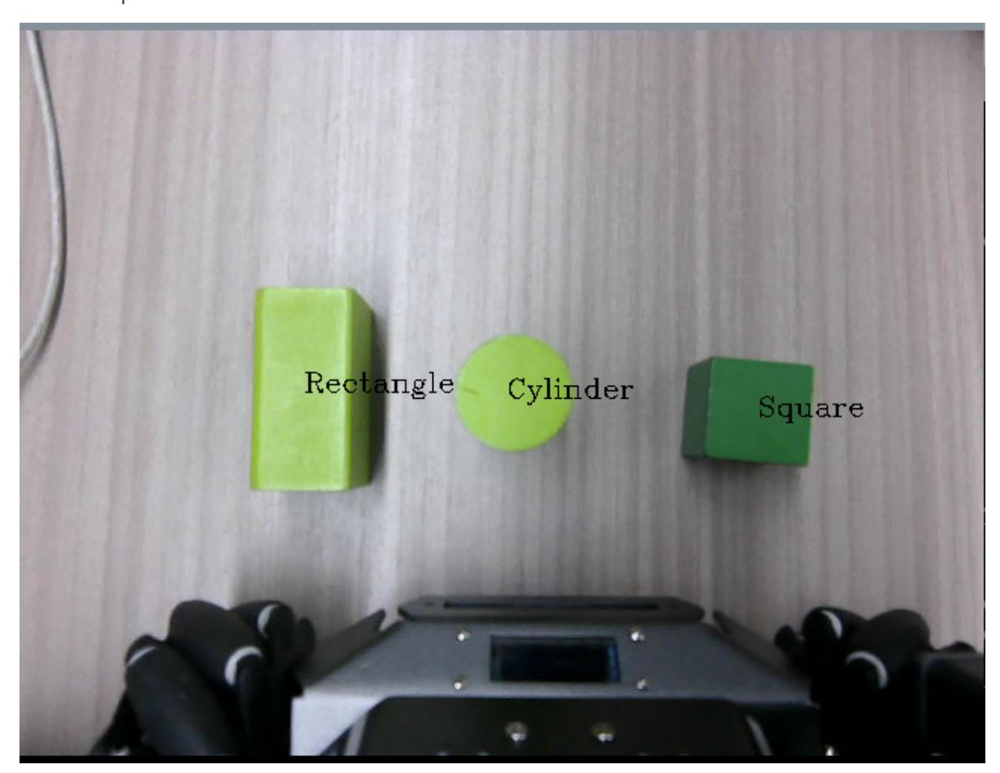

# Wood Block Shape Sorting

## 1. Content Description

This lesson captures camera images, identifies wooden-block shapes based on the target shape entered by the user, grasps the matching block, and places it at the configured position.

This lesson requires terminal commands. Use the terminal that matches your mainboard. Raspberry Pi 5 and Jetson Nano users should open a terminal on the host system, enter the Docker container, and then run the commands from this lesson inside the container. For Docker entry steps, see **Configuration and Operation Guide - Enter the Docker (Jetson Nano and Raspberry Pi 5 users, see here)**.

Orin users can open a terminal directly on the robot and run the commands there.

Wooden blocks used in this lesson: **30x30x30mm cubes, 30x30x60mm rectangular prisms, and 30x30mm cylinders**.

## 2. Program Startup

Start the robotic-arm solver and camera driver:

```bash
ros2 launch M3Pro_demo camera_arm_kin.launch.py
```

Open another terminal and start the robotic-arm grasping program:

```bash
ros2 run M3Pro_demo grasp_desktop
```

Open a third terminal and start the wood-block shape sorting program:

```bash
ros2 run M3Pro_demo shape_recognize
```

After this command starts, the second terminal should receive one frame of current-angle topic information and calculate the current arm pose, as shown below.

If the current-angle information is not received and the current pose is not calculated, coordinate conversion will produce an inaccurate grasping pose. Press Ctrl+C to stop the shape sorting program, then restart it until the grasping program receives the current-angle information and calculates the current end position.

After the program starts, enter the target block shape in the terminal. Three shapes are supported: **30x30x60mm** rectangular prism (`Rectangle`), **30x30x30mm** cube (`Square`), and **30x30mm** cylinder (`Cylinder`). To sort rectangular prisms, enter `Rectangle`, as shown below.

After pressing Enter, a color display appears and the recognized block shape is shown on the screen. Press the spacebar to start grasping. The program calculates the distance between the recognized block and `base_link`. If the distance is within `[190, 210]`, the arm lowers the gripper, grasps the block, and places it at the configured location. If the distance is outside `[190, 210]`, the chassis moves until the block is within range, then the arm grasps and places it.



## 3. Core Code Analysis

Program code path:

Raspberry Pi 5 and Jetson Nano:

```text
/root/yahboomcar_ws/src/M3Pro_demo/M3Pro_demo/shape_recognize.py
```

Orin:

```text
/home/jetson/yahboomcar_ws/src/M3Pro_demo/M3Pro_demo/shape_recognize.py
```

Import the required libraries:

```python
import cv2
import os
import numpy as np
from cv_bridge import CvBridge
import cv2 as cv
from M3Pro_demo.Robot_Move import *
from arm_interface.srv import ArmKinemarics
from arm_interface.msg import AprilTagInfo,CurJoints
from arm_msgs.msg import ArmJoints
from std_msgs.msg import Float32,Bool,Int16
```

```python
import time
import transforms3d as tfs
import tf_transformations as tf
import yaml
import math
from rclpy.node import Node
import rclpy
from message_filters import Subscriber,
TimeSynchronizer,ApproximateTimeSynchronizer
from sensor_msgs.msg import Image
from geometry_msgs.msg import Twist
from M3Pro_demo.compute_joint5 import *
```

Initialize the node and create the publishers and subscribers:

```python
def __init__(self, name):
    super().__init__(name)
    self.init_joints = [90, 100, 0, 0, 90, 0]
    self.rgb_bridge = CvBridge()
    self.depth_bridge = CvBridge()
    self.pub_pos_flag = False
    #Define the array that stores the current end pose coordinates
    self.CurEndPos = [0.1279009179959246, 0.00023254956548456117,
0.1484898062979958, 0.00036263794618046863, 1.3962632350758744,
0.0003332603981328959]
    #Dabai_DCW2 camera internal parameters
    self.camera_info_K = [477.57421875, 0.0, 319.3820495605469, 0.0,
477.55718994140625, 238.64108276367188, 0.0, 0.0, 1.0]
    #Rotation matrix from the end to the camera
    self.EndToCamMat = np.array([[ 0 ,0 ,1 ,-1.00e-01],
                                 [-1 ,0 ,0 ,0],
                                 [0 ,-1 ,0 ,4.82000000e-02],
                                 [ 0.00000000e+00 , 0.00000000e+00 ,
0.00000000e+00 , 1.00000000e+00]])
    self.rgb_image_sub = Subscriber(self, Image, '/camera/color/image_raw')
    self.sub_grasp_status =
self.create_subscription(Bool,"grasp_done",self.get_graspStatusCallBack,100)
    self.depth_image_sub = Subscriber(self, Image, '/camera/depth/image_raw')
    self.CmdVel_pub = self.create_publisher(Twist,"cmd_vel",1)
    self.pub_cur_joints = self.create_publisher(CurJoints,"Curjoints",1)
    self.pos_info_pub = self.create_publisher(AprilTagInfo,"PosInfo",1)
    self.pub_SixTargetAngle = self.create_publisher(ArmJoints, "arm6_joints",
10)
    self.client = self.create_client(ArmKinemarics, 'get_kinemarics')
    self.TargetJoint5_pub = self.create_publisher(Int16, "set_joint5", 10)
    self.pubSixArm(self.init_joints)
    #Get the current robot arm end pose coordinates
    self.get_current_end_pos()
    self.pubCurrentJoints()
    self.ts = ApproximateTimeSynchronizer([self.rgb_image_sub,
self.depth_image_sub], 1, 0.5)
    self.ts.registerCallback(self.callback)
    #Define the target wood block shape
    self.Target_Shape = "Cylinder" #Rectangle Square Cylinder
    self.x_offset = offset_config.get('x_offset')
    self.y_offset = offset_config.get('y_offset')
    self.z_offset = offset_config.get('z_offset')
```

```
self.adjust_dist = True
    self.linearx_PID = (0.5, 0.0, 0.2)
    self.linearx_pid = simplePID(self.linearx_PID[0] / 1000.0,
self.linearx_PID[1] / 1000.0, self.linearx_PID[2] / 1000.0)
    self.done_flag = True
    self.joint5 = Int16()
    self.corners = np.empty((4, 2), dtype=np.int32)
    self.valid_dist = True
    print("Init done.")
```

The image-topic callback processes camera frames:

```python
def callback(self,color_frame,depth_frame):
    #Get color image topic data and use CvBridge to convert message data into
image data
    rgb_image = self.rgb_bridge.imgmsg_to_cv2(color_frame,'rgb8')
    rgb_image = cv2.cvtColor(rgb_image, cv2.COLOR_RGB2BGR)
    result_image = np.copy(rgb_image)
    #Get color image topic data and use CvBridge to convert message data into
image data
    depth_image = self.depth_bridge.imgmsg_to_cv2(depth_frame, encoding[1])
    frame = cv.resize(depth_image, (640, 480))
    depth_to_color_image = cv2.applyColorMap(cv2.convertScaleAbs(depth_image,
alpha=1.0), cv2.COLORMAP_JET)
    depth_image_info = frame.astype(np.float32)
    #cv2.cvtColor converts the image from BGR to grayscale for subsequent image
processing
    gray_image = cv2.cvtColor(depth_to_color_image, cv2.COLOR_BGR2GRAY)
    #Create an all-zero array with exactly the same shape and data type as
gray_image
    black_image = np.zeros_like(gray_image)
    #Assign values to the array and copy the pixel values of the first 420 rows x
the first 640 columns of the grayscale image to the same position in black_image
    black_image[0:400, 0:640] = gray_image[0:400, 0:640]
    #Threshold black_image and set all pixels with values < 90 to 0 (pure black)
    black_image[black_image < 90] = 0
    cv2.circle(black_image, (320,240), 1, (255,255,255), 1)
    gauss_image = cv2.GaussianBlur(black_image, (3, 3), 1)
    #Convert the grayscale image to a binary image (black and white image)
    _,threshold_img = cv2.threshold(gauss_image, 0, 255, cv2.THRESH_BINARY)
    #Perform corrosion operation on the image to remove noise
    erode_img = cv2.erode(threshold_img, np.ones((5, 5), np.uint8))
    #Dilution operation on the image to connect the broken edges
    dilate_img = cv2.dilate(erode_img, np.ones((5, 5), np.uint8))
    #Find the contour according to the image and perform shape analysis. The
returned contours are a list of contour points.
    contours, hierarchy = cv2.findContours(dilate_img, cv2.RETR_EXTERNAL,
cv2.CHAIN_APPROX_NONE)
    #Traverse each contour point list
    for obj in contours:
        area = cv2.contourArea(obj)
        if area < 2000 :
            continue
        #Draw the contour function to visualize the detected object contours
        cv2.drawContours(depth_to_color_image, obj, -1, (255, 255, 0), 4)
```

```
#Calculate the perimeter of the object
        perimeter = cv2.arcLength(obj, True)
        #Approximate the contour into a simpler polygon
        approx = cv2.approxPolyDP(obj, 0.035 * perimeter, True)
        self.corners = approx
        cv2.drawContours(depth_to_color_image, approx, -1, (255, 0, 0), 4)
       # Calculate the number of edges
        CornerNum = len(approx)
        #print(CornerNum)
        x, y, w, h = cv2.boundingRect(approx)
        if CornerNum == 3: objType = "triangle"
        elif CornerNum == 4:
            side_lengths = []
            for i in range(4):
                p1 = approx[i]
                p2 = approx[(i + 1) % 4]
                side_lengths.append(np.linalg.norm(p1 - p2)) # Calculate the
distance between two points
            #Calculate the length of adjacent edges
            side_lengths = np.array(side_lengths)
            #Judge the error of two adjacent sides. If the error is within the
range, the adjacent sides are considered equal, which is a square, otherwise it
is a rectangle
            if np.allclose(side_lengths[1], side_lengths[0], atol=50): # Allow
some small errors
                objType = "Square"
            else:
                objType = "Rectangle"
            #According to actual needs, if the number of sides is greater than
5, it is considered a circle, that is, the top of the cylinder
        elif CornerNum > 5:
            objType = "Cylinder"
        else:
            objType = "None"
        rect = cv2.minAreaRect(obj)
        center = rect[0]
        key = cv2.waitKey(1)
        if key == 32:
            self.pub_pos_flag = True
            self.adjust_dist = True
        if self.pub_pos_flag == True:
            #If the shape of the currently detected wood block is the target
shape wood block and the last clamping and placement process is completed
            if objType == self.Target_Shape and self.done_flag == True:
                #Extract the center coordinates of the target shape
                cx = int(center[0])
                cy = int(center[1])
                #Calculate the depth information of the center point
                dist = depth_image_info[int(cy),int(cx)]/1000
                #Calculate the pose of the target shape block in the world
coordinate system
                pose = self.compute_heigh(cx,cy,dist)
                #Calculate the distance between the target shape block and the
car base_link
                dist_detect = math.sqrt(pose[1] ** 2 + pose[0]** 2)
                dist_detect = dist_detect*1000
                #If the distance is less than 13, modify the value of
self.valid_dist to False, indicating an invalid distance
```

```
if dist_detect<130:
                    self.valid_dist = False
                    print("Invalid dist.Plese restart the program.")
                dist = 'dist: ' + str(dist_detect) + 'mm'
                cv.putText(rgb_image, dist, (int(cx)+5, int(cy)+15),
cv.FONT_HERSHEY_SIMPLEX, 0.5, (255, 0, 0), 2)
                #If the distance is outside the range [190, 210], and chassis
adjustment is enabled and the distance is a valid distance, then call the
self.move_dist function to control the chassis adjustment distance
                if abs(dist_detect - 200.0)>10 and self.adjust_dist==True and
self.valid_dist == True:
                    self.move_dist(dist_detect)
                #If the distance is within the interval [190, 210] and the
distance is valid, then sort out the location information of the target shape and
then publish the message
                elif abs(dist_detect - 200.0)<10 and self.valid_dist == True:
                    self.pubVel(0,0,0)
                    self.adjust_dist = False
                    cx = int(center[0])
                    cy = int(center[1])
                    dist = depth_image_info[int(cy),int(cx)]/1000
                    print("dist: ",dist)
                    if dist!=0:
                        vx = self.corners[0][0][0] - self.corners[1][0][0]
                        vy = self.corners[0][0][1] - self.corners[1][0][1]
                        target_joint5 = compute_joint5(vx,vy)
                        self.joint5.data = int(target_joint5)
                        pos = AprilTagInfo()
                        pos.x = float(cx)
                        pos.y = float(cy)
                        pos.z = float(dist)
                        if self.pub_pos_flag == True:
                            self.pub_pos_flag = False
                            self.done_flag = False
                            self.pos_info_pub.publish(pos)
                            self.TargetJoint5_pub.publish(self.joint5)
            cv2.circle(rgb_image, (int(center[0]),int(center[1])), 5,
(0,255,255), 5)
        cv2.putText(rgb_image, objType, (x + w // 2, y + (h //2)),
cv2.FONT_HERSHEY_COMPLEX, 0.6, (0, 0, 0), 1)
    cv2.imshow("depth_to_color_image", depth_to_color_image)
    cv2.imshow("rgb_image", rgb_image)
    key = cv2.waitKey(10)
```
